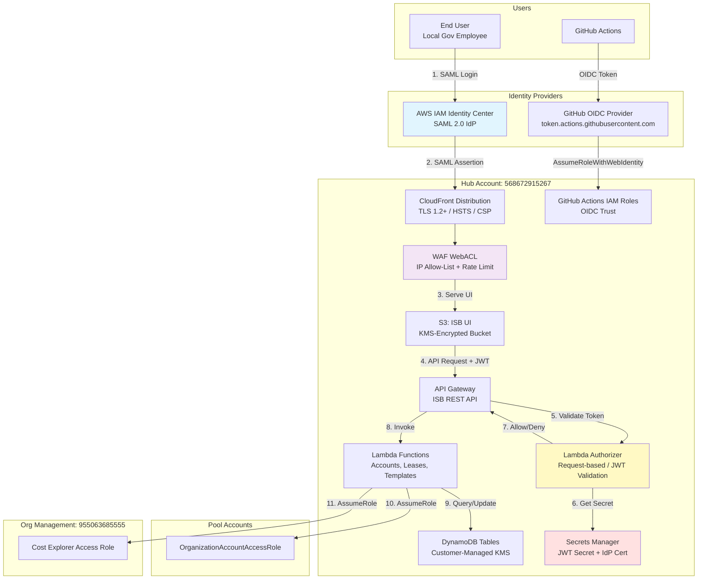
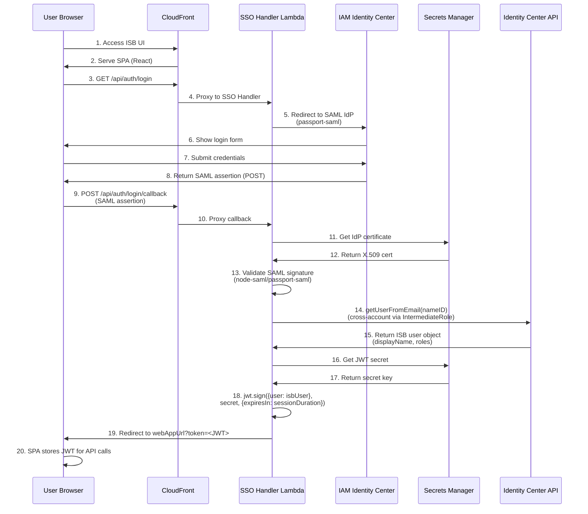
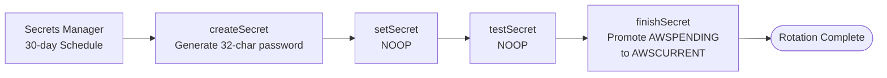
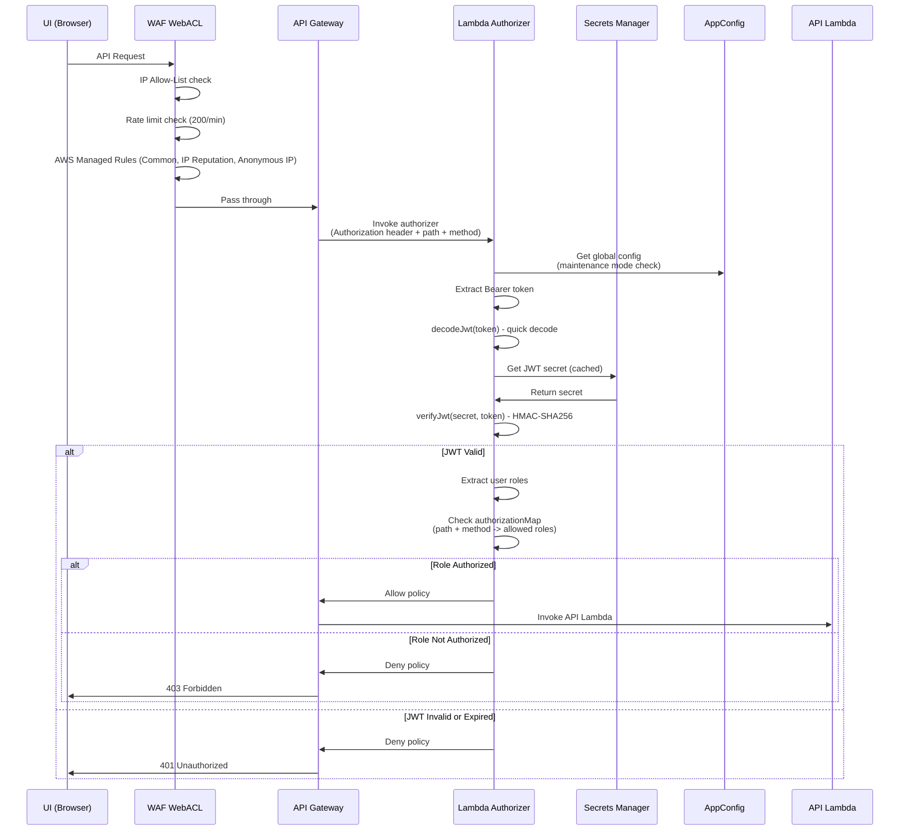

# Auth Architecture

> **Last Updated**: 2026-03-02
> **Sources**: `innovation-sandbox-on-aws` (auth-api.ts, rest-api-all.ts, authorizer-handler.ts, authorization.ts, authorization-map.ts, sso-handler, jwt.ts), `.state/scps/*.json`

## Executive Summary

The NDX:Try AWS platform implements a layered authentication and authorization model combining SAML 2.0 via AWS IAM Identity Center for user identity, JWT bearer tokens for stateless API authentication, role-based access control (RBAC) with three ISB roles (Admin, Manager, User), and GitHub OIDC for credential-less CI/CD deployments. All authentication flows converge in the Hub account (568672915267), where a Lambda authorizer validates JWT tokens against secrets stored in AWS Secrets Manager, with WAF-enforced IP allow-listing and rate limiting providing defence in depth at the API Gateway layer.

---

## Authentication Architecture Overview


```mermaid
flowchart TB
    subgraph "Users"
        user[End User<br/>Local Gov Employee]
        github_user[GitHub Actions]
    end

    subgraph "Identity Providers"
        idc[AWS IAM Identity Center<br/>SAML 2.0 IdP]
        github_oidc[GitHub OIDC Provider<br/>token.actions.githubusercontent.com]
    end

    subgraph "Hub Account: 568672915267"
        cloudfront[CloudFront Distribution<br/>TLS 1.2+ / HSTS / CSP]
        waf[WAF WebACL<br/>IP Allow-List + Rate Limit]
        s3_ui[S3: ISB UI<br/>KMS-Encrypted Bucket]
        apigw[API Gateway<br/>ISB REST API]
        authorizer[Lambda Authorizer<br/>Request-based / JWT Validation]
        lambda_funcs[Lambda Functions<br/>Accounts, Leases, Templates]
        dynamodb[DynamoDB Tables<br/>Customer-Managed KMS]
        secrets[Secrets Manager<br/>JWT Secret + IdP Cert]
        gh_roles[GitHub Actions IAM Roles<br/>OIDC Trust]
    end

    subgraph "Pool Accounts"
        pool_role[OrganizationAccountAccessRole]
    end

    subgraph "Org Management: 955063685555"
        org_role[Cost Explorer Access Role]
    end

    user -->|1. SAML Login| idc
    idc -->|2. SAML Assertion| cloudfront
    cloudfront --> waf
    waf -->|3. Serve UI| s3_ui
    s3_ui -->|4. API Request + JWT| apigw
    apigw -->|5. Validate Token| authorizer
    authorizer -->|6. Get Secret| secrets
    authorizer -->|7. Allow/Deny| apigw
    apigw -->|8. Invoke| lambda_funcs
    lambda_funcs -->|9. Query/Update| dynamodb
    lambda_funcs -->|10. AssumeRole| pool_role
    lambda_funcs -->|11. AssumeRole| org_role

    github_user -->|OIDC Token| github_oidc
    github_oidc -->|AssumeRoleWithWebIdentity| gh_roles

    style idc fill:#e1f5fe
    style authorizer fill:#fff9c4
    style secrets fill:#ffe1e1
    style waf fill:#f3e5f5
```

---

## 1. IAM Identity Center (SAML 2.0) Configuration

### Identity Source

| Property | Value |
|----------|-------|
| **Identity Source** | Identity Center Directory (AWS Managed) |
| **Region** | us-west-2 |
| **SAML Application** | Innovation Sandbox on AWS |
| **Application Start URL** | `https://isb.try.ndx.digital.cabinet-office.gov.uk` |
| **NameID Format** | `urn:oasis:names:tc:SAML:2.0:nameid-format:persistent` |

### SAML Attribute Mappings

| Attribute | Source | Purpose |
|-----------|--------|---------|
| `Subject` | `${user:subject}` | Unique user identifier (nameID) |
| `email` | `${user:email}` | User email address |
| `name` | `${user:name}` | Display name |
| `department` | `${user:department}` | Organization/Department |

### IdP Certificate Storage

The IdP X.509 certificate used to validate SAML assertions is stored in AWS Secrets Manager:

- **Secret Name**: `/isb/<namespace>/Auth/IdpCert`
- **Encryption**: Customer-managed KMS key
- **Rotation**: Manual (when the IdP certificate rotates, typically annually)

**Source**: `auth-api.ts` lines 91-101

### User Groups

| Group | Purpose |
|-------|---------|
| ISB-Admins | Platform administrators with full control |
| ISB-Users | Standard sandbox requesters |
| ISB-Managers | Lease approval and operational management |

---

## 2. SAML Authentication Flow


```mermaid
sequenceDiagram
    participant User as User Browser
    participant CF as CloudFront
    participant Lambda as SSO Handler Lambda
    participant IDC as IAM Identity Center
    participant Secrets as Secrets Manager
    participant IdcSvc as Identity Center API

    User->>CF: 1. Access ISB UI
    CF->>User: 2. Serve SPA (React)
    User->>CF: 3. GET /api/auth/login
    CF->>Lambda: 4. Proxy to SSO Handler

    Lambda->>IDC: 5. Redirect to SAML IdP<br/>(passport-saml)
    IDC->>User: 6. Show login form
    User->>IDC: 7. Submit credentials
    IDC->>User: 8. Return SAML assertion (POST)

    User->>CF: 9. POST /api/auth/login/callback<br/>(SAML assertion)
    CF->>Lambda: 10. Proxy callback

    Lambda->>Secrets: 11. Get IdP certificate
    Secrets->>Lambda: 12. Return X.509 cert

    Lambda->>Lambda: 13. Validate SAML signature<br/>(node-saml/passport-saml)

    Lambda->>IdcSvc: 14. getUserFromEmail(nameID)<br/>(cross-account via IntermediateRole)
    IdcSvc->>Lambda: 15. Return ISB user object<br/>(displayName, roles)

    Lambda->>Secrets: 16. Get JWT secret
    Secrets->>Lambda: 17. Return secret key

    Lambda->>Lambda: 18. jwt.sign({user: isbUser},<br/>secret, {expiresIn: sessionDuration})

    Lambda->>User: 19. Redirect to webAppUrl?token=<JWT>
    User->>User: 20. SPA stores JWT for API calls
```

### SSO Handler Implementation

The SSO handler is an Express.js application running inside a Lambda function, using `@node-saml/passport-saml` for SAML processing. It exposes the following routes via `/api/auth/{action+}`:

| Route | Method | Auth Required | Purpose |
|-------|--------|---------------|---------|
| `/auth/login` | GET | No | Initiate SAML authentication |
| `/auth/login/callback` | POST | No | Process SAML assertion |
| `/auth/login/status` | GET | JWT | Check authentication status |
| `/auth/logout` | GET | No | Redirect to IdP sign-out |

**Configuration**: Loaded from AppConfig (global configuration) and Secrets Manager, including session duration, IdP URLs, and IdP audience.

**Source**: `sso-handler/src/server.ts`, `sso-handler/src/config.ts`

### SAML Validation

The `passport-saml` strategy validates:

1. **XML signature** using the stored IdP X.509 certificate
2. **Audience restriction** against the configured `idpAudience`
3. **Timestamp validity** (NotBefore/NotOnOrAfter)

After validation, the handler resolves the user's ISB identity by calling `User.getIsbUser(nameID)`, which assumes a cross-account role into the Identity Center account via `IntermediateRole` to query the Identity Center directory.

**Source**: `sso-handler/src/user.ts`

---

## 3. JWT Token Management

### JWT Structure

The JWT tokens are signed using the `jsonwebtoken` library with HMAC-SHA256:

**Payload**:
```json
{
  "user": {
    "displayName": "User Name",
    "userName": "user@example.gov.uk",
    "email": "user@example.gov.uk",
    "roles": ["User"]
  },
  "iat": 1709337600,
  "exp": 1709351400
}
```

**Signing**: `jwt.sign({user: isbUser}, jwtSecret, {expiresIn: sessionDuration})`

**Session Duration**: Configurable via AppConfig (`auth.sessionDurationInMinutes`)

**Source**: `sso-handler/src/server.ts` line 212, `common/utils/jwt.ts`

### JWT Secret

| Property | Value |
|----------|-------|
| **Storage** | AWS Secrets Manager |
| **Secret Name** | `/isb/<namespace>/Auth/JwtSecret` |
| **Encryption** | Customer-managed KMS key |
| **Length** | 32 characters (alphanumeric + symbols) |
| **Rotation** | Automatic every 30 days |
| **Rotation Lambda** | `JwtSecretRotator` (reserved concurrency: 1) |

**Source**: `auth-api.ts` lines 47-89

### JWT Secret Rotation


```mermaid
flowchart LR
    schedule[Secrets Manager<br/>30-day Schedule] --> create[createSecret<br/>Generate 32-char password]
    create --> set[setSecret<br/>NOOP]
    set --> test[testSecret<br/>NOOP]
    test --> finish[finishSecret<br/>Promote AWSPENDING<br/>to AWSCURRENT]
    finish --> complete([Rotation Complete])
```

The rotation Lambda (`secret-rotator-handler.ts`) follows the four-step Secrets Manager rotation protocol:

1. **createSecret**: Generates a new 32-character random password via `GetRandomPasswordCommand` and stores it as `AWSPENDING`
2. **setSecret**: No-op (no external system to update)
3. **testSecret**: No-op (JWT validation is inherently tested on next use)
4. **finishSecret**: Promotes `AWSPENDING` to `AWSCURRENT` and demotes old version

**Source**: `secret-rotator/src/secret-rotator-handler.ts`

---

## 4. API Gateway Authorization

### Request Authorizer

The API Gateway uses a **Request-based Lambda authorizer** (not Token-based), with identity sources drawn from the Authorization header, request path, and HTTP method:

```typescript
const authorizer = new RequestAuthorizer(scope, "Authorizer", {
  handler: authorizerLambdaFunction.lambdaFunction,
  identitySources: [
    IdentitySource.header("Authorization"),
    IdentitySource.context("path"),
    IdentitySource.context("httpMethod"),
  ],
  resultsCacheTtl: Duration.minutes(5),
});
```

**Cache TTL**: 5 minutes (reduces Secrets Manager API calls)

**Source**: `rest-api-all.ts` lines 101-109

### Authorization Flow


```mermaid
sequenceDiagram
    participant UI as UI (Browser)
    participant WAF as WAF WebACL
    participant APIGW as API Gateway
    participant Auth as Lambda Authorizer
    participant Secrets as Secrets Manager
    participant Config as AppConfig
    participant API as API Lambda

    UI->>WAF: API Request
    WAF->>WAF: IP Allow-List check
    WAF->>WAF: Rate limit check (200/min)
    WAF->>WAF: AWS Managed Rules (Common, IP Reputation, Anonymous IP)
    WAF->>APIGW: Pass through

    APIGW->>Auth: Invoke authorizer<br/>(Authorization header + path + method)

    Auth->>Config: Get global config<br/>(maintenance mode check)
    Auth->>Auth: Extract Bearer token
    Auth->>Auth: decodeJwt(token) - quick decode
    Auth->>Secrets: Get JWT secret (cached)
    Secrets->>Auth: Return secret
    Auth->>Auth: verifyJwt(secret, token) - HMAC-SHA256

    alt JWT Valid
        Auth->>Auth: Extract user roles
        Auth->>Auth: Check authorizationMap<br/>(path + method -> allowed roles)
        alt Role Authorized
            Auth->>APIGW: Allow policy
            APIGW->>API: Invoke API Lambda
        else Role Not Authorized
            Auth->>APIGW: Deny policy
            APIGW->>UI: 403 Forbidden
        end
    else JWT Invalid or Expired
        Auth->>APIGW: Deny policy
        APIGW->>UI: 401 Unauthorized
    end
```

### Role-Based Access Control (RBAC)

ISB defines three roles as a Zod enum: `Admin`, `Manager`, `User`.

**Source**: `common/types/isb-types.ts` line 5

The authorization map defines which roles can access which endpoints:

| Endpoint | GET | POST | PATCH | PUT | DELETE |
|----------|-----|------|-------|-----|--------|
| `/leases` | Manager, Admin, User | User, Manager, Admin | - | - | - |
| `/leases/{param}` | User, Manager, Admin | - | Manager, Admin | - | - |
| `/leases/{param}/review` | - | Manager, Admin | - | - | - |
| `/leases/{param}/terminate` | - | Manager, Admin | - | - | - |
| `/leases/{param}/freeze` | - | Manager, Admin | - | - | - |
| `/leases/{param}/unfreeze` | - | Manager, Admin | - | - | - |
| `/leaseTemplates` | User, Manager, Admin | Admin, Manager | - | - | - |
| `/leaseTemplates/{param}` | User, Manager, Admin | - | - | Admin, Manager | Admin, Manager |
| `/configurations` | Manager, Admin, User | - | - | - | - |
| `/accounts` | Admin | Admin | - | - | - |
| `/accounts/{param}` | Admin | - | - | - | - |
| `/accounts/{param}/retryCleanup` | - | Admin | - | - | - |
| `/accounts/{param}/eject` | - | Admin | - | - | - |
| `/accounts/unregistered` | Admin | - | - | - | - |

**Source**: `authorizer/src/authorization-map.ts`

### Maintenance Mode

When `globalConfig.maintenanceMode` is enabled, only Admin users and `GET /configurations` requests are allowed. All other requests receive a Deny policy.

**Source**: `authorizer-handler.ts` lines 63-70

---

## 5. WAF Protection

The API Gateway has a regional WAF WebACL attached with five rules, evaluated in priority order:

| Priority | Rule | Action | Description |
|----------|------|--------|-------------|
| 0 | `IsbAllowListRule` | Block (non-matching) | IP allow-list using `X-Forwarded-For` header; blocks requests not from allowed CIDRs |
| 1 | `IsbRateLimitRule` | Block (429) | Rate-based rule: 200 requests per 60-second window per forwarded IP |
| 2 | `AWSManagedRulesCommonRuleSet` | Override:none | AWS managed rules (excludes SizeRestrictions_BODY, SizeRestrictions_QUERYSTRING, CrossSiteScripting_BODY) |
| 3 | `AWSManagedRulesAmazonIpReputationList` | Override:none | Blocks known malicious IPs |
| 4 | `AWSManagedRulesAnonymousIpList` | Override:none | Blocks VPN/proxy/Tor exit nodes |

**Source**: `rest-api-all.ts` lines 135-272

---

## 6. Cross-Account IAM Role Chains

### Hub to Pool Account

The SSO handler and other Lambda functions use a two-hop role chain:

1. Lambda execution role assumes `IntermediateRole` in the Hub account
2. `IntermediateRole` assumes `OrganizationAccountAccessRole` in the target pool account

### Hub to Identity Center Account

For user lookups during SAML callback:

1. SSO Handler Lambda assumes `IntermediateRole`
2. `IntermediateRole` assumes the IDC role in the Identity Center account (specified by `IDC_ROLE_ARN`)

**Source**: `sso-handler/src/user.ts` lines 13-23

---

## 7. GitHub Actions OIDC Authentication

GitHub Actions workflows authenticate to AWS using OIDC without long-lived credentials:

1. Workflow requests a JWT from GitHub's OIDC provider
2. AWS STS validates the JWT against `token.actions.githubusercontent.com`
3. Trust policy conditions verify repository ownership (`co-cddo/*`) and audience (`sts.amazonaws.com`)
4. STS returns temporary credentials (1-hour session)

See [51-oidc-configuration.md](./51-oidc-configuration.md) for the full OIDC provider and role inventory.

---

## 8. Security Controls Summary

| Control | Implementation |
|---------|----------------|
| **SAML Assertion Validation** | X.509 signature, timestamp, audience restriction via passport-saml |
| **JWT Signing** | HMAC-SHA256 with 32-character secret |
| **JWT Secret Rotation** | Automatic 30-day rotation via Secrets Manager |
| **Authorizer Caching** | 5-minute cache TTL on API Gateway |
| **RBAC Enforcement** | Path+method authorization map with three ISB roles |
| **Maintenance Mode** | AppConfig-driven, restricts to Admin only |
| **IP Allow-Listing** | WAF IP set on X-Forwarded-For header |
| **Rate Limiting** | 200 requests/minute per IP via WAF |
| **Managed WAF Rules** | Common Rule Set, IP Reputation, Anonymous IP List |
| **HTTPS Enforcement** | CloudFront REDIRECT_TO_HTTPS, TLS 1.2+ minimum |
| **Security Headers** | HSTS, X-Frame-Options DENY, CSP, X-Content-Type-Options, Referrer-Policy |
| **No Auth on SSO Endpoints** | `/auth/{action+}` explicitly uses `AuthorizationType.NONE` |
| **Cross-Account Roles** | IntermediateRole with explicit trust, short-lived STS credentials |
| **OIDC for CI/CD** | No long-lived access keys; repository-scoped trust |

---

## Related Documents

- [05-service-control-policies.md](./05-service-control-policies.md) - SCP guardrails applied to pool accounts
- [10-isb-core-architecture.md](./10-isb-core-architecture.md) - Core ISB architecture and Lambda functions
- [51-oidc-configuration.md](./51-oidc-configuration.md) - GitHub OIDC provider and role details
- [04-cross-account-trust.md](./04-cross-account-trust.md) - Full IAM role inventory
- [62-secrets-management.md](./62-secrets-management.md) - Secrets architecture and rotation

---
*Generated from source analysis. See [00-repo-inventory.md](./00-repo-inventory.md) for full inventory.*
