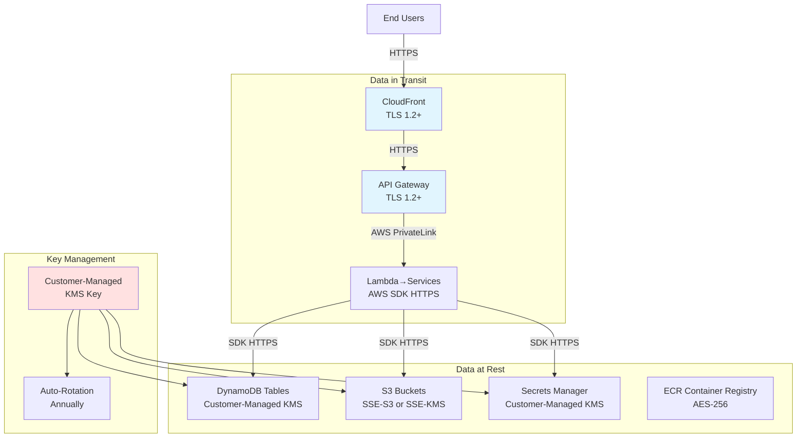

# Encryption and Data Protection

**Document Version:** 1.0
**Date:** 2026-02-03
**Hub Account:** 568672915267 (InnovationSandboxHub)

---

## Executive Summary

The NDX:Try AWS infrastructure implements encryption at rest and in transit across all data storage layers. This document catalogs encryption configurations for S3, DynamoDB, Secrets Manager, and network communications, with a focus on KMS key usage and TLS enforcement.

**Key Encryption Controls:**
- **DynamoDB:** Customer-managed KMS encryption for all tables
- **S3:** Server-side encryption (SSE-S3 or SSE-KMS)
- **Secrets Manager:** Customer-managed KMS encryption
- **TLS:** Enforced for all API and web traffic
- **KMS Key Management:** Centralized customer-managed keys with rotation

---

## Encryption Architecture Overview



---

## 1. DynamoDB Encryption

### Encryption Configuration

All DynamoDB tables use customer-managed KMS encryption:

**CDK Configuration (`isb-data-resources.ts`):**
```typescript
const table = new Table(scope, 'SandboxAccountTable', {
  partitionKey: { name: 'awsAccountId', type: AttributeType.STRING },
  billingMode: BillingMode.PAY_PER_REQUEST,
  pointInTimeRecoverySpecification: { pointInTimeRecoveryEnabled: true },
  deletionProtection: !devMode,
  removalPolicy: tableRemovalPolicy,
  encryptionKey: this.tableKmsKey,
  encryption: TableEncryption.CUSTOMER_MANAGED,
});
```

### DynamoDB Tables

| Table Name | Purpose | Encryption Key | PITR Enabled |
|-----------|---------|----------------|--------------|
| `SandboxAccountTable` | Pool account metadata | Customer KMS | Yes |
| `LeaseTable` | Active and historical leases | Customer KMS | Yes |
| `LeaseTemplateTable` | Scenario templates | Customer KMS | Yes |

**Key ARN:** Retrieved via `IsbKmsKeys.get(scope, namespace)`

### Encryption Features

**At Rest:**
- All table data encrypted with customer-managed KMS key
- Indexes encrypted with same key
- Backups encrypted with same key

**Point-in-Time Recovery:**
- Enabled on all tables (production)
- Continuous backups for 35 days
- Restore to any point within retention period

**Deletion Protection:**
- Enabled in production (`deletionProtection: !devMode`)
- Requires manual override to delete
- Prevents accidental table deletion

---

## 2. S3 Bucket Encryption

### Encryption Types

#### SSE-S3 (AWS-Managed Keys)

**Used for:**
- Static website assets (NDX website)
- CloudFormation templates
- CDK asset buckets
- Log buckets (non-sensitive)

**Configuration:**
```typescript
const bucket = new s3.Bucket(scope, 'StaticWebsiteBucket', {
  encryption: s3.BucketEncryption.S3_MANAGED,
  enforceSSL: true,
});
```

#### SSE-KMS (Customer-Managed Keys)

**Used for:**
- Cost reports (sensitive billing data)
- Log archives (long-term retention)
- Backup data
- Sensitive operational data

**Configuration (`lease-costs-storage.ts`):**
```typescript
const bucket = new s3.Bucket(scope, 'LeaseCostsBucket', {
  encryption: s3.BucketEncryption.KMS,
  encryptionKey: kmsKey,
  enforceSSL: true,
  versioned: true,
  lifecycleRules: [
    {
      transitions: [
        {
          storageClass: s3.StorageClass.INTELLIGENT_TIERING,
          transitionAfter: Duration.days(30),
        },
      ],
      expiration: Duration.days(1095), // 3 years
    },
  ],
});
```

### S3 Bucket Inventory

| Bucket Purpose | Encryption | Versioning | Lifecycle |
|---------------|-----------|------------|-----------|
| ISB UI Assets | SSE-S3 | No | None |
| NDX Static Website | SSE-S3 | No | None |
| Cost Reports | SSE-KMS | Yes | 3-year retention |
| CloudWatch Logs Archive | SSE-KMS | No | 7-year retention |
| CDK Assets | SSE-S3 | No | 30-day expiry |
| Account Cleanup Logs | SSE-S3 | No | 90-day expiry |

### Bucket Policies

**Enforce SSL/TLS:**
```json
{
  "Version": "2012-10-17",
  "Statement": [
    {
      "Sid": "DenyInsecureTransport",
      "Effect": "Deny",
      "Principal": "*",
      "Action": "s3:*",
      "Resource": [
        "arn:aws:s3:::bucket-name",
        "arn:aws:s3:::bucket-name/*"
      ],
      "Condition": {
        "Bool": {
          "aws:SecureTransport": "false"
        }
      }
    }
  ]
}
```

**CDK Implementation:**
```typescript
bucket.addToResourcePolicy(new iam.PolicyStatement({
  effect: iam.Effect.DENY,
  principals: [new iam.AnyPrincipal()],
  actions: ['s3:*'],
  resources: [bucket.bucketArn, `${bucket.bucketArn}/*`],
  conditions: {
    Bool: { 'aws:SecureTransport': 'false' },
  },
}));
```

---

## 3. KMS Key Management

### Customer-Managed Keys

**ISB Data Encryption Key:**

| Property | Value |
|----------|-------|
| **Alias** | `alias/isb-data-encryption-key` |
| **Usage** | DynamoDB tables, Secrets Manager |
| **Rotation** | Automatic annual rotation |
| **Deletion** | 30-day pending deletion window |
| **Key Policy** | Service-specific access |

**CDK Configuration (`kms.ts`):**
```typescript
export class IsbKmsKeys {
  static get(scope: Construct, namespace: string): Key {
    const key = new Key(scope, 'IsbDataKey', {
      alias: `isb-data-encryption-key`,
      description: `Encryption key for Innovation Sandbox data (${namespace})`,
      enableKeyRotation: true,
      removalPolicy: RemovalPolicy.RETAIN,
    });

    // Grant DynamoDB service access
    key.grantEncryptDecrypt(new ServicePrincipal('dynamodb.amazonaws.com'));

    // Grant Secrets Manager access
    key.grantEncryptDecrypt(new ServicePrincipal('secretsmanager.amazonaws.com'));

    return key;
  }
}
```

### Key Policies

**DynamoDB Access:**
```json
{
  "Sid": "Allow DynamoDB to use the key",
  "Effect": "Allow",
  "Principal": {
    "Service": "dynamodb.amazonaws.com"
  },
  "Action": [
    "kms:Decrypt",
    "kms:DescribeKey",
    "kms:CreateGrant"
  ],
  "Resource": "*",
  "Condition": {
    "StringEquals": {
      "kms:ViaService": "dynamodb.us-west-2.amazonaws.com"
    }
  }
}
```

**Lambda Function Access:**
```json
{
  "Sid": "Allow Lambda functions to decrypt",
  "Effect": "Allow",
  "Principal": {
    "AWS": "arn:aws:iam::568672915267:role/LambdaExecutionRole"
  },
  "Action": [
    "kms:Decrypt",
    "kms:DescribeKey"
  ],
  "Resource": "*"
}
```

### Key Rotation

**Automatic Rotation:**
- Enabled for all customer-managed keys
- Rotation period: 365 days
- AWS manages old key material (not deleted)
- Decryption works with old and new keys

**Manual Rotation Process (if needed):**
1. Create new KMS key
2. Update alias to point to new key
3. Decrypt data with old key
4. Re-encrypt data with new key
5. Schedule old key deletion (30 days)

---

## 4. Secrets Manager Encryption

### Secrets Inventory

| Secret Name | Purpose | Encryption Key | Rotation |
|------------|---------|----------------|----------|
| `/isb/ndx-try-isb/Auth/JwtSecret` | API JWT signing key | Customer KMS | 30 days |
| `/isb/ndx-try-isb/Auth/IdpCert` | SAML IdP certificate | Customer KMS | Manual |
| `github-token` | GitHub API token (scenarios) | AWS-Managed | Manual |
| `notify-api-key` | GOV.UK Notify API key | Customer KMS | Manual |

**CDK Configuration (`auth-api.ts`):**
```typescript
const jwtTokenSecret = new Secret(scope, 'JwtSecret', {
  secretName: `${SECRET_NAME_PREFIX}/${props.namespace}/Auth/JwtSecret`,
  description: 'The secret for JWT used by Innovation Sandbox',
  encryptionKey: kmsKey,
  generateSecretString: {
    passwordLength: 32,
  },
});

jwtTokenSecret.addRotationSchedule('RotationSchedule', {
  rotationLambda: jwtSecretRotatorLambda.lambdaFunction,
  automaticallyAfter: Duration.days(30),
  rotateImmediatelyOnUpdate: true,
});
```

### Secret Access Pattern

**Lambda Function Access:**
```typescript
import { GetSecretValueCommand, SecretsManagerClient } from '@aws-sdk/client-secrets-manager';

const client = new SecretsManagerClient({ region: 'us-west-2' });
const response = await client.send(new GetSecretValueCommand({
  SecretId: '/isb/ndx-try-isb/Auth/JwtSecret',
}));
const secret = response.SecretString;
```

**IAM Permissions Required:**
```json
{
  "Version": "2012-10-17",
  "Statement": [
    {
      "Effect": "Allow",
      "Action": [
        "secretsmanager:GetSecretValue",
        "secretsmanager:DescribeSecret"
      ],
      "Resource": "arn:aws:secretsmanager:us-west-2:568672915267:secret:/isb/ndx-try-isb/Auth/JwtSecret-*"
    },
    {
      "Effect": "Allow",
      "Action": [
        "kms:Decrypt",
        "kms:DescribeKey"
      ],
      "Resource": "arn:aws:kms:us-west-2:568672915267:key/<key-id>"
    }
  ]
}
```

---

## 5. TLS/SSL Configuration

### CloudFront Distribution

**TLS Settings:**
- **Minimum TLS Version:** TLS 1.2
- **SSL Certificate:** AWS Certificate Manager (ACM)
- **Cipher Suite:** TLSv1.2_2021
- **HSTS:** Enabled (Strict-Transport-Security header)

**CDK Configuration (`cloudfront-ui-api.ts`):**
```typescript
const distribution = new cloudfront.Distribution(scope, 'Distribution', {
  defaultBehavior: {
    origin: new origins.S3Origin(bucket),
    viewerProtocolPolicy: cloudfront.ViewerProtocolPolicy.REDIRECT_TO_HTTPS,
    allowedMethods: cloudfront.AllowedMethods.ALLOW_GET_HEAD,
    cachedMethods: cloudfront.CachedMethods.CACHE_GET_HEAD,
  },
  domainNames: ['isb.try.ndx.digital.cabinet-office.gov.uk'],
  certificate: certificate,
  minimumProtocolVersion: cloudfront.SecurityPolicyProtocol.TLS_V1_2_2021,
  httpVersion: cloudfront.HttpVersion.HTTP2_AND_3,
});
```

**Response Headers:**
```
Strict-Transport-Security: max-age=31536000; includeSubDomains
X-Content-Type-Options: nosniff
X-Frame-Options: DENY
X-XSS-Protection: 1; mode=block
Content-Security-Policy: default-src 'self'
```

### API Gateway

**TLS Settings:**
- **Minimum TLS Version:** TLS 1.2
- **Endpoint Type:** Regional
- **Custom Domain:** ACM certificate
- **Client Certificates:** Not used (OIDC/JWT authentication)

**CDK Configuration (`rest-api-all.ts`):**
```typescript
const api = new apigateway.RestApi(scope, 'IsbRestApi', {
  restApiName: 'Innovation Sandbox API',
  description: 'API for Innovation Sandbox operations',
  deployOptions: {
    stageName: 'prod',
    tracingEnabled: true,
    loggingLevel: apigateway.MethodLoggingLevel.INFO,
  },
  endpointConfiguration: {
    types: [apigateway.EndpointType.REGIONAL],
  },
  policy: new iam.PolicyDocument({
    statements: [
      new iam.PolicyStatement({
        effect: iam.Effect.ALLOW,
        principals: [new iam.AnyPrincipal()],
        actions: ['execute-api:Invoke'],
        resources: ['execute-api:/*'],
        conditions: {
          StringEquals: { 'aws:SecureTransport': 'true' },
        },
      }),
    ],
  }),
});
```

### Lambda to AWS Services

**AWS SDK HTTPS:**
- All AWS SDK calls use HTTPS by default
- Certificate validation enabled
- TLS 1.2+ enforced

**Example (DynamoDB Client):**
```typescript
import { DynamoDBClient } from '@aws-sdk/client-dynamodb';

const client = new DynamoDBClient({
  region: 'us-west-2',
  // HTTPS is default, no explicit configuration needed
});
```

---

## 6. Encryption Summary Tables

### Encryption at Rest Summary

| Service | Data Type | Encryption Method | Key Type | Rotation |
|---------|-----------|-------------------|----------|----------|
| DynamoDB | All tables | SSE | Customer-managed KMS | Annual |
| S3 (sensitive) | Cost reports, logs | SSE-KMS | Customer-managed KMS | Annual |
| S3 (static assets) | Website files | SSE-S3 | AWS-managed | N/A |
| Secrets Manager | Secrets | SSE | Customer-managed KMS | 30 days (JWT) |
| ECR | Container images | AES-256 | AWS-managed | N/A |
| CloudWatch Logs | Application logs | AES-256 | AWS-managed | N/A |
| EBS Volumes | Lambda temp storage | EBS Encryption | AWS-managed | N/A |

### Encryption in Transit Summary

| Connection | Protocol | TLS Version | Certificate Authority |
|-----------|----------|-------------|----------------------|
| User → CloudFront | HTTPS | TLS 1.2+ | ACM |
| User → API Gateway | HTTPS | TLS 1.2+ | ACM |
| CloudFront → S3 | HTTPS | TLS 1.2+ | AWS Internal |
| API Gateway → Lambda | AWS PrivateLink | N/A | N/A |
| Lambda → DynamoDB | HTTPS | TLS 1.2+ | AWS SDK |
| Lambda → S3 | HTTPS | TLS 1.2+ | AWS SDK |
| Lambda → Secrets Manager | HTTPS | TLS 1.2+ | AWS SDK |
| GitHub Actions → AWS | HTTPS (OIDC) | TLS 1.2+ | Public CA |

---

## 7. Compliance and Best Practices

### NCSC Cloud Security Principles Alignment

| Principle | Implementation |
|-----------|----------------|
| **Data in Transit Protection** | TLS 1.2+ for all connections |
| **Data at Rest Protection** | KMS encryption for sensitive data |
| **Data Deletion** | S3 lifecycle policies, DynamoDB TTL |
| **Cryptographic Key Management** | AWS KMS with automatic rotation |

### NIST Cybersecurity Framework Alignment

| Category | Implementation |
|----------|----------------|
| **PR.DS-1: Data-at-rest protection** | Customer-managed KMS for DynamoDB, S3, Secrets |
| **PR.DS-2: Data-in-transit protection** | TLS 1.2+ for all network communication |
| **PR.DS-5: Protections against data leaks** | S3 bucket policies deny non-SSL |
| **PR.AC-1: Identity management** | KMS key policies limit access |

### Best Practices Implemented

**Encryption:**
- [x] Customer-managed KMS keys for sensitive data
- [x] Automatic key rotation enabled
- [x] Separate keys per environment (if multi-env)
- [x] KMS key deletion protection (30-day window)

**TLS/SSL:**
- [x] TLS 1.2 minimum enforced
- [x] HSTS headers configured
- [x] CloudFront uses latest security policy
- [x] S3 denies non-HTTPS access

**Secrets Management:**
- [x] Secrets stored in Secrets Manager (not environment variables)
- [x] Automatic rotation for critical secrets
- [x] KMS encryption for all secrets
- [x] Least-privilege IAM access

---

## 8. Encryption Gaps and Recommendations

### Current Gaps

1. **CloudWatch Logs Encryption**
   - **Current:** AWS-managed encryption
   - **Recommendation:** Customer-managed KMS for sensitive logs
   - **Impact:** Enhanced control over log access

2. **EBS Volume Encryption**
   - **Current:** Default AWS-managed encryption
   - **Recommendation:** Customer-managed KMS for Lambda storage
   - **Impact:** Consistent key management

3. **S3 Bucket Key**
   - **Current:** Not enabled
   - **Recommendation:** Enable S3 Bucket Keys to reduce KMS costs
   - **Impact:** 99% reduction in KMS API calls

### Future Enhancements

1. **Field-Level Encryption**
   - Encrypt PII fields at application layer
   - Use AWS Encryption SDK
   - Store encryption context in DynamoDB

2. **Envelope Encryption**
   - Implement for large data objects
   - Reduce KMS API calls
   - Improve performance

3. **Key Versioning Tracking**
   - Track which KMS key version encrypted each record
   - Automate re-encryption with new key versions
   - Improve security posture

---

## Related Documents

- [60-auth-architecture.md](./60-auth-architecture.md) - Authentication and JWT
- [62-secrets-management.md](./62-secrets-management.md) - Secrets architecture
- [63-compliance.md](./63-compliance.md) - Security controls

---

**Source Files:**
- DynamoDB: `/Users/cns/httpdocs/cddo/ndx-try-arch/repos/innovation-sandbox-on-aws/source/infrastructure/lib/isb-data-resources.ts`
- S3 Costs: `/Users/cns/httpdocs/cddo/ndx-try-arch/repos/innovation-sandbox-on-aws-costs/infra/lib/constructs/lease-costs-storage.ts`
- KMS Keys: `/Users/cns/httpdocs/cddo/ndx-try-arch/repos/innovation-sandbox-on-aws/source/infrastructure/lib/components/kms.ts`
- Secrets: `/Users/cns/httpdocs/cddo/ndx-try-arch/repos/innovation-sandbox-on-aws/source/infrastructure/lib/components/api/auth-api.ts`
- CloudFront: `/Users/cns/httpdocs/cddo/ndx-try-arch/repos/innovation-sandbox-on-aws/source/infrastructure/lib/components/cloudfront/cloudfront-ui-api.ts`
