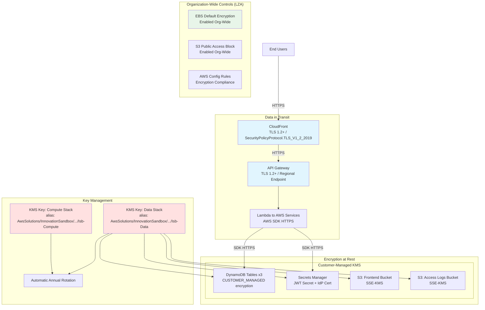

# Encryption

> **Last Updated**: 2026-03-02
> **Sources**: `innovation-sandbox-on-aws` (kms.ts, isb-data-resources.ts, cloudfront-ui-api.ts, auth-api.ts, rest-api-all.ts), `innovation-sandbox-on-aws-costs`, `ndx-try-aws-lza` (security-config.yaml)

## Executive Summary

The NDX:Try AWS platform enforces encryption at rest using customer-managed AWS KMS keys for all sensitive data stores (DynamoDB, Secrets Manager, S3 frontend and logging buckets) and encryption in transit using TLS 1.2+ across all network paths. KMS keys are per-stack singletons with automatic annual rotation enabled, and S3 buckets universally enforce SSL via bucket policies. The Landing Zone Accelerator additionally enforces EBS default volume encryption and S3 public access blocks across the entire organization.

---

## Encryption Architecture Overview


```mermaid
flowchart TB
    subgraph "Encryption at Rest"
        subgraph "Customer-Managed KMS"
            dynamodb[DynamoDB Tables x3<br/>CUSTOMER_MANAGED encryption]
            secrets[Secrets Manager<br/>JWT Secret + IdP Cert]
            s3_fe[S3: Frontend Bucket<br/>SSE-KMS]
            s3_logs[S3: Access Logs Bucket<br/>SSE-KMS]
        end
    end

    subgraph "Data in Transit"
        cloudfront[CloudFront<br/>TLS 1.2+ / SecurityPolicyProtocol.TLS_V1_2_2019]
        apigw[API Gateway<br/>TLS 1.2+ / Regional Endpoint]
        lambda_sdk[Lambda to AWS Services<br/>AWS SDK HTTPS]
    end

    subgraph "Key Management"
        kms_data[KMS Key: Data Stack<br/>alias: AwsSolutions/InnovationSandbox/.../Isb-Data]
        kms_compute[KMS Key: Compute Stack<br/>alias: AwsSolutions/InnovationSandbox/.../Isb-Compute]
        kms_rotation[Automatic Annual Rotation]
    end

    subgraph "Organization-Wide Controls (LZA)"
        ebs_enc[EBS Default Encryption<br/>Enabled Org-Wide]
        s3_block[S3 Public Access Block<br/>Enabled Org-Wide]
        config_rules[AWS Config Rules<br/>Encryption Compliance]
    end

    kms_data --> dynamodb
    kms_data --> secrets
    kms_data --> s3_fe
    kms_data --> s3_logs
    kms_data --> kms_rotation
    kms_compute --> kms_rotation

    users[End Users] -->|HTTPS| cloudfront
    cloudfront -->|HTTPS| apigw
    apigw --> lambda_sdk
    lambda_sdk -->|SDK HTTPS| dynamodb
    lambda_sdk -->|SDK HTTPS| secrets

    style kms_data fill:#ffe1e1
    style kms_compute fill:#ffe1e1
    style cloudfront fill:#e1f5fe
    style apigw fill:#e1f5fe
    style ebs_enc fill:#e8f5e9
```

---

## 1. KMS Key Management

### Key Architecture

The ISB uses a singleton pattern for KMS keys, creating one key per CDK stack per namespace:

```typescript
export class IsbKmsKeys {
  private static instances: { [key: string]: Key } = {};
  public static get(scope: Construct, namespace: string, keyId?: string): Key {
    const isbKeyId = keyId ?? Stack.of(scope).stackName;
    if (!IsbKmsKeys.instances[isbKeyId]) {
      IsbKmsKeys.instances[isbKeyId] = new Key(Stack.of(scope), `IsbKmsKey-${isbKeyId}`, {
        enableKeyRotation: true,
        description: `Encryption Key for Innovation Sandbox: ${isbKeyId}`,
        alias: `AwsSolutions/InnovationSandbox/${namespace}/${isbKeyId}`,
        removalPolicy: isDevMode(scope) ? RemovalPolicy.DESTROY : RemovalPolicy.RETAIN,
      });
    }
    return IsbKmsKeys.instances[isbKeyId]!;
  }
}
```

**Source**: `infrastructure/lib/components/kms.ts`

### Key Properties

| Property | Value |
|----------|-------|
| **Alias Pattern** | `AwsSolutions/InnovationSandbox/<namespace>/<stackName>` |
| **Automatic Rotation** | Enabled (annual, managed by AWS) |
| **Removal Policy** | RETAIN in production, DESTROY in dev mode |
| **Description** | `Encryption Key for Innovation Sandbox: <stackName>` |

### Key Grants

KMS key policies grant access to specific AWS services and IAM principals:

| Grantee | Actions | Context |
|---------|---------|---------|
| SSO Handler Lambda | `kms:Encrypt`, `kms:Decrypt` | JWT/IdP cert decryption |
| Authorizer Lambda | `kms:Encrypt`, `kms:Decrypt` | JWT secret decryption |
| `logs.amazonaws.com` | `kms:Encrypt`, `kms:Decrypt`, `kms:GenerateDataKey*` | CloudWatch log encryption |
| `delivery.logs.amazonaws.com` | `kms:Encrypt`, `kms:Decrypt`, `kms:GenerateDataKey*` | CloudFront access log delivery |
| `cloudfront.amazonaws.com` | `s3:GetObject` (via bucket policy) | Origin access to encrypted S3 |

---

## 2. DynamoDB Encryption

All three DynamoDB tables use customer-managed KMS encryption with point-in-time recovery:

| Table | Partition Key | Sort Key | Encryption | PITR | Deletion Protection |
|-------|---------------|----------|------------|------|---------------------|
| `SandboxAccountTable` | `awsAccountId` (S) | - | CUSTOMER_MANAGED KMS | Yes | Yes (prod) |
| `LeaseTemplateTable` | `uuid` (S) | - | CUSTOMER_MANAGED KMS | Yes | Yes (prod) |
| `LeaseTable` | `userEmail` (S) | `uuid` (S) | CUSTOMER_MANAGED KMS | Yes | Yes (prod) |

**CDK Configuration**:
```typescript
new Table(scope, 'SandboxAccountTable', {
  encryptionKey: this.tableKmsKey,
  encryption: TableEncryption.CUSTOMER_MANAGED,
  pointInTimeRecoverySpecification: { pointInTimeRecoveryEnabled: true },
  deletionProtection: !devMode,
  billingMode: BillingMode.PAY_PER_REQUEST,
});
```

**Encryption Coverage**:
- All table data, indexes (including GSI `StatusIndex` on LeaseTable), and backups are encrypted with the same customer-managed key
- Point-in-time recovery provides continuous backups for 35 days
- The `tableKmsKeyId` is shared via SSM Parameter Store for cross-stack access

**Source**: `isb-data-resources.ts` lines 43-84

---

## 3. S3 Bucket Encryption

### Frontend Bucket

| Property | Value |
|----------|-------|
| **Encryption** | `BucketEncryption.KMS` (customer-managed) |
| **Block Public Access** | `BLOCK_ALL` |
| **Enforce SSL** | `true` |
| **Versioning** | Enabled |
| **Object Ownership** | `OBJECT_WRITER` |

**Source**: `cloudfront-ui-api.ts` lines 100-111

### Access Logs Bucket

| Property | Value |
|----------|-------|
| **Encryption** | `BucketEncryption.KMS` (customer-managed) |
| **Block Public Access** | `BLOCK_ALL` |
| **Enforce SSL** | `true` |
| **Versioning** | Disabled (access logs do not need versioning) |
| **Lifecycle** | Transition to Glacier after configurable days; expiry after configurable retention |

**Source**: `cloudfront-ui-api.ts` lines 113-144

### SSL Enforcement

All S3 buckets set `enforceSSL: true` in CDK, which automatically adds a bucket policy statement denying any `s3:*` action when `aws:SecureTransport` is `false`. This ensures that all access to bucket contents occurs over HTTPS.

---

## 4. Secrets Manager Encryption

All secrets in AWS Secrets Manager are encrypted with the same customer-managed KMS key used by DynamoDB:

| Secret | Encryption |
|--------|-----------|
| `/isb/<namespace>/Auth/JwtSecret` | Customer-managed KMS |
| `/isb/<namespace>/Auth/IdpCert` | Customer-managed KMS |

The KMS key is passed explicitly to the `Secret` construct:

```typescript
const jwtTokenSecret = new Secret(scope, "JwtSecret", {
  encryptionKey: kmsKey,
  generateSecretString: { passwordLength: 32 },
});
```

**Source**: `auth-api.ts` lines 45-55

---

## 5. TLS / Transport Encryption

### CloudFront Distribution

| Property | Value |
|----------|-------|
| **Minimum Protocol Version** | `SecurityPolicyProtocol.TLS_V1_2_2019` |
| **Viewer Protocol Policy** | `REDIRECT_TO_HTTPS` |
| **HTTP Version** | HTTP/2 |
| **IPv6** | Disabled |

**Source**: `cloudfront-ui-api.ts` lines 274-314

### Security Response Headers

CloudFront adds the following security headers to all responses:

| Header | Value |
|--------|-------|
| **Strict-Transport-Security** | `max-age=46656000; includeSubDomains` (540 days) |
| **X-Content-Type-Options** | `nosniff` |
| **X-Frame-Options** | `DENY` |
| **Referrer-Policy** | `no-referrer` |
| **Content-Security-Policy** | `upgrade-insecure-requests; default-src 'none'; script-src 'self'; style-src 'self'; img-src 'self' data:; font-src 'self' data:; connect-src 'self'; manifest-src 'self'; frame-ancestors 'none'; base-uri 'none'; object-src 'none'` |
| **Cache-Control** | `no-store, no-cache` |

**Source**: `cloudfront-ui-api.ts` lines 160-208

### API Gateway

| Property | Value |
|----------|-------|
| **Minimum TLS Version** | TLS 1.2 (AWS default for regional endpoints) |
| **Tracing** | Enabled (X-Ray) |
| **Throttling** | Configurable rate and burst limits via CDK context |

### Lambda to AWS Services

All Lambda functions use the AWS SDK v3, which enforces HTTPS by default for all service API calls. No custom transport configuration is needed.

---

## 6. Organization-Wide Encryption Controls (LZA)

The Landing Zone Accelerator enforces encryption controls across the entire AWS Organization:

### EBS Default Encryption

```yaml
ebsDefaultVolumeEncryption:
  enable: true
  excludeRegions: []
```

All EBS volumes created in any account are encrypted by default.

### S3 Public Access Block

```yaml
s3PublicAccessBlock:
  enable: true
  excludeAccounts: []
```

Public access is blocked at the account level for all accounts in the organization.

### AWS Config Rules for Encryption

The LZA deploys Config rules that check encryption compliance:

| Config Rule | Resource Type | Purpose |
|-------------|---------------|---------|
| `dynamodb-table-encrypted-kms` | `AWS::DynamoDB::Table` | Verifies DynamoDB tables use KMS encryption |
| `secretsmanager-using-cmk` | `AWS::SecretsManager::Secret` | Verifies secrets use customer-managed keys |
| `codebuild-project-artifact-encryption` | `AWS::CodeBuild::Project` | Verifies CodeBuild artifact encryption |
| `backup-recovery-point-encrypted` | `AWS::Backup::RecoveryPoint` | Verifies backup encryption |
| `sagemaker-endpoint-configuration-kms-key-configured` | SageMaker | Verifies KMS key on endpoints |
| `sagemaker-notebook-instance-kms-key-configured` | SageMaker | Verifies KMS key on notebooks |
| `cloudwatch-log-group-encrypted` | CloudWatch | Verifies log group encryption |

**Source**: `ndx-try-aws-lza/security-config.yaml` lines 127-267

---

## 7. Encryption Boundary Summary

### Encryption at Rest

| Service | Data Type | Method | Key Type | Rotation |
|---------|-----------|--------|----------|----------|
| DynamoDB | All 3 tables + GSIs + backups | SSE (CUSTOMER_MANAGED) | Customer-managed KMS | Annual (auto) |
| S3 (Frontend) | Static UI assets | SSE-KMS | Customer-managed KMS | Annual (auto) |
| S3 (Logs) | CloudFront access logs | SSE-KMS | Customer-managed KMS | Annual (auto) |
| Secrets Manager | JWT secret, IdP cert | SSE | Customer-managed KMS | Annual (key) / 30 days (JWT value) |
| EBS Volumes | All volumes org-wide | Default encryption | AWS-managed or account default | N/A |
| CloudWatch Logs | Application logs | AES-256 or KMS | AWS-managed by default | N/A |

### Encryption in Transit

| Connection | Protocol | TLS Version | Certificate |
|-----------|----------|-------------|-------------|
| User to CloudFront | HTTPS | TLS 1.2+ | ACM or CloudFront default |
| CloudFront to S3 | HTTPS (OAC with SigV4) | TLS 1.2+ | AWS internal |
| CloudFront to API Gateway | HTTPS | TLS 1.2+ | AWS internal |
| API Gateway to Lambda | AWS internal | N/A | N/A |
| Lambda to DynamoDB | HTTPS | TLS 1.2+ | AWS SDK |
| Lambda to Secrets Manager | HTTPS | TLS 1.2+ | AWS SDK |
| Lambda to SSM | HTTPS | TLS 1.2+ | AWS SDK |
| GitHub Actions to AWS | HTTPS (OIDC/STS) | TLS 1.2+ | Public CA |

---

## Related Documents

- [05-service-control-policies.md](./05-service-control-policies.md) - SCP guardrails enforcing encryption
- [10-isb-core-architecture.md](./10-isb-core-architecture.md) - DynamoDB schema and Lambda architecture
- [60-auth-architecture.md](./60-auth-architecture.md) - JWT and SAML authentication using encrypted secrets
- [62-secrets-management.md](./62-secrets-management.md) - Secrets Manager encryption details
- [40-lza-configuration.md](./40-lza-configuration.md) - LZA security configuration

---
*Generated from source analysis. See [00-repo-inventory.md](./00-repo-inventory.md) for full inventory.*
