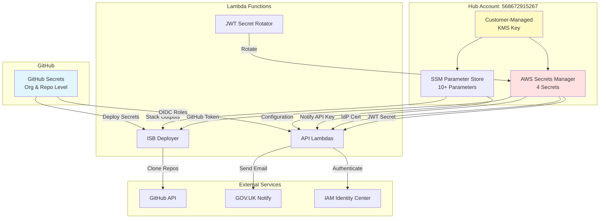

# Secrets Management

**Document Version:** 1.0
**Date:** 2026-02-03
**Hub Account:** 568672915267 (InnovationSandboxHub)

---

## Executive Summary

The NDX:Try AWS infrastructure uses a combination of AWS Secrets Manager, SSM Parameter Store, and GitHub Secrets for managing sensitive configuration data. This document catalogs all secrets, their storage locations, access patterns, rotation strategies, and naming conventions.

**Key Findings:**
- **Secrets Manager:** 4 secrets (JWT, IdP cert, API keys)
- **SSM Parameter Store:** 10+ parameters (configuration sharing)
- **GitHub Secrets:** 15+ secrets across 6 repositories
- **Rotation:** Automated for JWT (30 days), manual for certificates
- **Encryption:** Customer-managed KMS keys for all sensitive data

---

## Secrets Management Architecture



---

## 1. AWS Secrets Manager

### Secrets Inventory

| Secret Name | Purpose | Rotation | Created By | Encryption |
|------------|---------|----------|-----------|------------|
| `/isb/ndx-try-isb/Auth/JwtSecret` | JWT token signing key | 30 days (auto) | CDK | Customer KMS |
| `/isb/ndx-try-isb/Auth/IdpCert` | SAML IdP X.509 certificate | Manual | CDK | Customer KMS |
| `github-token-scenarios` | GitHub API token for scenarios repo | Manual | Manual | Customer KMS |
| `notify-api-key-prod` | GOV.UK Notify API key | Manual | Manual | Customer KMS |

### Secret Details

#### JWT Secret

**Full Name:** `/isb/ndx-try-isb/Auth/JwtSecret`

**Purpose:** Signing and verifying JWT tokens for ISB API authentication

**Format:** 32-character alphanumeric string

**CDK Configuration:**
```typescript
const jwtTokenSecret = new Secret(scope, 'JwtSecret', {
  secretName: `${SECRET_NAME_PREFIX}/${props.namespace}/Auth/JwtSecret`,
  description: 'The secret for JWT used by Innovation Sandbox',
  encryptionKey: kmsKey,
  generateSecretString: {
    passwordLength: 32,
  },
});
```

**Rotation Configuration:**
```typescript
jwtTokenSecret.addRotationSchedule('RotationSchedule', {
  rotationLambda: jwtSecretRotatorLambda.lambdaFunction,
  automaticallyAfter: Duration.days(30),
  rotateImmediatelyOnUpdate: true,
});
```

**Rotation Lambda:** `JwtSecretRotatorFunction`

**Rotation Process:**
1. Generate new 32-character secret
2. Store as AWSPENDING version
3. Test JWT generation and validation
4. Promote to AWSCURRENT
5. Deprecate AWSPREVIOUS

**Access Pattern:**
```typescript
import { GetSecretValueCommand, SecretsManagerClient } from '@aws-sdk/client-secrets-manager';

const client = new SecretsManagerClient({ region: 'us-west-2' });
const response = await client.send(new GetSecretValueCommand({
  SecretId: '/isb/ndx-try-isb/Auth/JwtSecret',
}));
const secret = response.SecretString;
```

**Accessed By:**
- Lambda Authorizer (JWT validation)
- SSO Handler Lambda (JWT generation)

---

#### IdP Certificate

**Full Name:** `/isb/ndx-try-isb/Auth/IdpCert`

**Purpose:** SAML IdP X.509 certificate for validating SAML assertions

**Format:** PEM-encoded X.509 certificate

**CDK Configuration:**
```typescript
const idpCertSecret = new Secret(scope, 'IdpCert', {
  secretName: `${SECRET_NAME_PREFIX}/${props.namespace}/Auth/IdpCert`,
  description: 'IAM Identity Center Certificate of the ISB SAML 2.0 custom app',
  encryptionKey: kmsKey,
  secretStringValue: SecretValue.unsafePlainText(
    'Please paste the IAM Identity Center Certificate of the ' +
    'Innovation Sandbox SAML 2.0 custom application here'
  ),
});
```

**Rotation:** Manual (when IdP certificate rotates)

**Manual Update Process:**
1. Download new IdP metadata from IAM Identity Center
2. Extract X.509 certificate from metadata
3. Update Secrets Manager secret via AWS Console or CLI
4. Test SAML authentication

**AWS CLI Update:**
```bash
aws secretsmanager update-secret \
  --secret-id /isb/ndx-try-isb/Auth/IdpCert \
  --secret-string "$(cat new-certificate.pem)" \
  --profile NDX/InnovationSandboxHub
```

**Accessed By:**
- SSO Handler Lambda (SAML signature validation)

---

#### GitHub Token (Scenarios)

**Full Name:** `github-token-scenarios` (or similar)

**Purpose:** GitHub API token for cloning scenario repositories in deployer Lambda

**Format:** GitHub Personal Access Token (classic or fine-grained)

**Permissions Required:**
- `repo` scope (read repository contents)
- Access to `co-cddo/ndx_try_aws_scenarios` repository

**Rotation:** Manual (GitHub recommends 90 days)

**Accessed By:**
- ISB Deployer Lambda (sparse clone of scenarios)

---

#### GOV.UK Notify API Key

**Full Name:** `notify-api-key-prod`

**Purpose:** GOV.UK Notify API key for sending lease approval/termination emails

**Format:** `notify-api-key-xxxxx...`

**Rotation:** Manual (service-dependent)

**Accessed By:**
- Email Notification Lambda

---

### Secrets Manager Access Patterns

**Lambda Function IAM Policy:**
```json
{
  "Version": "2012-10-17",
  "Statement": [
    {
      "Effect": "Allow",
      "Action": [
        "secretsmanager:GetSecretValue",
        "secretsmanager:DescribeSecret"
      ],
      "Resource": [
        "arn:aws:secretsmanager:us-west-2:568672915267:secret:/isb/ndx-try-isb/Auth/*"
      ]
    },
    {
      "Effect": "Allow",
      "Action": [
        "kms:Decrypt",
        "kms:DescribeKey"
      ],
      "Resource": "arn:aws:kms:us-west-2:568672915267:key/<key-id>"
    }
  ]
}
```

**CDK Helper Function:**
```typescript
// Grants Lambda access to specific secret
secret.grantRead(lambdaFunction);
```

---

## 2. SSM Parameter Store

### Parameter Types

**String Parameters:**
- Configuration values
- Stack outputs
- Non-sensitive settings

**StringList Parameters:**
- Not used in current architecture

**SecureString Parameters:**
- Sensitive configuration (KMS-encrypted)
- Less common (prefer Secrets Manager)

### Parameter Inventory

| Parameter Name | Type | Purpose | Created By |
|---------------|------|---------|-----------|
| `/isb/ndx-try-isb/data/config` | String | Data stack configuration JSON | CDK |
| `/isb/ndx-try-isb/idc/config` | String | Identity Center configuration JSON | CDK |
| `/isb/ndx-try-isb/accountpool/config` | String | Account pool configuration JSON | CDK |
| `/isb/ndx-try-isb/compute/api-url` | String | API Gateway URL | CDK |
| `/isb/ndx-try-isb/compute/cloudfront-url` | String | CloudFront distribution URL | CDK |
| `/github-actions/approver/role-arn` | String | Approver deployment role | Manual |
| `/github-actions/deployer/ecr-repo` | String | Deployer ECR repository | CDK |
| `/cdk/bootstrap/version` | String | CDK bootstrap version | CDK Bootstrap |

### Parameter Naming Convention

**Pattern:** `/{namespace}/{stack}/{parameter-name}`

**Examples:**
- `/isb/ndx-try-isb/data/config`
- `/isb/prod/compute/api-url`
- `/github-actions/approver/role-arn`

### Data Configuration Parameter

**Parameter Name:** `/isb/ndx-try-isb/data/config`

**CDK Configuration (`isb-data-resources.ts`):**
```typescript
new aws_ssm.StringParameter(scope, 'DataConfiguration', {
  parameterName: sharedDataSsmParamName(props.namespace),
  description: 'The configuration of the data stack of Innovation Sandbox',
  stringValue: JSON.stringify({
    configApplicationId: this.config.application.applicationId,
    configEnvironmentId: this.config.environment.environmentId,
    globalConfigConfigurationProfileId: this.config.globalConfigHostedConfiguration.configurationProfileId,
    nukeConfigConfigurationProfileId: this.config.nukeConfigHostedConfiguration.configurationProfileId,
    reportingConfigConfigurationProfileId: this.config.reportingConfigHostedConfiguration.configurationProfileId,
    accountTable: this.sandboxAccountTable.tableName,
    leaseTemplateTable: this.leaseTemplateTable.tableName,
    leaseTable: this.leaseTable.tableName,
    tableKmsKeyId: this.tableKmsKey.keyId,
    solutionVersion: getContextFromMapping(scope, 'version'),
    supportedSchemas: JSON.stringify(supportedSchemas),
  } satisfies DataConfig),
  simpleName: true,
});
```

**Purpose:** Share DynamoDB table names and AppConfig IDs across Lambda functions

**Access Pattern:**
```typescript
import { GetParameterCommand, SSMClient } from '@aws-sdk/client-ssm';

const ssmClient = new SSMClient({ region: 'us-west-2' });
const response = await ssmClient.send(new GetParameterCommand({
  Name: '/isb/ndx-try-isb/data/config',
}));
const config = JSON.parse(response.Parameter.Value);
const tableName = config.accountTable;
```

---

### SSM Parameter Access Patterns

**Lambda Function IAM Policy:**
```json
{
  "Version": "2012-10-17",
  "Statement": [
    {
      "Effect": "Allow",
      "Action": [
        "ssm:GetParameter",
        "ssm:GetParameters"
      ],
      "Resource": [
        "arn:aws:ssm:us-west-2:568672915267:parameter/isb/ndx-try-isb/*"
      ]
    }
  ]
}
```

**CDK Helper Function:**
```typescript
// Grant Lambda access to parameters with prefix
grantIsbSsmParameterRead(lambdaFunction, namespace);
```

---

## 3. GitHub Secrets

### Organization-Level Secrets

**Not used in current architecture** (all secrets are repository-scoped)

### Repository-Level Secrets

#### innovation-sandbox-on-aws-approver

| Secret Name | Purpose |
|------------|---------|
| (No secrets - uses OIDC only) | N/A |

**Note:** Role ARN is hardcoded in workflow file

---

#### innovation-sandbox-on-aws-billing-seperator

| Secret Name | Purpose |
|------------|---------|
| `AWS_ROLE_ARN` | IAM role for CDK deployment |

**Usage in Workflow:**
```yaml
- name: Configure AWS credentials via OIDC
  uses: aws-actions/configure-aws-credentials@v5
  with:
    role-to-assume: ${{ secrets.AWS_ROLE_ARN }}
    aws-region: ${{ vars.AWS_REGION || 'eu-west-2' }}
```

---

#### innovation-sandbox-on-aws-costs

| Secret Name | Purpose |
|------------|---------|
| `AWS_ROLE_ARN` | IAM role for CDK deployment |
| `COST_EXPLORER_ROLE_ARN` | Cross-account Cost Explorer access role |
| `ISB_LEASES_LAMBDA_ARN` | ISB Leases Lambda ARN for JWT validation |

**Usage in Workflow:**
```yaml
- name: CDK Deploy
  run: |
    npx cdk deploy --require-approval never \
      --context eventBusName=${{ vars.EVENT_BUS_NAME }} \
      --context costExplorerRoleArn=${{ secrets.COST_EXPLORER_ROLE_ARN }} \
      --context isbLeasesLambdaArn=${{ secrets.ISB_LEASES_LAMBDA_ARN }} \
      --context alertEmail=${{ vars.ALERT_EMAIL }}
```

---

#### innovation-sandbox-on-aws-deployer

| Secret Name | Purpose |
|------------|---------|
| `AWS_DEPLOY_ROLE_ARN` | IAM role for ECR/Lambda deployment |

---

#### ndx

| Secret Name | Purpose |
|------------|---------|
| `ISB_NDX_USERS_GROUP_ID` | Identity Center group ID for signup Lambda |

**Usage in Workflow:**
```yaml
- name: Deploy Cross-Account Role
  run: |
    aws cloudformation deploy \
      --template-file infra-signup/isb-cross-account-role.yaml \
      --stack-name ndx-signup-cross-account-role \
      --capabilities CAPABILITY_NAMED_IAM \
      --parameter-overrides GroupId=${{ secrets.ISB_NDX_USERS_GROUP_ID }}
```

---

#### ndx-try-aws-scp

| Secret Name | Purpose |
|------------|---------|
| `AWS_ROLE_ARN` | IAM role for Terraform deployment |
| `SLACK_BUDGET_ALERT_EMAIL` | Email for budget alerts (sent to Slack webhook) |

**Usage in Workflow:**
```yaml
env:
  TF_VAR_budget_alert_emails: ${{ secrets.SLACK_BUDGET_ALERT_EMAIL }}
```

---

### GitHub Secrets Management

**Creating a Secret:**
1. Navigate to repository → Settings → Secrets and variables → Actions
2. Click "New repository secret"
3. Enter name (UPPERCASE_WITH_UNDERSCORES)
4. Enter value (never logged)
5. Click "Add secret"

**Updating a Secret:**
1. Navigate to secret in repository settings
2. Click "Update secret"
3. Enter new value
4. Click "Update secret"

**Secret Rotation Best Practices:**
- Rotate AWS IAM role ARNs when role is recreated
- Rotate API keys every 90 days
- Rotate GitHub tokens every 90 days
- Update Identity Center group IDs when groups change

---

## 4. Environment Variables vs Secrets

### When to Use Secrets Manager

**Use Secrets Manager for:**
- API keys (JWT secret, Notify API key, GitHub tokens)
- Certificates (IdP X.509 certificate)
- Database passwords (if applicable)
- Anything that requires automatic rotation

**Benefits:**
- Automatic rotation with Lambda
- Versioning (AWSCURRENT, AWSPENDING, AWSPREVIOUS)
- KMS encryption at rest
- Fine-grained IAM access control
- CloudTrail audit logging

---

### When to Use SSM Parameter Store

**Use SSM Parameter Store for:**
- Configuration values (table names, URLs)
- Stack outputs (CloudFormation outputs)
- Non-sensitive settings (feature flags)
- Cross-stack references

**Benefits:**
- Free for standard parameters
- Version history
- Hierarchical naming
- Integration with CDK (cross-stack references)

---

### When to Use GitHub Secrets

**Use GitHub Secrets for:**
- OIDC role ARNs
- CDK context values (per-environment)
- Deployment-time configuration
- External service identifiers

**Benefits:**
- Scoped to repository or organization
- Encrypted at rest by GitHub
- Masked in workflow logs
- Supports environments for approval gates

---

### When to Use Environment Variables

**Use Lambda Environment Variables for:**
- Non-sensitive configuration (namespace, region)
- Runtime flags (DEBUG mode)
- Static configuration (timeouts, limits)

**Benefits:**
- Fast access (no API call)
- Visible in Lambda console
- Easy to update via CDK

**Avoid for:**
- Secrets (use Secrets Manager)
- Cross-stack references (use SSM)

---

## 5. Secrets Naming Conventions

### Secrets Manager Naming

**Pattern:** `/{namespace}/{category}/{secret-name}`

**Examples:**
- `/isb/ndx-try-isb/Auth/JwtSecret`
- `/isb/prod/Auth/IdpCert`
- `/myapp/prod/database/password`

**Benefits:**
- Hierarchical organization
- Easy to grant access by prefix
- Clear ownership and purpose

---

### SSM Parameter Naming

**Pattern:** `/{namespace}/{stack}/{parameter-name}`

**Examples:**
- `/isb/ndx-try-isb/data/config`
- `/github-actions/approver/role-arn`
- `/cdk/bootstrap/version`

**Benefits:**
- Consistent with CDK conventions
- Easy to query by path
- Clear stack ownership

---

### GitHub Secrets Naming

**Pattern:** `UPPERCASE_WITH_UNDERSCORES`

**Examples:**
- `AWS_ROLE_ARN`
- `COST_EXPLORER_ROLE_ARN`
- `ISB_NDX_USERS_GROUP_ID`

**Benefits:**
- Standard GitHub convention
- Easy to identify in workflow files
- Distinct from environment variables

---

## 6. Secrets Access Audit

### CloudTrail Events

**Secrets Manager:**
- `GetSecretValue` - Secret retrieval
- `UpdateSecret` - Secret update
- `RotateSecret` - Manual rotation trigger
- `PutSecretValue` - Lambda rotation

**SSM Parameter Store:**
- `GetParameter` - Parameter retrieval
- `PutParameter` - Parameter update
- `DeleteParameter` - Parameter deletion

**Example CloudTrail Query:**
```sql
fields @timestamp, userIdentity.principalId, eventName, requestParameters.secretId
| filter eventSource = "secretsmanager.amazonaws.com"
| filter eventName = "GetSecretValue"
| sort @timestamp desc
| limit 100
```

---

## 7. Secrets Rotation Summary

| Secret | Rotation Method | Frequency | Lambda | Status |
|--------|----------------|-----------|---------|--------|
| JWT Secret | Automatic | 30 days | JwtSecretRotatorFunction | Active |
| IdP Certificate | Manual | Certificate expiry (~1 year) | N/A | Manual |
| GitHub Token | Manual | 90 days (recommended) | N/A | Manual |
| Notify API Key | Manual | Service-dependent | N/A | Manual |
| GitHub Secrets (IAM Roles) | Manual | When role recreated | N/A | Manual |

---

## 8. Security Best Practices

### Implemented

- [x] Customer-managed KMS encryption for all secrets
- [x] Automatic rotation for JWT secret
- [x] Least-privilege IAM access to secrets
- [x] CloudTrail logging of secret access
- [x] Secrets versioning (AWSCURRENT, AWSPREVIOUS)
- [x] GitHub secrets masked in workflow logs

### Recommended Enhancements

- [ ] Implement automatic rotation for GitHub tokens
- [ ] Add IdP certificate rotation Lambda
- [ ] Create Secrets Manager rotation alarms
- [ ] Implement secret access anomaly detection
- [ ] Add secret expiry notifications (for manual secrets)

---

## Related Documents

- [60-auth-architecture.md](./60-auth-architecture.md) - JWT and SAML authentication
- [61-encryption.md](./61-encryption.md) - KMS encryption
- [51-oidc-configuration.md](./51-oidc-configuration.md) - GitHub OIDC

---

**Source Files:**
- Auth API: `/Users/cns/httpdocs/cddo/ndx-try-arch/repos/innovation-sandbox-on-aws/source/infrastructure/lib/components/api/auth-api.ts`
- Data Resources: `/Users/cns/httpdocs/cddo/ndx-try-arch/repos/innovation-sandbox-on-aws/source/infrastructure/lib/isb-data-resources.ts`
- JWT Rotator: `/Users/cns/httpdocs/cddo/ndx-try-arch/repos/innovation-sandbox-on-aws/source/lambdas/helpers/secret-rotator/`
- Workflows: `/Users/cns/httpdocs/cddo/ndx-try-arch/repos/*/.github/workflows/*.yml`
