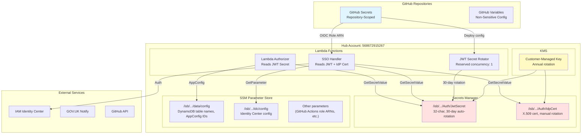
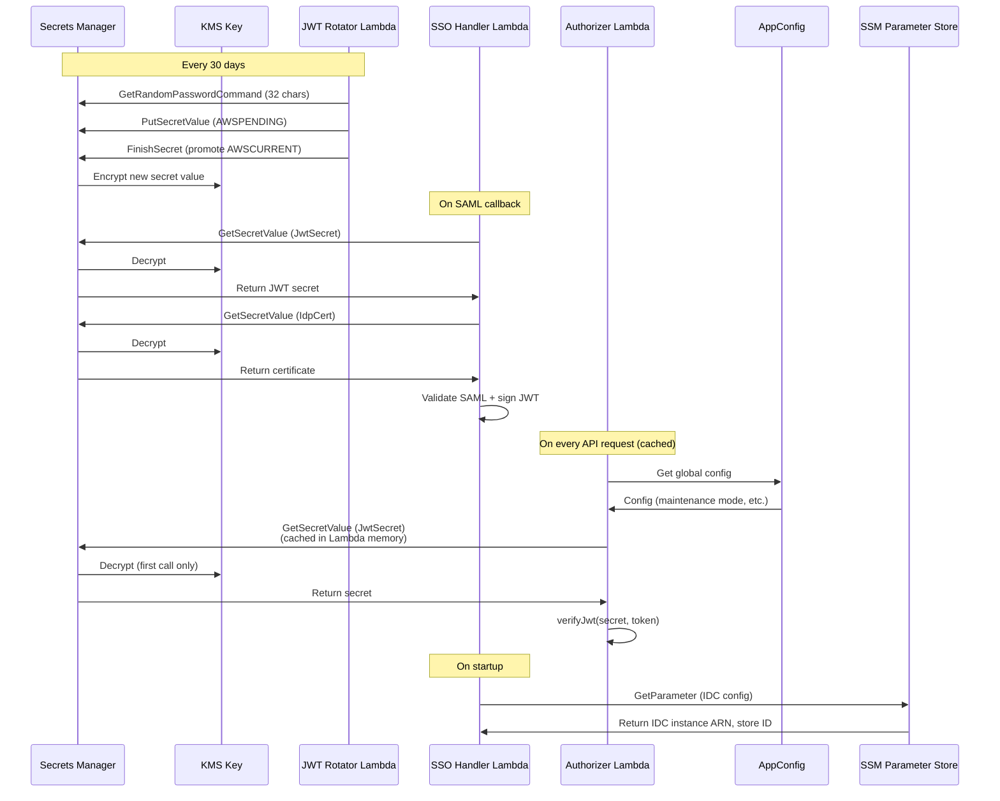

# Secrets Management

> **Last Updated**: 2026-03-06
> **Sources**: `innovation-sandbox-on-aws` (auth-api.ts, secret-rotator-handler.ts, sso-handler/config.ts), `innovation-sandbox-on-aws-costs`, `innovation-sandbox-on-aws-billing-seperator`, `innovation-sandbox-on-aws-deployer`, `ndx`, `ndx-try-aws-scp`, GitHub Actions workflow files

## Executive Summary

The NDX:Try AWS platform manages secrets across three tiers: AWS Secrets Manager for runtime application secrets (JWT signing key, IdP certificate, API keys), SSM Parameter Store for non-sensitive configuration sharing between CDK stacks, and GitHub repository secrets for CI/CD deployment parameters. Only the JWT signing secret has automated rotation (30-day cycle via a dedicated Lambda function); all other secrets require manual rotation. All Secrets Manager secrets are encrypted with customer-managed KMS keys.

---

## Secrets Management Architecture


```mermaid
flowchart TB
    subgraph "GitHub Repositories"
        gh_secrets[GitHub Secrets<br/>Repository-Scoped]
        gh_vars[GitHub Variables<br/>Non-Sensitive Config]
    end

    subgraph "Hub Account: 568672915267"
        subgraph "Secrets Manager"
            jwt_secret["/isb/.../Auth/JwtSecret"<br/>32-char, 30-day auto-rotation]
            idp_cert["/isb/.../Auth/IdpCert"<br/>X.509 cert, manual rotation]
        end

        subgraph "SSM Parameter Store"
            ssm_data["/isb/.../data/config"<br/>DynamoDB table names, AppConfig IDs]
            ssm_idc["/isb/.../idc/config"<br/>Identity Center config]
            ssm_other["Other parameters<br/>(GitHub Actions role ARNs, etc.)"]
        end

        subgraph "KMS"
            kms_key[Customer-Managed Key<br/>Annual rotation]
        end

        subgraph "Lambda Functions"
            rotator[JWT Secret Rotator<br/>Reserved concurrency: 1]
            sso_handler[SSO Handler<br/>Reads JWT + IdP Cert]
            authorizer[Lambda Authorizer<br/>Reads JWT Secret]
        end
    end

    subgraph "External Services"
        idc[IAM Identity Center]
        notify[GOV.UK Notify]
        github_api[GitHub API]
    end

    kms_key --> jwt_secret
    kms_key --> idp_cert

    rotator -->|30-day rotation| jwt_secret
    sso_handler -->|GetSecretValue| jwt_secret
    sso_handler -->|GetSecretValue| idp_cert
    authorizer -->|GetSecretValue| jwt_secret

    sso_handler -->|GetParameter| ssm_idc
    authorizer -->|AppConfig| ssm_data

    gh_secrets -->|OIDC Role ARN| sso_handler
    gh_secrets -->|Deploy config| rotator

    sso_handler -->|Auth| idc

    style jwt_secret fill:#ffe1e1
    style idp_cert fill:#ffe1e1
    style kms_key fill:#fff9c4
    style gh_secrets fill:#e1f5fe
```

---

## 1. AWS Secrets Manager

### Secrets Inventory

| Secret Name | Purpose | Encryption | Rotation | Accessed By |
|------------|---------|------------|----------|-------------|
| `/isb/<ns>/Auth/JwtSecret` | JWT signing key for API auth | Customer KMS | 30 days (auto) | Lambda Authorizer, SSO Handler |
| `/isb/<ns>/Auth/IdpCert` | SAML IdP X.509 certificate | Customer KMS | Manual | SSO Handler |

### JWT Secret

**Full Path**: `/isb/<namespace>/Auth/JwtSecret`

**CDK Definition** (`auth-api.ts`):
```typescript
const jwtTokenSecret = new Secret(scope, "JwtSecret", {
  secretName: `${SECRET_NAME_PREFIX}/${props.namespace}/Auth/JwtSecret`,
  description: "The secret for JWT used by Innovation Sandbox",
  encryptionKey: kmsKey,
  generateSecretString: {
    passwordLength: 32,
  },
});
```

**Rotation Schedule**:
```typescript
jwtTokenSecret.addRotationSchedule("RotationSchedule", {
  rotationLambda: jwtSecretRotatorLambda.lambdaFunction,
  automaticallyAfter: Duration.days(30),
  rotateImmediatelyOnUpdate: true,
});
```

**Rotation Lambda**: `JwtSecretRotator` with `reservedConcurrentExecutions: 1` to prevent concurrent rotation.

**Rotation Process** (from `secret-rotator-handler.ts`):

| Step | Action | Implementation |
|------|--------|----------------|
| `createSecret` | Generate new 32-char random password via `GetRandomPasswordCommand`, store as `AWSPENDING` | Active |
| `setSecret` | No-op (no external system to update) | NOOP |
| `testSecret` | No-op (JWT validation tested on first use) | NOOP |
| `finishSecret` | Promote `AWSPENDING` to `AWSCURRENT` via `UpdateSecretVersionStageCommand` | Active |

**Access Pattern**:
```typescript
const secretsManagerHelper = IsbClients.secretsManager(env);
const jwtSecret = await secretsManagerHelper.getStringSecret(env.JWT_SECRET_NAME);
```

The authorizer Lambda caches the JWT secret in a module-level variable (`let jwtSecret = ""`) initialized lazily on first invocation, reducing Secrets Manager API calls across warm Lambda invocations.

**Source**: `authorizer/src/authorization.ts` lines 18, 129-133

### IdP Certificate

**Full Path**: `/isb/<namespace>/Auth/IdpCert`

**CDK Definition** (`auth-api.ts`):
```typescript
const idpCertSecret = new Secret(scope, "IdpCert", {
  secretName: `${SECRET_NAME_PREFIX}/${props.namespace}/Auth/IdpCert`,
  description: "IAM Identity Center Certificate of the ISB SAML 2.0 custom app",
  encryptionKey: kmsKey,
  secretStringValue: SecretValue.unsafePlainText(
    "Please paste the IAM Identity Center Certificate of the" +
      " Innovation Sandbox SAML 2.0 custom application here"
  ),
});
```

**Format**: PEM-encoded X.509 certificate

**Rotation**: Manual. When the IAM Identity Center SAML application certificate rotates (typically annually), an administrator must:

1. Download the new IdP metadata from IAM Identity Center
2. Extract the X.509 certificate
3. Update the secret via AWS Console or CLI:
   ```bash
   aws secretsmanager update-secret \
     --secret-id /isb/<namespace>/Auth/IdpCert \
     --secret-string "$(cat new-certificate.pem)"
   ```
4. Test SAML authentication

**Access Pattern**: The SSO handler fetches both secrets in a single batch call:
```typescript
const allSecrets = await secretsManagerHelper.getStringSecrets(
  env.JWT_SECRET_NAME,
  env.IDP_CERT_SECRET_NAME,
);
```

**Source**: `sso-handler/src/config.ts` lines 37-39

### IAM Access Policy

Lambda functions that need secret access receive a targeted policy:

```typescript
const secretAccessPolicy = new aws_iam.PolicyStatement({
  actions: ["secretsmanager:GetSecretValue"],
  effect: aws_iam.Effect.ALLOW,
  resources: [jwtTokenSecret.secretArn, idpCertSecret.secretArn],
});
ssoLambda.lambdaFunction.addToRolePolicy(secretAccessPolicy);
kmsKey.grantEncryptDecrypt(ssoLambda.lambdaFunction);
```

Both `secretsmanager:GetSecretValue` and `kms:Encrypt/Decrypt` are required because the secrets are encrypted with a customer-managed KMS key.

**Source**: `auth-api.ts` lines 103-107, 166-168

---

## 2. SSM Parameter Store

### Parameter Inventory

| Parameter Name | Type | Purpose | Created By |
|---------------|------|---------|-----------|
| `/isb/<ns>/data/config` | String (JSON) | DynamoDB table names, AppConfig IDs, KMS key ID, solution version | CDK (IsbDataResources) |
| `/isb/<ns>/idc/config` | String (JSON) | Identity Center instance configuration | CDK |

### Data Configuration Parameter

**Parameter Name**: Set by `sharedDataSsmParamName(namespace)`

**Contents** (JSON):
```json
{
  "configApplicationId": "...",
  "configEnvironmentId": "...",
  "globalConfigConfigurationProfileId": "...",
  "nukeConfigConfigurationProfileId": "...",
  "reportingConfigConfigurationProfileId": "...",
  "accountTable": "SandboxAccountTable-...",
  "leaseTemplateTable": "LeaseTemplateTable-...",
  "leaseTable": "LeaseTable-...",
  "tableKmsKeyId": "key-id",
  "solutionVersion": "...",
  "supportedSchemas": "[\"1\"]"
}
```

**Purpose**: Cross-stack configuration sharing. Lambda functions read this parameter at startup to discover DynamoDB table names and AppConfig profile IDs without hardcoding them.

**Source**: `isb-data-resources.ts` lines 86-106

### Access Pattern

Lambda functions are granted SSM read access via a shared helper:
```typescript
grantIsbSsmParameterRead(
  ssoLambda.lambdaFunction.role as Role,
  sharedIdcSsmParamName(props.namespace),
  props.idcAccountId,
);
```

---

## 3. GitHub Secrets

### Repository-Level Secrets

GitHub repository secrets are used to pass deployment-time configuration to GitHub Actions workflows. These are encrypted at rest by GitHub and masked in workflow logs.

#### innovation-sandbox-on-aws-billing-seperator

| Secret | Purpose |
|--------|---------|
| `AWS_ROLE_ARN` | IAM role ARN for OIDC-based CDK deployment |

#### innovation-sandbox-on-aws-costs

| Secret | Purpose |
|--------|---------|
| `AWS_ROLE_ARN` | IAM role ARN for OIDC-based CDK deployment |
| `COST_EXPLORER_ROLE_ARN` | Cross-account role for Cost Explorer queries |
| `ISB_LEASES_LAMBDA_ARN` | ISB Leases Lambda ARN (passed as CDK context) |

#### innovation-sandbox-on-aws-deployer

| Secret | Purpose |
|--------|---------|
| `AWS_DEPLOY_ROLE_ARN` | IAM role ARN for ECR/Lambda deployment |

#### ndx

| Secret | Purpose |
|--------|---------|
| `ISB_NDX_USERS_GROUP_ID` | Identity Center group ID for signup Lambda |

#### ndx-try-aws-scp

| Secret | Purpose |
|--------|---------|
| `AWS_ROLE_ARN` | IAM role ARN for Terraform deployment |
| `SLACK_BUDGET_ALERT_EMAIL` | Email for Slack-routed budget alerts |

### GitHub Variables (Non-Secret)

Some workflows also use GitHub Variables (non-sensitive, visible in settings):

| Variable | Example | Used By |
|----------|---------|---------|
| `AWS_REGION` | `us-east-1` | billing-seperator, costs |
| `EVENT_BUS_NAME` | `ISBEventBus` | costs |
| `ALERT_EMAIL` | team email | costs |

---

## 4. Lambda Environment Variables

Non-sensitive configuration is passed to Lambda functions via environment variables at deployment time:

| Variable | Example Value | Purpose |
|----------|---------------|---------|
| `JWT_SECRET_NAME` | `/isb/ndx-try-isb/Auth/JwtSecret` | Secret name reference (not the secret itself) |
| `IDP_CERT_SECRET_NAME` | `/isb/ndx-try-isb/Auth/IdpCert` | Secret name reference |
| `INTERMEDIATE_ROLE_ARN` | `arn:aws:iam::...:role/InnovationSandbox-ndx-IntermediateRole` | Cross-account hop |
| `IDC_ROLE_ARN` | `arn:aws:iam::<idc-account>:role/...` | Identity Center access |
| `ISB_NAMESPACE` | `ndx-try-isb` | Namespace for parameter resolution |
| `APP_CONFIG_APPLICATION_ID` | Application ID | AppConfig lookup |
| `APP_CONFIG_ENVIRONMENT_ID` | Environment ID | AppConfig lookup |
| `APP_CONFIG_PROFILE_ID` | Profile ID | AppConfig lookup |
| `POWERTOOLS_SERVICE_NAME` | `SsoHandler` | Structured logging |
| `USER_AGENT_EXTRA` | Custom user agent | SDK call attribution |

These are never used for sensitive values. Actual secrets are always resolved at runtime from Secrets Manager.

**Source**: `auth-api.ts` lines 143-154, `rest-api-all.ts` lines 83-89

---

## 5. Secret Flow Diagram


```mermaid
sequenceDiagram
    participant SM as Secrets Manager
    participant KMS as KMS Key
    participant Rotator as JWT Rotator Lambda
    participant SSO as SSO Handler Lambda
    participant Auth as Authorizer Lambda
    participant AppConfig as AppConfig
    participant SSM as SSM Parameter Store

    Note over Rotator,SM: Every 30 days
    Rotator->>SM: GetRandomPasswordCommand (32 chars)
    Rotator->>SM: PutSecretValue (AWSPENDING)
    Rotator->>SM: FinishSecret (promote AWSCURRENT)
    SM->>KMS: Encrypt new secret value

    Note over SSO: On SAML callback
    SSO->>SM: GetSecretValue (JwtSecret)
    SM->>KMS: Decrypt
    SM->>SSO: Return JWT secret
    SSO->>SM: GetSecretValue (IdpCert)
    SM->>KMS: Decrypt
    SM->>SSO: Return certificate
    SSO->>SSO: Validate SAML + sign JWT

    Note over Auth: On every API request (cached)
    Auth->>AppConfig: Get global config
    AppConfig->>Auth: Config (maintenance mode, etc.)
    Auth->>SM: GetSecretValue (JwtSecret)<br/>(cached in Lambda memory)
    SM->>KMS: Decrypt (first call only)
    SM->>Auth: Return secret
    Auth->>Auth: verifyJwt(secret, token)

    Note over SSO: On startup
    SSO->>SSM: GetParameter (IDC config)
    SSM->>SSO: Return IDC instance ARN, store ID
```

---

## 6. Secrets Rotation Summary

| Secret | Method | Frequency | Lambda | Automated |
|--------|--------|-----------|--------|-----------|
| JWT Secret | Secrets Manager rotation | 30 days | JwtSecretRotator | Yes |
| IdP Certificate | Manual update | ~1 year (cert expiry) | N/A | No |
| GitHub Secrets (Role ARNs) | Manual update | When IAM roles recreated | N/A | No |
| GitHub Secrets (API Keys) | Manual update | Recommended 90 days | N/A | No |

---

## 7. Naming Conventions

### Secrets Manager

**Pattern**: `/{prefix}/{namespace}/{category}/{name}`

**Examples**:
- `/isb/ndx-try-isb/Auth/JwtSecret`
- `/isb/ndx-try-isb/Auth/IdpCert`

The prefix is defined by `SECRET_NAME_PREFIX` from `isb-types.js`.

### SSM Parameter Store

**Pattern**: `/{namespace}/{stack}/{parameter-name}`

**Examples**:
- `/isb/ndx-try-isb/data/config`
- `/isb/ndx-try-isb/idc/config`

### GitHub Secrets

**Pattern**: `UPPERCASE_WITH_UNDERSCORES`

**Examples**: `AWS_ROLE_ARN`, `COST_EXPLORER_ROLE_ARN`, `ISB_NDX_USERS_GROUP_ID`

---

## 8. Security Best Practices

### Implemented

- Customer-managed KMS encryption for all Secrets Manager secrets
- Automatic rotation for the most critical secret (JWT signing key)
- Least-privilege IAM policies scoped to specific secret ARNs
- Lambda-level secret caching to reduce API call frequency
- Reserved concurrency of 1 on the rotation Lambda to prevent race conditions
- Secrets never stored in Lambda environment variables (only name references)
- GitHub secrets masked in workflow logs
- CDK `unsafePlainText` used only for placeholder values (IdP cert initial value)

### Audit Trail

All secret access is logged via CloudTrail:
- `secretsmanager:GetSecretValue` -- secret retrieval
- `secretsmanager:PutSecretValue` -- rotation writes
- `secretsmanager:UpdateSecretVersionStage` -- rotation promotion
- `ssm:GetParameter` -- parameter reads
- `kms:Decrypt` -- KMS key usage for decryption

---

## Related Documents

- [60-auth-architecture.md](./60-auth-architecture.md) - JWT and SAML authentication flows
- [61-encryption.md](./61-encryption.md) - KMS key management and encryption at rest
- [05-service-control-policies.md](./05-service-control-policies.md) - Guardrails protecting ISB resources
- [10-isb-core-architecture.md](./10-isb-core-architecture.md) - Core ISB Lambda and data architecture
- [51-oidc-configuration.md](./51-oidc-configuration.md) - GitHub OIDC and role ARN configuration

---
*Generated from source analysis. See [00-repo-inventory.md](./00-repo-inventory.md) for full inventory.*
