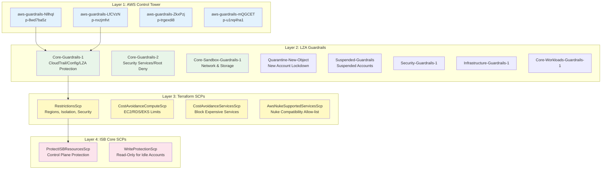
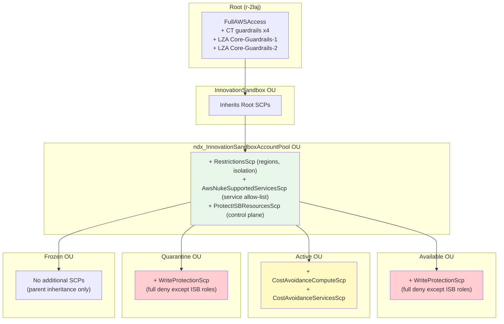

# Compliance

> **Last Updated**: 2026-03-02
> **Sources**: `.state/scps/*.json` (19 SCPs), `ndx-try-aws-lza` (security-config.yaml), `innovation-sandbox-on-aws` (kms.ts, rest-api-all.ts, cloudfront-ui-api.ts), `ndx-try-aws-scp`

## Executive Summary

The NDX:Try AWS platform enforces compliance through a four-layered policy hierarchy: AWS Control Tower managed guardrails, Landing Zone Accelerator (LZA) service control policies and AWS Config rules, Terraform-managed Innovation Sandbox cost and security SCPs, and ISB Core lifecycle protection policies. Together, 19 Service Control Policies restrict region usage to us-east-1 and us-west-2, block expensive services, limit compute instance sizes, protect the ISB control plane, and enforce write protection on idle accounts. The LZA further enables GuardDuty, Security Hub (with FSBP, NIST 800-53 Rev 5, and CIS v3.0.0 standards), Macie, IAM Access Analyzer, and 25+ AWS Config rules across the organization.

---

## Policy Hierarchy



---

## 1. Service Control Policies (19 Total)

### SCP Inventory by Source

| Source | Count | Management Tool |
|--------|-------|-----------------|
| AWS (FullAWSAccess) | 1 | AWS Managed |
| AWS Control Tower | 4 | Control Tower Managed |
| LZA | 8 | LZA Pipeline (security-config.yaml) |
| Terraform | 4 | co-cddo/ndx-try-aws-scp |
| ISB Core | 2 | innovation-sandbox-on-aws |
| **Total** | **19** | |

### Complete SCP List

| Policy ID | Name | Source |
|-----------|------|--------|
| p-FullAWSAccess | FullAWSAccess | AWS |
| p-8wd7ba5z | aws-guardrails-NllhqI | Control Tower |
| p-nxzjmfvt | aws-guardrails-LfCVzN | Control Tower |
| p-trgexdi8 | aws-guardrails-ZkxPzj | Control Tower |
| p-u1nq4ha1 | aws-guardrails-mQGCET | Control Tower |
| p-wr0deafe | AWSAccelerator-Core-Guardrails-1 | LZA |
| p-eybze26q | AWSAccelerator-Core-Guardrails-2 | LZA |
| p-eolruvn3 | AWSAccelerator-Core-Sandbox-Guardrails-1 | LZA |
| p-k3kvpq9a | AWSAccelerator-Core-Workloads-Guardrails-1 | LZA |
| p-s37b6cez | AWSAccelerator-Suspended-Guardrails | LZA |
| p-txuho3u8 | AWSAccelerator-Quarantine-New-Object | LZA |
| p-vtn1xi9m | AWSAccelerator-Security-Guardrails-1 | LZA |
| p-w2ssyciy | AWSAccelerator-Infrastructure-Guardrails-1 | LZA |
| p-6tw8eixp | InnovationSandboxRestrictionsScp | Terraform |
| p-1rzl0ufv | InnovationSandboxCostAvoidanceComputeScp | Terraform |
| p-64setrzn | InnovationSandboxCostAvoidanceServicesScp | Terraform |
| p-7pd0szg9 | InnovationSandboxAwsNukeSupportedServicesScp | Terraform |
| p-gn4fu3co | InnovationSandboxProtectISBResourcesScp | ISB Core |
| p-tyb1wjxv | InnovationSandboxWriteProtectionScp | ISB Core |

---

## 2. Innovation Sandbox SCPs (Detail)

### InnovationSandboxRestrictionsScp (p-6tw8eixp)

**Attached To**: ndx_InnovationSandboxAccountPool OU (parent, inherited by all child OUs)

**Statements**:

| SID | Effect | What It Does |
|-----|--------|--------------|
| `DenyRegionAccess` | Deny | Restricts all actions (except Bedrock) to **us-east-1** and **us-west-2** only |
| `DenyExpensiveBedrockModels` | Deny | Blocks `InvokeModel`/`Converse` on `anthropic.claude*opus*` and `anthropic.claude*sonnet*` models |
| `SecurityAndIsolationRestrictions` | Deny | Blocks billing portal, CloudTrail service channels, RAM resource sharing, WAFv2 firewall manager, SSM document sharing, network manager |
| `CostImplicationRestrictions` | Deny | Blocks reserved instance purchases, billing modifications, Shield subscriptions, Cost Explorer modifications |
| `OperationalRestrictions` | Deny | Blocks Direct Connect, CloudHSM, Route53 Domains, Storage Gateway, Chime, region enablement, and 30+ other restricted services |

**Exempted Principals**: `InnovationSandbox-ndx*`, `AWSReservedSSO_ndx_IsbAdmins*`, `stacksets-exec-*`, `AWSControlTowerExecution`

**Source**: `.state/scps/p-6tw8eixp.json`

### InnovationSandboxCostAvoidanceComputeScp (p-1rzl0ufv)

**Attached To**: Active OU

**Statements**:

| SID | Effect | What It Does |
|-----|--------|--------------|
| `DenyUnallowedEC2` | Deny | Only allows: t2.micro/small/medium, t3.micro/small/medium/large, t3a.micro/small/medium/large, m5.large/xlarge, m6i.large/xlarge |
| `DenyExpensiveEC2` | Deny | Blocks GPU (p*, g*), Inferentia (inf*, trn*), bare metal (*.metal*), and instances >= 12xlarge |
| `DenyExpensiveEBS` | Deny | Blocks Provisioned IOPS volumes (io1, io2) |
| `DenyLargeEBS` | Deny | Blocks EBS volumes > 500 GB |
| `DenyUnallowedRDS` | Deny | Only allows: db.t3.*, db.t4g.*, db.m5.large/xlarge, db.m6g.large/xlarge, db.m6i.large/xlarge |
| `DenyUnallowedCache` | Deny | Only allows: cache.t3.*, cache.t4g.*, cache.m5.large, cache.m6g.large |
| `LimitEKSSize` | Deny | Blocks EKS node groups with maxSize > 5 |
| `LimitASGSize` | Deny | Blocks Auto Scaling Groups with MaxSize > 10 |
| `DenyLambdaPC` | Deny | Blocks Lambda provisioned concurrency |

**Source**: `.state/scps/p-1rzl0ufv.json`

### InnovationSandboxCostAvoidanceServicesScp (p-64setrzn)

**Attached To**: Active OU

**Statements**:

| SID | Effect | Blocked Services |
|-----|--------|------------------|
| `DenyExpensiveML` | Deny | SageMaker endpoints, training jobs, hyperparameter tuning |
| `DenyExpensiveData` | Deny | EMR, Redshift clusters, GameLift fleets |
| `DenyExpensiveServices` | Deny | MSK, FSx, Kinesis streams, dedicated hosts, reserved instances/savings plans, Neptune, DocumentDB, MemoryDB, OpenSearch, Batch compute environments, Glue jobs/dev endpoints, Timestream, QLDB |

**Source**: `.state/scps/p-64setrzn.json`

### InnovationSandboxAwsNukeSupportedServicesScp (p-7pd0szg9)

**Attached To**: ndx_InnovationSandboxAccountPool OU (parent)

**Type**: Allow-list (uses `NotAction` to deny everything except listed services)

**Purpose**: Restricts sandbox accounts to only use AWS services that AWS Nuke can clean up, ensuring accounts can be properly recycled after lease termination.

**Allowed Services**: 130+ services including EC2, S3, Lambda, DynamoDB, RDS, ECS, EKS, CloudFormation, IAM, Bedrock, SageMaker, ElastiCache, API Gateway, CloudFront, and more.

**Source**: `.state/scps/p-7pd0szg9.json`

### InnovationSandboxProtectISBResourcesScp (p-gn4fu3co)

**Attached To**: ndx_InnovationSandboxAccountPool OU (parent)

**Statements**:

| SID | Effect | What It Protects |
|-----|--------|------------------|
| `ProtectIsbControlPlaneResources` | Deny all | ISB IAM roles (`InnovationSandbox-ndx*`), SSO reserved roles, ISB-prefixed resources (`*Isb-ndx*`), stacksets-exec roles, SAML providers |
| `ProtectControlTowerResources` | Deny all | CloudTrail trails, EventBridge rules, Lambda functions, log groups, SNS topics, IAM roles prefixed with `aws-controltower-` |
| `DenyConfigActions` | Deny | Prevents deletion/modification of AWS Config recorder and delivery channel |
| `ProtectControlTowerTaggedConfigResources` | Deny | Prevents modification of Config resources tagged `aws-control-tower: managed-by-control-tower` |
| `DenyControlTowerConfigTagActions` | Deny | Prevents adding/removing `aws-control-tower` tags from Config resources |

**Source**: `.state/scps/p-gn4fu3co.json`

### InnovationSandboxWriteProtectionScp (p-tyb1wjxv)

**Attached To**: Available OU, Quarantine OU

**Statement**: A single statement (`DenyAllExceptIsbRoles`) that denies all actions (`Action: *`) on all resources (`Resource: *`) for all principals except the ISB control plane roles. This effectively makes accounts read-only until they are leased or after they enter quarantine.

**Source**: `.state/scps/p-tyb1wjxv.json`

---

## 3. OU-to-SCP Attachment and Effective Permissions



### Effective SCP Stack by Account State

| Account State | Effective SCPs (cumulative) |
|---------------|----------------------------|
| **Available** | FullAWSAccess + CT guardrails + LZA guardrails + RestrictionsScp + NukeSupportedScp + ProtectISBScp + **WriteProtectionScp** |
| **Active** | FullAWSAccess + CT guardrails + LZA guardrails + RestrictionsScp + NukeSupportedScp + ProtectISBScp + **CostComputeScp + CostServicesScp** |
| **Frozen** | FullAWSAccess + CT guardrails + LZA guardrails + RestrictionsScp + NukeSupportedScp + ProtectISBScp |
| **Quarantine** | FullAWSAccess + CT guardrails + LZA guardrails + RestrictionsScp + NukeSupportedScp + ProtectISBScp + **WriteProtectionScp** |

---

## 4. LZA Security Services

The Landing Zone Accelerator enables the following security services across all accounts in the organization:

### Security Monitoring

| Service | Status | Configuration |
|---------|--------|---------------|
| **AWS GuardDuty** | Enabled | S3 protection, EKS protection, findings exported to S3 every 6 hours |
| **AWS Security Hub** | Enabled | Multi-region aggregation, 3 standards enabled |
| **Amazon Macie** | Enabled | Policy findings every 15 minutes, published to Security Hub |
| **IAM Access Analyzer** | Enabled | Organization-level analyzer |

### Security Hub Standards

| Standard | Status | Scope |
|----------|--------|-------|
| AWS Foundational Security Best Practices (FSBP) v1.0.0 | Enabled | Root OU (all accounts) |
| NIST SP 800-53 Rev 5 | Enabled | Root OU (all accounts) |
| CIS AWS Foundations Benchmark v3.0.0 | Enabled | Root OU (all accounts) |
| CIS AWS Foundations Benchmark v1.2.0 | Disabled | - |

**Source**: `ndx-try-aws-lza/security-config.yaml` lines 43-80

### SCP Integrity

```yaml
scpRevertChangesConfig:
  enable: true
```

The LZA automatically reverts unauthorized manual changes to SCPs, maintaining policy integrity.

---

## 5. AWS Config Rules

The LZA deploys 25+ AWS Config rules for compliance monitoring. Key rules include:

### Encryption Compliance

| Rule | Resource Type | Purpose |
|------|---------------|---------|
| `dynamodb-table-encrypted-kms` | DynamoDB Table | Ensures KMS encryption |
| `secretsmanager-using-cmk` | Secrets Manager | Ensures CMK usage |
| `backup-recovery-point-encrypted` | Backup Recovery Point | Ensures encrypted backups |
| `codebuild-project-artifact-encryption` | CodeBuild | Ensures artifact encryption |
| `cloudwatch-log-group-encrypted` | CloudWatch | Ensures log encryption |
| `api-gw-cache-enabled-and-encrypted` | API Gateway Stage | Ensures cache encryption |

### IAM and Access

| Rule | Resource Type | Purpose |
|------|---------------|---------|
| `iam-user-group-membership-check` | IAM User | Users must belong to groups |
| `iam-no-inline-policy-check` | IAM User/Role/Group | No inline policies |
| `iam-group-has-users-check` | IAM Group | Groups must have members |
| `ec2-instance-profile-attached` | EC2 Instance | Instances need profiles (auto-remediation) |

### Monitoring and Logging

| Rule | Resource Type | Purpose |
|------|---------------|---------|
| `cloudtrail-enabled` | CloudTrail | CloudTrail must be active |
| `cloudtrail-security-trail-enabled` | CloudTrail | Security trail required |
| `cloudtrail-s3-dataevents-enabled` | CloudTrail | S3 data events logging |
| `guardduty-non-archived-findings` | GuardDuty | Findings must be resolved (High: 1 day, Medium: 7 days, Low: 30 days) |
| `securityhub-enabled` | Security Hub | Security Hub active |

### Infrastructure

| Rule | Resource Type | Purpose |
|------|---------------|---------|
| `ec2-instance-detailed-monitoring-enabled` | EC2 Instance | Detailed monitoring required |
| `ec2-volume-inuse-check` | EC2 Volume | Volumes must be attached (deleteOnTermination: TRUE) |
| `ec2-instances-in-vpc` | EC2 Instance | Instances must be in VPC |
| `ebs-optimized-instance` | EC2 Instance | EBS optimization required |
| `ebs-in-backup-plan` | EBS | EBS in backup plan |
| `rds-in-backup-plan` | RDS | RDS in backup plan |
| `elb-logging-enabled` | ELB | ELB logging required (auto-remediation) |
| `no-unrestricted-route-to-igw` | Route Table | No open routes to IGW |
| `s3-bucket-policy-grantee-check` | S3 Bucket | Bucket policy validation |

### Auto-Remediation

Two Config rules have automated remediation enabled:

1. **ec2-instance-profile-attached**: Automatically attaches an IAM instance profile using SSM Automation (`Attach-IAM-Instance-Profile` document)
2. **elb-logging-enabled**: Automatically enables ELB access logging using SSM Automation (`SSM-ELB-Enable-Logging` document)

**Source**: `ndx-try-aws-lza/security-config.yaml` lines 118-391

---

## 6. IAM Password Policy

The LZA enforces a strict IAM password policy across the organization:

| Setting | Value |
|---------|-------|
| Minimum length | 14 characters |
| Require uppercase | Yes |
| Require lowercase | Yes |
| Require numbers | Yes |
| Require symbols | Yes |
| Allow user to change | Yes |
| Password reuse prevention | 24 previous passwords |
| Max password age | 90 days |
| Hard expiry | No (grace period allowed) |

**Source**: `ndx-try-aws-lza/security-config.yaml` lines 99-108

---

## 7. Application-Level Security Controls

Beyond organization-level policies, the ISB application enforces:

| Control | Implementation | Source |
|---------|----------------|--------|
| SAML 2.0 Authentication | passport-saml with IdP cert validation | sso-handler |
| JWT Bearer Token Auth | HMAC-SHA256, configurable session duration | authorizer-handler.ts |
| RBAC (3 roles) | Path+method authorization map | authorization-map.ts |
| WAF IP Allow-List | CIDR-based on X-Forwarded-For | rest-api-all.ts |
| WAF Rate Limiting | 200 req/min per IP | rest-api-all.ts |
| AWS Managed WAF Rules | Common Rule Set, IP Reputation, Anonymous IP | rest-api-all.ts |
| HSTS | 540-day max-age with includeSubDomains | cloudfront-ui-api.ts |
| Content Security Policy | Strict self-only CSP | cloudfront-ui-api.ts |
| X-Frame-Options | DENY | cloudfront-ui-api.ts |
| HTTPS Enforcement | CloudFront REDIRECT_TO_HTTPS | cloudfront-ui-api.ts |
| S3 SSL Enforcement | enforceSSL: true on all buckets | cloudfront-ui-api.ts |
| KMS Encryption at Rest | Customer-managed keys for DynamoDB, Secrets, S3 | kms.ts |
| 30-day Secret Rotation | Automated JWT secret rotation | auth-api.ts |
| Maintenance Mode | AppConfig-driven, Admin-only access | authorizer-handler.ts |

---

## 8. Compliance Summary

### NCSC Cloud Security Principles Alignment

| Principle | Status | Key Evidence |
|-----------|--------|-------------|
| 1. Data in Transit | Compliant | TLS 1.2+, HSTS, S3 SSL enforcement |
| 2. Asset Protection | Partial | Multi-AZ (DynamoDB, Lambda), PITR, but single-region |
| 3. User Separation | Compliant | Dedicated AWS accounts per sandbox lease |
| 4. Governance | Partial | IaC, code review, SCPs, but no formal ISMS |
| 5. Operational Security | Partial | Dependabot, CloudTrail, Config, but no centralized SIEM |
| 6. Personnel Security | Compliant | SSO with MFA, organizational access controls |
| 7. Secure Development | Partial | TypeScript strict, ESLint, Dependabot, but no SAST/DAST |
| 8. Supply Chain | Partial | Pinned GitHub Actions, npm audit, OpenSSF Scorecard |
| 9. User Management | Compliant | IAM Identity Center, group-based RBAC, short-lived credentials |
| 10. Identity & Auth | Compliant | SAML 2.0, JWT, OIDC, no long-lived credentials |
| 11. External Interfaces | Compliant | WAF, Lambda authorizer, no public S3 buckets |
| 12. Secure Admin | Compliant | SSO only, no IAM users, branch protection |
| 13. Audit Information | Partial | CloudTrail, CloudWatch, but limited retention archival |
| 14. Secure Use | Partial | Documentation provided, but no formal training programme |

### GDS Service Standard

| Point | Status | Key Evidence |
|-------|--------|-------------|
| 5. Accessibility | Met | pa11y-ci, GOV.UK Design System |
| 9. Create Secure Service | Met | All security controls above |
| 12. Open Source | Met | All repositories public on GitHub |
| 14. Reliable Service | Partial | Multi-AZ, PITR, but no documented SLA |

---

## Related Documents

- [05-service-control-policies.md](./05-service-control-policies.md) - Full SCP detail with OU attachment mapping
- [10-isb-core-architecture.md](./10-isb-core-architecture.md) - Core ISB architecture
- [40-lza-configuration.md](./40-lza-configuration.md) - LZA organizational structure and configuration
- [41-terraform-scp.md](./41-terraform-scp.md) - Terraform SCP module analysis
- [60-auth-architecture.md](./60-auth-architecture.md) - Authentication and authorization controls
- [61-encryption.md](./61-encryption.md) - Encryption at rest and in transit
- [62-secrets-management.md](./62-secrets-management.md) - Secrets rotation and access patterns

---
*Generated from source analysis. See [00-repo-inventory.md](./00-repo-inventory.md) for full inventory.*
