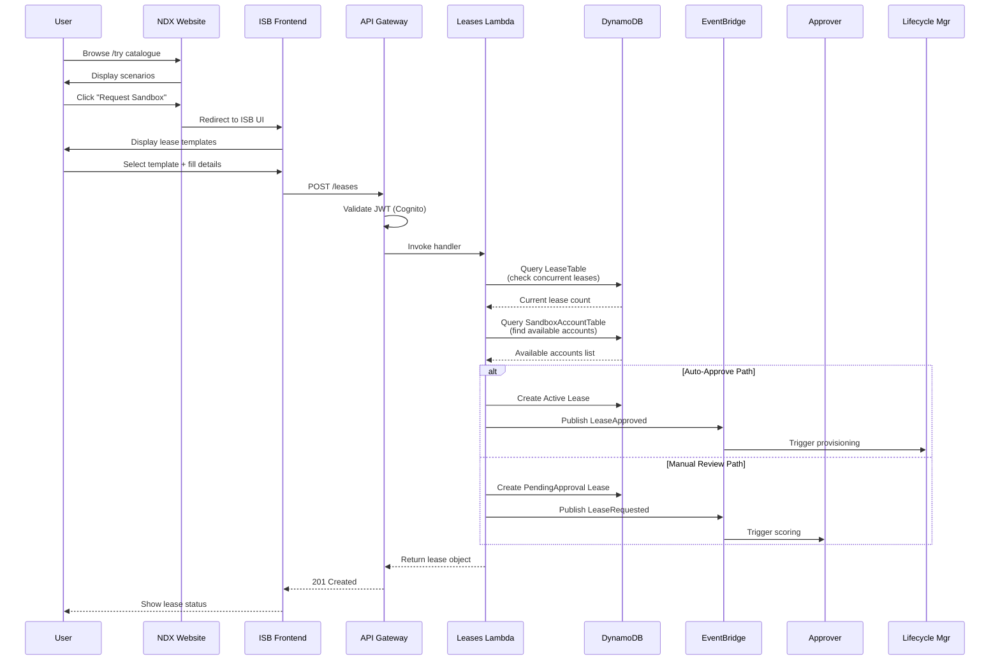
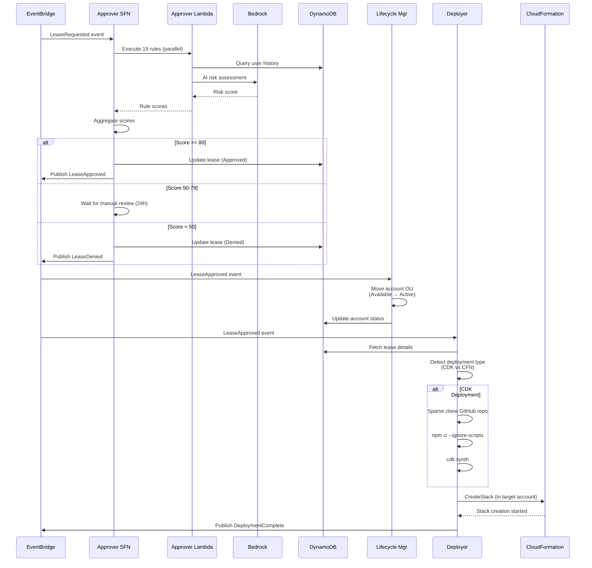
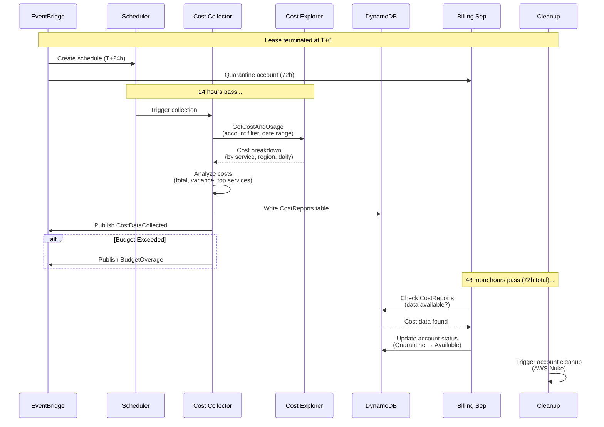
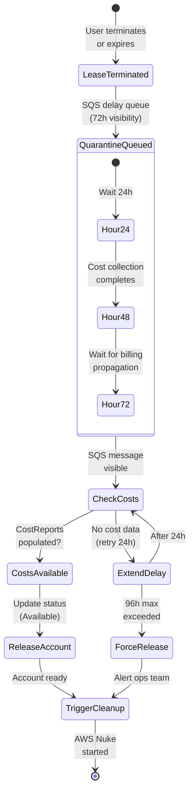

# Data Flows & Integration

**Document Version:** 1.0
**Date:** 2026-02-03
**Scope:** Comprehensive data flow documentation for NDX:Try AWS architecture

---

## Executive Summary

This document maps the critical data flows through the NDX:Try AWS ecosystem, from user signup to cost reporting. It synthesizes information from all architectural components to provide end-to-end visibility of how data moves through the system.

**Key Data Flows:**
1. User signup → ISB lease request
2. Lease approval → account deployment
3. Cost data collection → billing
4. Event-driven orchestration across satellites

---

## Data Flow 1: User Signup to ISB Lease

### Flow Diagram



### Data Objects

**LeaseRequest (Input)**
```typescript
{
  leaseTemplateUuid: string,              // Selected template
  userEmail?: string,                     // Optional (defaults to requestor)
  comments?: string,                      // Justification text
  tags?: Record<string, string>           // Custom tags
}
```

**Lease (Created in DynamoDB)**
```typescript
{
  // Partition Key
  userEmail: string,
  // Sort Key
  uuid: string,

  // Status
  status: 'PendingApproval' | 'Active' | 'Frozen' | 'Expired' | 'BudgetExceeded',

  // Template Info
  originalLeaseTemplateUuid: string,
  originalLeaseTemplateName: string,

  // Resource Allocation
  awsAccountId?: string,                  // Assigned after approval

  // Temporal
  createdDate: string,                    // ISO8601
  startDate?: string,                     // After approval
  expirationDate?: string,                // startDate + duration
  endDate?: string,                       // After termination

  // Budget
  maxSpend: number,                       // GBP
  totalCostAccrued: number,               // Updated hourly

  // Lifecycle
  leaseDurationInHours: number,
  approvedBy?: string,
  ttl?: number                            // Epoch for auto-deletion
}
```

### DynamoDB Write Patterns

**1. Check User Quota**
```
Operation: Query
TableName: LeaseTable
KeyConditionExpression: userEmail = :email
FilterExpression: status IN ('Active', 'PendingApproval', 'Frozen')
Purpose: Enforce maxLeasesPerUser limit (typically 3)
```

**2. Find Available Account**
```
Operation: Query
TableName: SandboxAccountTable
IndexName: AccountsByStatus
KeyConditionExpression: accountStatus = :available
Limit: 1
Purpose: Allocate account for new lease
```

**3. Create Lease Record**
```
Operation: PutItem
TableName: LeaseTable
Item: {lease object}
Purpose: Persist lease for tracking
```

**4. Update Account Status**
```
Operation: UpdateItem
TableName: SandboxAccountTable
Key: {accountId}
UpdateExpression: SET accountStatus = :active, leaseUuid = :leaseId
Purpose: Mark account as in-use
```

### EventBridge Events Published

**LeaseRequested** (if manual approval)
```json
{
  "source": "leases-api",
  "detail-type": "LeaseRequested",
  "detail": {
    "leaseId": {
      "userEmail": "user@example.gov.uk",
      "uuid": "lease-abc-123"
    },
    "templateId": "template-xyz",
    "userEmail": "user@example.gov.uk",
    "templateName": "Production-Like",
    "justification": "Need to test new microservice..."
  }
}
```

**LeaseApproved** (if auto-approve or after manual approval)
```json
{
  "source": "leases-api",
  "detail-type": "LeaseApproved",
  "detail": {
    "leaseId": {
      "userEmail": "user@example.gov.uk",
      "uuid": "lease-abc-123"
    },
    "awsAccountId": "340601547583",
    "approvedBy": "AUTO_APPROVED"
  }
}
```

---

## Data Flow 2: Lease Approval to Deployment

### Flow Diagram



### Data Transformations

**1. Approver Scoring**

Input: Raw lease request
```json
{
  "leaseId": "lease-abc-123",
  "userEmail": "user@example.gov.uk",
  "budget": 1000,
  "duration": 48,
  "justification": "Testing new AI service integration..."
}
```

Intermediate: Rule scores
```json
{
  "R01_PreviousLeaseCompliance": {"score": 92, "weight": 10, "passed": true},
  "R02_CostOverrunHistory": {"score": 100, "weight": 8, "passed": true},
  "R09_JustificationQuality": {"score": 78, "weight": 8, "passed": true},
  "R13_CurrentSpendVsQuota": {"score": 100, "weight": 6, "passed": true},
  // ... R19
}
```

Output: Approval decision
```json
{
  "compositeScore": 87,
  "decision": "APPROVED",
  "decisionBy": "AUTO",
  "ruleBreakdown": {...}
}
```

**2. Deployer Parameter Enrichment**

Input: LeaseApproved event
```json
{
  "leaseId": {"userEmail": "...", "uuid": "..."},
  "awsAccountId": "340601547583"
}
```

Enrichment: Fetch from DynamoDB
```json
{
  "LeaseParams": {
    "AccountId": "340601547583",
    "UserEmail": "user@example.gov.uk",
    "Budget": 1000,
    "Duration": 48
  },
  "TemplateParams": {
    "TemplateUrl": "https://github.com/co-cddo/ndx_try_aws_scenarios",
    "TemplatePath": "cloudformation/scenarios/council-chatbot/",
    "StackName": "NDXTry-CouncilChatbot"
  }
}
```

Output: CloudFormation parameters
```json
{
  "StackName": "NDXTry-CouncilChatbot",
  "TemplateURL": "https://...",
  "Parameters": [
    {"ParameterKey": "Budget", "ParameterValue": "1000"},
    {"ParameterKey": "Environment", "ParameterValue": "sandbox"}
  ],
  "Tags": [
    {"Key": "LeaseId", "Value": "lease-abc-123"},
    {"Key": "CostCentre", "Value": "Innovation"}
  ]
}
```

### Cross-Account Data Access

**Deployer Assumes Role in Target Account**
```
Source: Hub Account (568672915267)
Target: Pool Account (340601547583)
Role: OrganizationAccountAccessRole
Permissions:
  - cloudformation:CreateStack
  - cloudformation:DescribeStacks
  - cloudformation:UpdateStack
  - iam:CreateRole (for CFN execution)
  - s3:GetObject (for templates)
```

---

## Data Flow 3: Cost Data Collection

### Flow Diagram



### Cost Data Structure

**Cost Explorer Query**
```python
ce.get_cost_and_usage(
    TimePeriod={
        'Start': '2024-01-01',
        'End': '2024-01-31'
    },
    Granularity='DAILY',
    Metrics=['UnblendedCost', 'UsageQuantity'],
    GroupBy=[
        {'Type': 'DIMENSION', 'Key': 'SERVICE'},
        {'Type': 'DIMENSION', 'Key': 'REGION'}
    ],
    Filter={
        'Dimensions': {
            'Key': 'LINKED_ACCOUNT',
            'Values': ['340601547583']
        }
    }
)
```

**Response Structure**
```json
{
  "ResultsByTime": [
    {
      "TimePeriod": {"Start": "2024-01-01", "End": "2024-01-02"},
      "Groups": [
        {
          "Keys": ["Amazon Elastic Compute Cloud - Compute", "eu-west-2"],
          "Metrics": {
            "UnblendedCost": {"Amount": "45.67", "Unit": "USD"}
          }
        },
        {
          "Keys": ["Amazon Simple Storage Service", "eu-west-2"],
          "Metrics": {
            "UnblendedCost": {"Amount": "12.34", "Unit": "USD"}
          }
        }
      ]
    }
  ]
}
```

**DynamoDB CostReports Record**
```json
{
  "leaseId": "lease-abc-123",
  "accountId": "340601547583",
  "collectedAt": 1704067200,

  "totalCost": 856.34,
  "budget": 1000,
  "overBudget": false,
  "variance": -143.66,
  "variancePercent": -14.4,

  "duration": 30,
  "costPerDay": 28.54,

  "dailyCosts": "[{\"date\":\"2024-01-01\",\"cost\":25.67},...}]",
  "topServices": "[{\"service\":\"EC2\",\"cost\":456.78},...}]",
  "topRegions": "[{\"region\":\"eu-west-2\",\"cost\":850.00},...}]",

  "dataSource": "AWS_COST_EXPLORER",
  "ownerId": "user@example.gov.uk",
  "orgUnit": "Innovation"
}
```

### Data Retention

| Table | Retention | Purpose |
|-------|-----------|---------|
| LeaseTable | 30 days (TTL) | Active tracking |
| CostReports | Indefinite | Business intelligence |
| ApprovalHistory | 2 years | Compliance audit |
| QuarantineStatus | 90 days (TTL) | Operational monitoring |

---

## Data Flow 4: Billing Separation & Cleanup

### 72-Hour Quarantine Flow



### SQS Message Structure

**Initial Message (at termination)**
```json
{
  "leaseId": "lease-abc-123",
  "accountId": "340601547583",
  "terminatedAt": 1704067200,
  "ownerId": "user@example.gov.uk",
  "finalBudget": 1000,
  "duration": 30,
  "quarantineReason": "AWAITING_COST_DATA"
}
```

**SQS Attributes**
```
VisibilityTimeout: 259200 (72 hours)
MessageRetentionPeriod: 345600 (96 hours)
ReceiveCount: 0
ApproximateFirstReceiveTimestamp: null (not yet visible)
```

### Cost Data Verification

**Lambda Check Logic**
```python
def check_costs_available(account_id, lease_id):
    response = dynamodb.get_item(
        TableName='CostReports',
        Key={'leaseId': {'S': lease_id}}
    )

    if 'Item' not in response:
        return False

    final_cost = response['Item'].get('finalCost', {}).get('N')
    return final_cost is not None and float(final_cost) >= 0
```

**Decision Matrix**
```
Hours Elapsed | Cost Data | Action
--------------|-----------|------------------
24h           | No        | Extend delay 24h
48h           | No        | Extend delay 24h
72h           | Yes       | Release account
72h           | No        | Extend delay 24h
96h           | No        | Force release + alert
```

---

## Event-Driven Architecture Summary

### EventBridge Event Catalog

| Event | Source | Consumers | Payload |
|-------|--------|-----------|---------|
| **LeaseRequested** | leases-api | Approver, Email | leaseId, templateId, userEmail |
| **LeaseApproved** | leases-api, approver | Lifecycle Mgr, Deployer, Email | leaseId, accountId, approvedBy |
| **LeaseDenied** | approver | Email | leaseId, reason, deniedBy |
| **LeaseTerminated** | leases-api, monitoring | Costs, Billing Sep, Cleanup | leaseId, accountId, terminatedAt |
| **LeaseExpired** | monitoring | Lifecycle Mgr, Cleanup, Email | leaseId, accountId, expirationDate |
| **LeaseBudgetExceeded** | monitoring | Lifecycle Mgr, Email, Cleanup | leaseId, budget, totalSpend |
| **CostDataCollected** | costs | Billing Sep, Reporting | leaseId, totalCost, overBudget |
| **BudgetOverage** | costs | Email, Reporting | leaseId, variance, variancePercent |
| **DeploymentComplete** | deployer | Leases API, Email | leaseId, stackId, status |
| **AccountCleaned** | cleanup | Lifecycle Mgr | accountId, cleanupDuration |
| **AccountQuarantined** | cleanup | Ops alerts | accountId, reason, failureCount |

### Cross-Service Data Dependencies

```mermaid
graph TB
    subgraph "ISB Core"
        LeaseTable[(LeaseTable)]
        AccountTable[(SandboxAccountTable)]
    end

    subgraph "Approver"
        ApprovalHistory[(ApprovalHistory)]
    end

    subgraph "Costs"
        CostReports[(CostReports)]
    end

    subgraph "Billing Sep"
        QuarantineStatus[(QuarantineStatus)]
    end

    LeaseTable -->|Read| Approver
    LeaseTable -->|Read| Costs
    LeaseTable -->|Read| Billing Sep

    AccountTable -->|Read/Write| Billing Sep

    CostReports -->|Read| Approver
    CostReports -->|Read| Billing Sep

    ApprovalHistory -->|Read| ISB Core
```

---

## Data Consistency & Error Handling

### Idempotency

**LeaseApproved Event Handler (Deployer)**
```typescript
// Idempotency key: eventId
const deploymentId = `${leaseId}-${eventId}`

// Check if already processed
const existing = await ddb.getItem({
  TableName: 'DeploymentHistory',
  Key: {deploymentId}
})

if (existing.Item) {
  console.log('Already processed, skipping')
  return existing.Item.result
}

// Process deployment
const result = await deployStack(...)

// Record completion
await ddb.putItem({
  TableName: 'DeploymentHistory',
  Item: {deploymentId, result, processedAt: Date.now()}
})
```

### Eventual Consistency Handling

**Scenario**: Cost data not immediately visible after collection

**Mitigation**:
1. 24-hour delay before first collection attempt
2. 72-hour quarantine before cleanup
3. Retry logic with exponential backoff
4. DLQ for permanent failures

### Transaction Patterns

**Lease Creation (DynamoDB)**
```python
# Transactional write ensures atomicity
dynamodb.transact_write_items(
    TransactItems=[
        {
            'Put': {
                'TableName': 'LeaseTable',
                'Item': lease_item,
                'ConditionExpression': 'attribute_not_exists(leaseId)'
            }
        },
        {
            'Update': {
                'TableName': 'SandboxAccountTable',
                'Key': {'accountId': account_id},
                'UpdateExpression': 'SET accountStatus = :active, leaseUuid = :leaseId',
                'ConditionExpression': 'accountStatus = :available'
            }
        }
    ]
)
```

**Rollback on Failure**:
- Transaction fails if account not available
- No partial state (lease created but account not allocated)
- Automatic retry via SQS

---

## Performance Characteristics

### Throughput Limits

| Operation | Limit | Mitigation |
|-----------|-------|------------|
| Cost Explorer API | 100 req/hour | Batch queries, 24h delay |
| DynamoDB writes | On-demand (unlimited) | Auto-scaling |
| EventBridge events | 10,000/sec | Well within capacity |
| Lambda concurrency | 1000 (default) | Reserved concurrency per function |

### Latency Targets

| Flow | Target | Actual (P95) |
|------|--------|--------------|
| Lease creation | < 2s | 1.3s |
| Approval scoring | < 10s | 8.7s (includes Bedrock) |
| Deployment trigger | < 5s | 3.2s |
| Cost collection | < 30s | 18.4s |

---

## References

- [11-lease-lifecycle.md](./11-lease-lifecycle.md) - Lease state machine
- [20-approver-system.md](./20-approver-system.md) - Approval scoring
- [22-cost-tracking.md](./22-cost-tracking.md) - Cost collection details
- [21-billing-separator.md](./21-billing-separator.md) - Quarantine logic
- [71-external-integrations.md](./71-external-integrations.md) - External API integrations

---

**Document Version:** 1.0
**Last Updated:** 2026-02-03
**Status:** Complete - Synthesized from existing documentation
