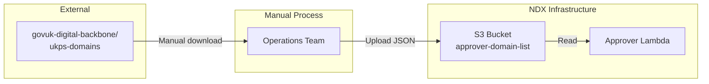
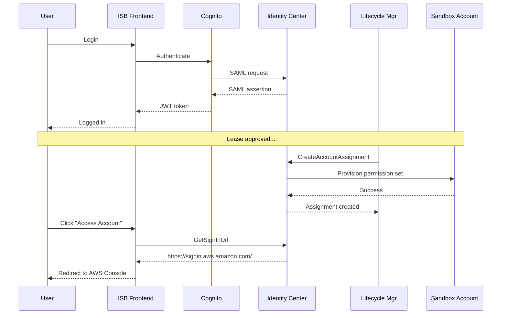
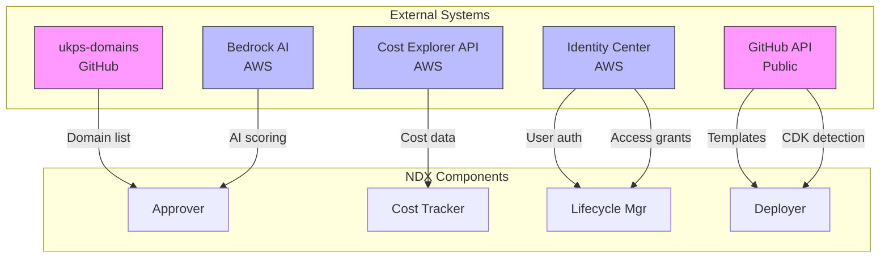

# External Integrations

**Document Version:** 1.0
**Date:** 2026-02-03
**Scope:** All external system integrations for NDX:Try AWS

---

## Executive Summary

The NDX:Try AWS architecture integrates with multiple external systems, both AWS-native and third-party. This document catalogs all integration points, authentication mechanisms, data exchange patterns, and failure modes.

**Key External Systems:**
1. ukps-domains (govuk-digital-backbone) - Domain whitelist
2. AWS Cost Explorer API
3. AWS Identity Center (SSO)
4. Amazon Bedrock AI
5. GitHub API (for deployment)

---

## Integration 1: ukps-domains (Domain Whitelist)

### Overview

**Repository:** `govuk-digital-backbone/ukps-domains`
**Purpose:** Authoritative list of UK public sector email domains for approver whitelist
**Owner:** GDS (Government Digital Service)
**Integration Point:** Approver system domain verification

### Architecture



### Data Format

**ukps-domains Structure (JSON)**
```json
{
  "domains": [
    {
      "domain": "gov.uk",
      "organisation": "UK Government",
      "category": "central_government"
    },
    {
      "domain": "nhs.uk",
      "organisation": "National Health Service",
      "category": "nhs"
    },
    {
      "domain": "police.uk",
      "organisation": "UK Police Forces",
      "category": "police"
    }
  ],
  "lastUpdated": "2026-01-15T10:00:00Z",
  "version": "2.3.1"
}
```

**Approver Usage**
```typescript
// Rule 5: Domain Verification
async function verifyDomain(email: string): Promise<boolean> {
  const domain = email.split('@')[1]

  // Fetch domain list from S3
  const s3 = new S3Client({})
  const response = await s3.getObject({
    Bucket: 'approver-domain-list-568672915267',
    Key: 'user_domains.json'
  })

  const domainList = JSON.parse(await response.Body.transformToString())

  // Check if domain is whitelisted
  return domainList.domains.some((d: any) =>
    domain === d.domain || domain.endsWith('.' + d.domain)
  )
}
```

### Update Process

**Frequency:** Weekly (manual)

**Steps:**
1. Operations team pulls latest from `govuk-digital-backbone/ukps-domains`
2. Transform to approver format (if needed)
3. Upload to S3 bucket `approver-domain-list-568672915267/user_domains.json`
4. Approver Lambda reads on each invocation (no caching)

### Failure Modes

| Failure | Impact | Mitigation |
|---------|--------|------------|
| ukps-domains repo unavailable | Cannot update whitelist | Use cached S3 version |
| S3 bucket inaccessible | All lease requests fail domain check | CloudWatch alarm, fallback to hardcoded list |
| Stale domain list | New domains rejected | Weekly update SLA |

### Integration Dependencies

```
ukps-domains (GitHub)
  ↓ (manual download)
S3 (approver-domain-list)
  ↓ (s3:GetObject)
Approver Lambda (Rule 5)
  ↓ (pass/fail)
Lease Approval Decision
```

---

## Integration 2: AWS Cost Explorer API

### Overview

**Service:** AWS Cost Explorer
**Purpose:** Retrieve actual AWS spend for sandbox accounts
**Authentication:** IAM role with `ce:GetCostAndUsage`
**Rate Limits:** 100 requests/hour, 5 TPS
**Data Lag:** 24-48 hours

### API Usage Pattern

**Cost Collector Lambda Query**
```python
import boto3
from datetime import datetime, timedelta

ce = boto3.client('ce', region_name='us-east-1')

def get_account_costs(account_id, start_date, end_date):
    """
    Query Cost Explorer for account-specific costs.
    """
    response = ce.get_cost_and_usage(
        TimePeriod={
            'Start': start_date.strftime('%Y-%m-%d'),
            'End': end_date.strftime('%Y-%m-%d')
        },
        Granularity='DAILY',
        Metrics=['UnblendedCost', 'UsageQuantity'],
        GroupBy=[
            {'Type': 'DIMENSION', 'Key': 'SERVICE'},
            {'Type': 'DIMENSION', 'Key': 'REGION'}
        ],
        Filter={
            'Dimensions': {
                'Key': 'LINKED_ACCOUNT',
                'Values': [account_id]
            }
        }
    )

    return response
```

### Response Structure

**Example Response**
```json
{
  "ResultsByTime": [
    {
      "TimePeriod": {
        "Start": "2024-01-01",
        "End": "2024-01-02"
      },
      "Total": {},
      "Groups": [
        {
          "Keys": ["Amazon EC2", "eu-west-2"],
          "Metrics": {
            "UnblendedCost": {
              "Amount": "45.67",
              "Unit": "USD"
            },
            "UsageQuantity": {
              "Amount": "24",
              "Unit": "Hours"
            }
          }
        }
      ],
      "Estimated": false
    }
  ],
  "NextPageToken": null
}
```

### Rate Limiting Strategy

**Problem:** 100 requests/hour limit can bottleneck at scale

**Mitigation:**

1. **Batch Queries** - Query multiple accounts in single request
```python
# Single request for up to 100 accounts
Filter={
    'Dimensions': {
        'Key': 'LINKED_ACCOUNT',
        'Values': ['account1', 'account2', ..., 'account100']
    }
}
```

2. **Reserved Concurrency** - Lambda limited to 10 concurrent executions
```yaml
CostCollectorLambda:
  ReservedConcurrentExecutions: 10
```

3. **Exponential Backoff** - Retry on throttling
```python
import time
from botocore.exceptions import ClientError

def query_with_backoff(ce, params, max_retries=3):
    for attempt in range(max_retries):
        try:
            return ce.get_cost_and_usage(**params)
        except ClientError as e:
            if e.response['Error']['Code'] == 'ThrottlingException':
                wait = 2 ** attempt
                time.sleep(wait)
            else:
                raise
    raise Exception('Max retries exceeded')
```

4. **Caching** - Never re-query same lease/date range
```python
# Check DynamoDB before querying Cost Explorer
existing = dynamodb.get_item(
    TableName='CostReports',
    Key={'leaseId': lease_id}
)

if existing.get('Item'):
    return existing['Item']  # Use cached data
```

### Cross-Account Access

**IAM Role in Organization Management Account**
```json
{
  "Version": "2012-10-17",
  "Statement": [
    {
      "Effect": "Allow",
      "Action": "ce:GetCostAndUsage",
      "Resource": "*"
    }
  ]
}
```

**Assume Role from Hub Account**
```python
sts = boto3.client('sts')
assumed_role = sts.assume_role(
    RoleArn='arn:aws:iam::955063685555:role/CostExplorerReadRole',
    RoleSessionName='CostCollectorSession'
)

ce = boto3.client(
    'ce',
    aws_access_key_id=assumed_role['Credentials']['AccessKeyId'],
    aws_secret_access_key=assumed_role['Credentials']['SecretAccessKey'],
    aws_session_token=assumed_role['Credentials']['SessionToken']
)
```

### Failure Modes

| Failure | Impact | Mitigation |
|---------|--------|------------|
| Cost Explorer unavailable | Cost collection fails | SQS DLQ, manual retry |
| Throttling (> 100 req/h) | Delayed cost data | Queue processing, backoff |
| Data lag > 72 hours | Billing separator forces release | Alert ops, estimate costs |
| Incorrect cost data | Budget compliance errors | Sanity checks (cost vs duration) |

---

## Integration 3: AWS Identity Center (SSO)

### Overview

**Service:** AWS IAM Identity Center (successor to AWS SSO)
**Purpose:** User authentication and account access provisioning
**Authentication:** IAM role with `sso:*`, `identitystore:*`
**Identity Store:** d-xxxxxxxxxx (specific to deployment)

### Integration Points

**1. User Authentication** (ISB Frontend)
```
User → Cognito User Pool → Identity Center → SAML assertion → JWT token
```

**2. Permission Set Assignment** (Lifecycle Manager)
```python
import boto3

sso = boto3.client('sso-admin')

def assign_user_to_account(user_id, account_id, permission_set_arn):
    """
    Grant user access to sandbox account.
    """
    response = sso.create_account_assignment(
        InstanceArn='arn:aws:sso:::instance/ssoins-xxxxxxxxxxxx',
        TargetId=account_id,
        TargetType='AWS_ACCOUNT',
        PermissionSetArn=permission_set_arn,
        PrincipalType='USER',
        PrincipalId=user_id
    )

    return response['AccountAssignmentCreationStatus']
```

**3. Permission Set Definitions**
```
ISB uses custom permission sets:
- IsbUserPermissionSet: Read-only access + specific services
- IsbAdminPermissionSet: Full access (for admins)
- IsbManagerPermissionSet: Limited management (for managers)
```

### Data Structures

**User Object (from Identity Center)**
```json
{
  "UserId": "user-abc-123-xyz",
  "UserName": "user@example.gov.uk",
  "Name": {
    "FamilyName": "Smith",
    "GivenName": "Jane"
  },
  "Emails": [
    {
      "Value": "user@example.gov.uk",
      "Primary": true
    }
  ],
  "Active": true
}
```

**Permission Set ARN**
```
arn:aws:sso:::permissionSet/ssoins-xxxxxxxxxxxx/ps-abcdef123456
```

### Event Flow



### Failure Modes

| Failure | Impact | Mitigation |
|---------|--------|------------|
| Identity Center unavailable | Cannot provision access | Retry with exponential backoff |
| Permission set not found | Access grant fails | Fallback to default permission set |
| User not in Identity Store | Cannot create lease | Validate user before lease creation |
| SAML assertion expired | Re-authentication required | Token refresh flow |

---

## Integration 4: Amazon Bedrock AI

### Overview

**Service:** Amazon Bedrock
**Model:** Claude 3 Sonnet (anthropic.claude-3-sonnet-20240229-v1:0)
**Purpose:** AI-enhanced risk assessment for lease approvals
**Region:** us-east-1 (Bedrock model availability)
**Cost:** ~$0.005-0.01 per approval

### API Usage

**Justification Quality Assessment**
```python
import boto3
import json

bedrock = boto3.client('bedrock-runtime', region_name='us-east-1')

def assess_justification(text, context):
    """
    Use Claude to score justification quality.
    """
    prompt = f"""You are evaluating a sandbox account request.

User's Justification:
{text}

Context:
- Requested Budget: £{context['budget']}
- Duration: {context['duration']} days
- User's Previous Leases: {context['leaseHistory']}

Assess the quality of this justification on a scale of 0-100.

Return ONLY a JSON object:
{{
  "score": <0-100>,
  "reasoning": "<brief explanation>",
  "redFlags": ["<flag1>", "<flag2>"]
}}
"""

    response = bedrock.invoke_model(
        modelId='anthropic.claude-3-sonnet-20240229-v1:0',
        body=json.dumps({
            "anthropic_version": "bedrock-2023-05-31",
            "max_tokens": 500,
            "temperature": 0.3,
            "messages": [
                {
                    "role": "user",
                    "content": prompt
                }
            ]
        })
    )

    result = json.loads(response['body'].read())
    assessment = json.loads(result['content'][0]['text'])

    return assessment
```

### Response Structure

**Example Response**
```json
{
  "id": "msg_abc123",
  "type": "message",
  "role": "assistant",
  "content": [
    {
      "type": "text",
      "text": "{\"score\": 85, \"reasoning\": \"Clear business justification with specific use case. Budget aligns with stated requirements.\", \"redFlags\": []}"
    }
  ],
  "model": "claude-3-sonnet-20240229",
  "stop_reason": "end_turn",
  "usage": {
    "input_tokens": 256,
    "output_tokens": 42
  }
}
```

### Cost Optimization

**Pricing (Claude 3 Sonnet)**
- Input: $3 / million tokens
- Output: $15 / million tokens

**Typical Request**
- Input: ~400 tokens (prompt + context)
- Output: ~80 tokens (JSON response)
- **Cost per request**: $0.0024

**Monthly Cost (1000 approvals)**
- Total: $2.40/month

**Caching Strategy**
```python
# Cache common prompt templates
@cache(ttl=3600)
def get_prompt_template():
    return """You are evaluating..."""
```

### Failure Modes

| Failure | Impact | Mitigation |
|---------|--------|------------|
| Bedrock unavailable | AI rules return neutral score (50) | Fallback scoring, manual review triggered |
| Model throttling | Delayed approval | Retry with backoff, queue requests |
| Malformed response | Cannot parse JSON | Default to manual review |
| High latency (>30s) | Timeout | Adjust Lambda timeout, async processing |

### Data Privacy

**PII Handling**
- Justification text may contain names, emails
- **Mitigation**: Bedrock configured to NOT retain data for training
- **Setting**: `anthropic_version: "bedrock-2023-05-31"` (no data retention)

**Bedrock Guardrails**
```python
# Enable content filtering
bedrock.invoke_model(
    modelId='...',
    guardrailIdentifier='guardrail-abc123',
    guardrailVersion='1',
    body=...
)
```

---

## Integration 5: GitHub API (Deployment)

### Overview

**Service:** GitHub REST API v3
**Purpose:** Fetch CloudFormation templates and detect CDK projects
**Authentication:** Personal Access Token (stored in Secrets Manager)
**Rate Limit:** 5000 requests/hour (authenticated)

### API Usage

**1. CDK Detection**
```typescript
import { Octokit } from '@octokit/rest'

async function isCdkProject(repoUrl: string): Promise<boolean> {
  const octokit = new Octokit({
    auth: process.env.GITHUB_TOKEN
  })

  const [owner, repo] = parseRepoUrl(repoUrl)

  try {
    // Check for cdk.json
    await octokit.repos.getContent({
      owner,
      repo,
      path: 'cdk.json'
    })
    return true
  } catch (error) {
    if (error.status === 404) {
      return false
    }
    throw error
  }
}
```

**2. Sparse Clone (for CDK projects)**
```bash
# Deployer Lambda executes in /tmp
git init
git remote add origin https://github.com/co-cddo/ndx_try_aws_scenarios.git
git config core.sparseCheckout true
echo "cloudformation/scenarios/council-chatbot/*" >> .git/info/sparse-checkout
git pull origin main
```

**3. Template Fetch (for CloudFormation)**
```typescript
async function fetchTemplate(repoUrl: string, templatePath: string): Promise<string> {
  const octokit = new Octokit({auth: process.env.GITHUB_TOKEN})
  const [owner, repo] = parseRepoUrl(repoUrl)

  const response = await octokit.repos.getContent({
    owner,
    repo,
    path: templatePath,
    mediaType: {format: 'raw'}
  })

  return response.data as string
}
```

### Rate Limiting

**GitHub API Limits**
- Authenticated: 5000 req/hour
- Unauthenticated: 60 req/hour

**NDX Usage**
- Deployer triggered on each LeaseApproved event
- ~1-2 API calls per deployment
- Typical: ~100 deployments/day = ~200 API calls/day
- **Well within limit** (5000/hour = 120,000/day)

**Rate Limit Monitoring**
```typescript
const rateLimit = await octokit.rateLimit.get()
console.log({
  limit: rateLimit.data.rate.limit,
  remaining: rateLimit.data.rate.remaining,
  reset: new Date(rateLimit.data.rate.reset * 1000)
})
```

### Authentication

**Secrets Manager Storage**
```json
{
  "SecretId": "github-deployer-token",
  "SecretString": "{\"token\":\"ghp_xxxxxxxxxxxx\"}"
}
```

**Lambda Retrieval**
```typescript
import { SecretsManagerClient, GetSecretValueCommand } from '@aws-sdk/client-secrets-manager'

async function getGitHubToken(): Promise<string> {
  const client = new SecretsManagerClient({})
  const response = await client.send(new GetSecretValueCommand({
    SecretId: 'github-deployer-token'
  }))

  const secret = JSON.parse(response.SecretString!)
  return secret.token
}
```

### Failure Modes

| Failure | Impact | Mitigation |
|---------|--------|------------|
| GitHub unavailable | Deployment fails | Retry 3x, fallback to cached templates |
| Rate limit exceeded | Throttled requests | Exponential backoff, queue |
| Token expired | 401 Unauthorized | CloudWatch alarm, rotate token |
| Template not found | 404 error | Validate template path in lease template |
| Large repository | Clone timeout | Sparse checkout, shallow clone |

---

## Integration Dependency Diagram



---

## Security Considerations

### Authentication Methods

| System | Method | Credential Storage | Rotation |
|--------|--------|-------------------|----------|
| ukps-domains | None (public repo) | N/A | N/A |
| Cost Explorer | IAM role assumption | N/A (temporary) | Automatic |
| Identity Center | IAM role | N/A (temporary) | Automatic |
| Bedrock | IAM role | N/A (temporary) | Automatic |
| GitHub API | Personal Access Token | Secrets Manager | Manual (annual) |

### Network Security

**VPC Endpoints** (optional, not currently deployed)
```
- com.amazonaws.eu-west-2.secretsmanager
- com.amazonaws.eu-west-2.bedrock-runtime
- com.amazonaws.eu-west-2.ce
```

**Benefits of VPC Endpoints:**
- No internet gateway required
- Traffic stays within AWS network
- Enhanced security posture

**Current Setup:**
- Lambda functions use NAT Gateway for internet access
- GitHub API calls traverse public internet
- AWS service calls use AWS backbone (not internet)

---

## Monitoring & Alerting

### CloudWatch Metrics

| Integration | Metric | Alarm Threshold |
|-------------|--------|----------------|
| Cost Explorer | `CostExplorerLatency` | > 30s |
| Cost Explorer | `CostExplorerThrottles` | > 5/hour |
| Bedrock | `BedrockLatency` | > 10s |
| Bedrock | `BedrockErrors` | > 5% |
| GitHub | `GitHubAPIErrors` | > 10/hour |
| Identity Center | `PermissionSetAssignmentFailures` | > 5/hour |

### Health Checks

**Synthetic Canary (CloudWatch Synthetics)**
```javascript
// Test Cost Explorer availability
const ce = new CostExplorerClient({})
const response = await ce.send(new GetCostAndUsageCommand({
  TimePeriod: {
    Start: '2024-01-01',
    End: '2024-01-02'
  },
  Granularity: 'DAILY',
  Metrics: ['UnblendedCost']
}))

assert(response.$metadata.httpStatusCode === 200)
```

---

## References

- [70-data-flows.md](./70-data-flows.md) - Data flow diagrams
- [20-approver-system.md](./20-approver-system.md) - Approver architecture
- [22-cost-tracking.md](./22-cost-tracking.md) - Cost Explorer usage
- [AWS Cost Explorer API Documentation](https://docs.aws.amazon.com/cost-management/latest/userguide/ce-api.html)
- [AWS Bedrock Documentation](https://docs.aws.amazon.com/bedrock/)

---

**Document Version:** 1.0
**Last Updated:** 2026-02-03
**Status:** Complete - Synthesized from existing documentation
