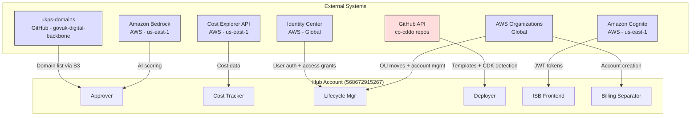
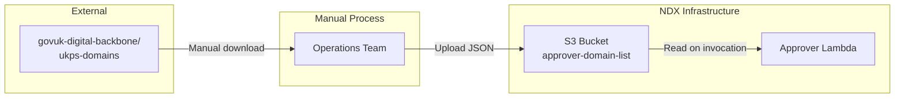
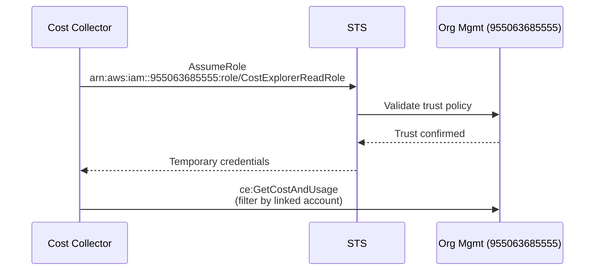
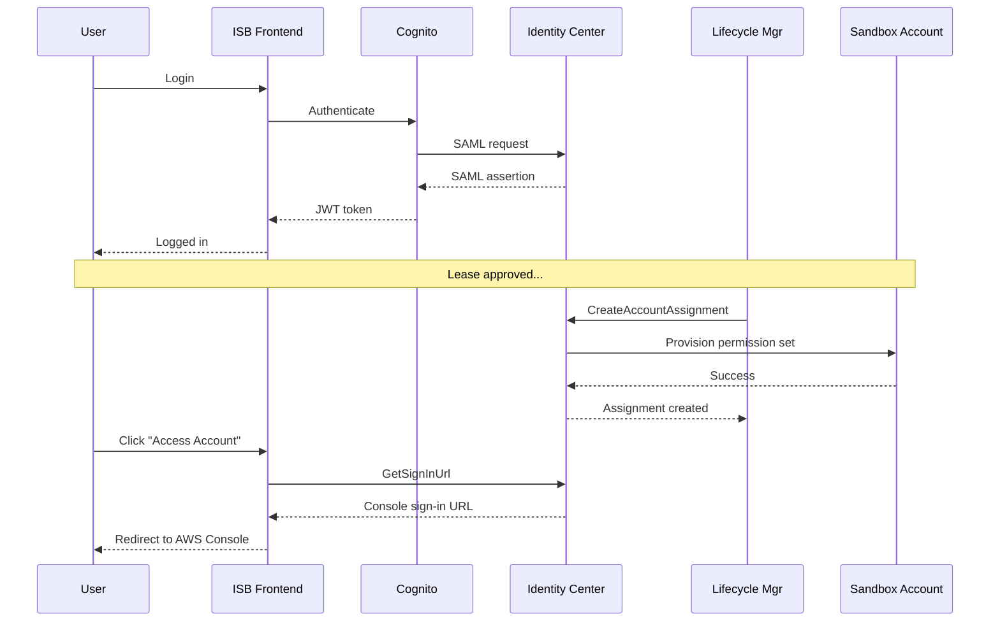

# External Integrations

> **Last Updated**: 2026-03-06
> **Sources**: repos/innovation-sandbox-on-aws-approver, repos/innovation-sandbox-on-aws-costs, repos/innovation-sandbox-on-aws-deployer, repos/innovation-sandbox-on-aws-billing-seperator, .state/discovered-accounts.json, .state/org-ous.json

## Executive Summary

The NDX:Try AWS platform integrates with multiple external systems beyond the core ISB infrastructure. These integrations span AWS-native services (Cost Explorer, Bedrock, Identity Center, Organizations), third-party APIs (GitHub), and cross-organizational data sources (ukps-domains for UK public sector domain whitelisting). Each integration has distinct authentication patterns, failure modes, and data exchange contracts.

---

## Integration Map


```mermaid
graph TB
    subgraph "External Systems"
        UKPS[ukps-domains<br/>GitHub - govuk-digital-backbone]
        CE[Cost Explorer API<br/>AWS - us-east-1]
        IDC[Identity Center<br/>AWS - Global]
        BEDROCK[Amazon Bedrock<br/>AWS - us-east-1]
        GITHUB[GitHub API<br/>co-cddo repos]
        ORGS[AWS Organizations<br/>Global]
        COGNITO[Amazon Cognito<br/>AWS - us-east-1]
    end

    subgraph "Hub Account (568672915267)"
        APPROVER[Approver]
        COSTS[Cost Tracker]
        LIFECYCLE[Lifecycle Mgr]
        DEPLOYER[Deployer]
        FRONTEND[ISB Frontend]
        BILLING[Billing Separator]
    end

    UKPS -->|Domain list via S3| APPROVER
    CE -->|Cost data| COSTS
    IDC -->|User auth + access grants| LIFECYCLE
    BEDROCK -->|AI scoring| APPROVER
    GITHUB -->|Templates + CDK detection| DEPLOYER
    ORGS -->|OU moves + account mgmt| LIFECYCLE
    ORGS -->|Account creation| BILLING
    COGNITO -->|JWT tokens| FRONTEND

    style UKPS fill:#ddf,stroke:#333
    style CE fill:#ddf,stroke:#333
    style IDC fill:#ddf,stroke:#333
    style BEDROCK fill:#ddf,stroke:#333
    style GITHUB fill:#fdd,stroke:#333
    style ORGS fill:#ddf,stroke:#333
    style COGNITO fill:#ddf,stroke:#333
```

---

## Integration 1: ukps-domains (Domain Whitelist)

### Overview

| Property | Value |
|----------|-------|
| **Repository** | `govuk-digital-backbone/ukps-domains` |
| **Purpose** | Authoritative list of UK public sector email domains |
| **Owner** | GDS (Government Digital Service) |
| **Consumer** | Approver system (domain verification rule) |
| **Update Frequency** | Weekly (manual) |

### Data Flow


```mermaid
graph LR
    subgraph "External"
        UKPS[govuk-digital-backbone/<br/>ukps-domains]
    end

    subgraph "NDX Infrastructure"
        S3[S3 Bucket<br/>approver-domain-list]
        Lambda[Approver Lambda]
    end

    subgraph "Manual Process"
        Ops[Operations Team]
    end

    UKPS -->|Manual download| Ops
    Ops -->|Upload JSON| S3
    S3 -->|Read on invocation| Lambda
```

### Data Format

```json
{
  "domains": [
    {"domain": "gov.uk", "organisation": "UK Government", "category": "central_government"},
    {"domain": "nhs.uk", "organisation": "National Health Service", "category": "nhs"},
    {"domain": "police.uk", "organisation": "UK Police Forces", "category": "police"}
  ],
  "lastUpdated": "2026-01-15T10:00:00Z",
  "version": "2.3.1"
}
```

### Failure Modes

| Failure | Impact | Mitigation |
|---------|--------|------------|
| ukps-domains repo unavailable | Cannot update whitelist | Use cached S3 version |
| S3 bucket inaccessible | All domain checks fail | CloudWatch alarm, fallback list |
| Stale domain list | Legitimate new domains rejected | Weekly update SLA |

---

## Integration 2: AWS Cost Explorer API

### Overview

| Property | Value |
|----------|-------|
| **Service** | AWS Cost Explorer |
| **Purpose** | Retrieve actual AWS spend for sandbox accounts |
| **Authentication** | IAM role assumption (Hub to Org Mgmt) |
| **Rate Limits** | 100 requests/hour, 5 TPS |
| **Data Lag** | 24-48 hours |
| **Region** | us-east-1 (Cost Explorer endpoint) |

### Cross-Account Access Pattern


```mermaid
sequenceDiagram
    participant Cost Collector
    participant STS
    participant Org Mgmt (955063685555)

    Cost Collector->>STS: AssumeRole<br/>arn:aws:iam::955063685555:role/CostExplorerReadRole
    STS->>Org Mgmt (955063685555): Validate trust policy
    Org Mgmt (955063685555)-->>STS: Trust confirmed
    STS-->>Cost Collector: Temporary credentials
    Cost Collector->>Org Mgmt (955063685555): ce:GetCostAndUsage<br/>(filter by linked account)
```

### Rate Limiting Strategy

The `innovation-sandbox-on-aws-costs` repository uses `@aws-sdk/client-cost-explorer` v3.995.0 with the following mitigations:

1. **Batch Queries**: Query multiple accounts in a single request using `LINKED_ACCOUNT` dimension filter
2. **Reserved Concurrency**: Lambda limited to prevent parallel Cost Explorer bursts
3. **Exponential Backoff**: Retry on `ThrottlingException`
4. **Caching**: Never re-query same lease/date range (check DynamoDB first)

### Failure Modes

| Failure | Impact | Mitigation |
|---------|--------|------------|
| Cost Explorer unavailable | Cost collection fails | SQS DLQ, manual retry |
| Throttling (> 100 req/h) | Delayed cost data | Queue processing, backoff |
| Data lag > 72 hours | Billing separator forces release | Alert ops, estimate costs |
| Incorrect cost data | Budget compliance errors | Sanity checks (cost vs duration) |

---

## Integration 3: AWS Identity Center (SSO)

### Overview

| Property | Value |
|----------|-------|
| **Service** | AWS IAM Identity Center |
| **Purpose** | User authentication and account access provisioning |
| **Authentication** | IAM role with `sso:*`, `identitystore:*` |
| **Identity Store** | Configured via ISB IDC Stack |
| **Consumer** | Lifecycle Manager Lambda |

### Integration Points

**1. User Authentication** (ISB Frontend)
```
User -> Cognito User Pool -> Identity Center -> SAML assertion -> JWT token
```

**2. Permission Set Assignment** (on lease approval)
```
Lifecycle Manager -> Identity Center -> CreateAccountAssignment
  TargetId: pool account ID
  PrincipalType: USER
  PermissionSetArn: IsbUserPermissionSet
```

**3. Permission Set Revocation** (on lease termination)
```
Lifecycle Manager -> Identity Center -> DeleteAccountAssignment
  TargetId: pool account ID
  PrincipalType: USER
```

### Event Flow


```mermaid
sequenceDiagram
    participant User
    participant ISB Frontend
    participant Cognito
    participant Identity Center
    participant Lifecycle Mgr
    participant Sandbox Account

    User->>ISB Frontend: Login
    ISB Frontend->>Cognito: Authenticate
    Cognito->>Identity Center: SAML request
    Identity Center-->>Cognito: SAML assertion
    Cognito-->>ISB Frontend: JWT token
    ISB Frontend-->>User: Logged in

    Note over User,Sandbox Account: Lease approved...

    Lifecycle Mgr->>Identity Center: CreateAccountAssignment
    Identity Center->>Sandbox Account: Provision permission set
    Sandbox Account-->>Identity Center: Success
    Identity Center-->>Lifecycle Mgr: Assignment created

    User->>ISB Frontend: Click "Access Account"
    ISB Frontend->>Identity Center: GetSignInUrl
    Identity Center-->>ISB Frontend: Console sign-in URL
    ISB Frontend-->>User: Redirect to AWS Console
```

### Failure Modes

| Failure | Impact | Mitigation |
|---------|--------|------------|
| Identity Center unavailable | Cannot provision access | Retry with exponential backoff |
| Permission set not found | Access grant fails | Fallback to default permission set |
| User not in Identity Store | Cannot create lease | Validate user before lease creation |
| SAML assertion expired | Re-authentication required | Token refresh flow |

---

## Integration 4: Amazon Bedrock AI

### Overview

| Property | Value |
|----------|-------|
| **Service** | Amazon Bedrock |
| **Model** | Claude 3 Sonnet (anthropic.claude-3-sonnet-20240229-v1:0) |
| **Purpose** | AI-enhanced risk assessment for lease approvals |
| **Region** | us-east-1 (Bedrock model availability) |
| **Consumer** | Approver Lambda (rules R09, R16, R19) |
| **Cost** | ~$0.005-0.01 per approval |

### API Usage

The Approver uses `@aws-sdk/client-bedrock-runtime` v3.987.0 to invoke Claude 3 Sonnet for three scoring rules:

- **R09 Justification Quality**: Evaluates the business case text
- **R16 Anomaly Detection**: Identifies unusual request patterns
- **R19 Holistic Risk**: Overall risk scoring with context

### Cost Profile

| Metric | Value |
|--------|-------|
| Input tokens per request | ~400 |
| Output tokens per request | ~80 |
| Cost per request | ~$0.0024 |
| Monthly cost (1000 approvals) | ~$2.40 |

### Data Privacy

- Bedrock configured to NOT retain data for training
- Justification text may contain PII (names, emails)
- API version `bedrock-2023-05-31` ensures no data retention

### Failure Modes

| Failure | Impact | Mitigation |
|---------|--------|------------|
| Bedrock unavailable | AI rules return neutral score (50) | Fallback scoring, manual review triggered |
| Model throttling | Delayed approval | Retry with backoff, queue requests |
| Malformed response | Cannot parse JSON | Default to manual review |
| High latency (>30s) | Lambda timeout | Adjusted Lambda timeout, async processing |

---

## Integration 5: GitHub API (Deployment)

### Overview

| Property | Value |
|----------|-------|
| **Service** | GitHub REST API v3 |
| **Purpose** | Fetch CloudFormation templates and CDK projects |
| **Authentication** | Personal Access Token (Secrets Manager) |
| **Rate Limit** | 5000 requests/hour (authenticated) |
| **Consumer** | Deployer Lambda |

### API Usage

The Deployer (`innovation-sandbox-on-aws-deployer`) uses `@aws-sdk/client-secrets-manager` v3.993.0 to retrieve the GitHub token, then:

1. **CDK Detection**: Check for `cdk.json` in the repository
2. **Sparse Clone**: For CDK projects, clone only the required path
3. **Template Fetch**: For CloudFormation, download the template YAML directly

### Authentication

```
Secrets Manager -> "github-deployer-token" -> ghp_xxxxxxxxxxxx
```

The Deployer also uses `@aws-sdk/client-ssm` for parameter store lookups for ISB API configuration used by the `@co-cddo/isb-client` library.

### Failure Modes

| Failure | Impact | Mitigation |
|---------|--------|------------|
| GitHub unavailable | Deployment fails | Retry 3x, fallback to cached templates |
| Rate limit exceeded | Throttled requests | Exponential backoff, queue |
| Token expired | 401 Unauthorized | CloudWatch alarm, rotate token |
| Template not found | 404 error | Validate template path in lease template |
| Large repository | Clone timeout | Sparse checkout, shallow clone |

---

## Integration 6: AWS Organizations

### Overview

| Property | Value |
|----------|-------|
| **Service** | AWS Organizations |
| **Purpose** | Account lifecycle management (OU moves) |
| **Authentication** | IAM role in Hub account |
| **Consumer** | Lifecycle Manager, Billing Separator |

### OU Move Operations

The Billing Separator (`@aws-sdk/client-organizations` v3.1000.0) performs OU moves as part of the account lifecycle:

```
Available OU -> Active OU       (on lease approval)
Active OU -> CleanUp OU         (on lease termination)
CleanUp OU -> Available OU      (after successful cleanup)
CleanUp OU -> Quarantine OU     (after cleanup failure)
```

### Current OU Structure (from .state/org-ous.json)

| OU Name | OU ID | Purpose |
|---------|-------|---------|
| InnovationSandbox | ou-2laj-lha5vsam | Parent for ISB resources |
| ndx_InnovationSandboxAccountPool | ou-2laj-4dyae1oa | Pool account parent |
| Infrastructure | ou-2laj-40z2mrlg | Network, Perimeter, SharedServices |
| Security | ou-2laj-8q61vv13 | Audit, LogArchive |
| Workloads | ou-2laj-4t1kuxou | InnovationSandboxHub |
| Suspended | ou-2laj-vn184pt1 | Deactivated accounts |

---

## Integration 7: @co-cddo/isb-client (Shared API Client)

### Overview

| Property | Value |
|----------|-------|
| **Package** | `@co-cddo/isb-client` |
| **Purpose** | Shared TypeScript client for ISB API |
| **Distribution** | GitHub Releases (tarball) |
| **Consumers** | Approver, Costs, Deployer |

### Version Distribution

| Consumer | Client Version | Distribution URL |
|----------|---------------|-----------------|
| Approver | v2.0.1 | `github.com/co-cddo/innovation-sandbox-on-aws-client/releases/download/v2.0.1/...` |
| Costs | v2.0.0 | `github.com/co-cddo/innovation-sandbox-on-aws-client/releases/download/v2.0.0/...` |
| Deployer | v2.0.0 | `github.com/co-cddo/innovation-sandbox-on-aws-client/releases/download/v2.0.0/...` |

This client wraps the ISB API Gateway with typed methods for lease operations, account queries, and template lookups, using `@aws-sdk/client-secrets-manager` v3.992.0 for API key retrieval.

---

## Security Considerations

### Authentication Methods

| System | Method | Credential Storage | Rotation |
|--------|--------|-------------------|----------|
| ukps-domains | None (public repo) | N/A | N/A |
| Cost Explorer | IAM role assumption | N/A (temporary) | Automatic |
| Identity Center | IAM role | N/A (temporary) | Automatic |
| Bedrock | IAM role | N/A (temporary) | Automatic |
| GitHub API | Personal Access Token | Secrets Manager | Manual (annual) |
| Organizations | IAM role | N/A (temporary) | Automatic |

### Network Security

**Current Setup:**
- Lambda functions use NAT Gateway for internet access (GitHub API calls)
- AWS service calls (Bedrock, Cost Explorer, etc.) traverse the AWS backbone
- No VPC endpoints currently deployed for AWS services

**Recommended VPC Endpoints:**
```
- com.amazonaws.us-east-1.bedrock-runtime
- com.amazonaws.us-east-1.ce
- com.amazonaws.us-east-1.secretsmanager
```

---

## Monitoring & Alerting

### CloudWatch Metrics

| Integration | Metric | Alarm Threshold |
|-------------|--------|----------------|
| Cost Explorer | `CostExplorerLatency` | > 30s |
| Cost Explorer | `CostExplorerThrottles` | > 5/hour |
| Bedrock | `BedrockLatency` | > 10s |
| Bedrock | `BedrockErrors` | > 5% |
| GitHub | `GitHubAPIErrors` | > 10/hour |
| Identity Center | `PermissionSetAssignmentFailures` | > 5/hour |

---

## References

- [70-data-flows.md](./70-data-flows.md) - Data flow diagrams
- [20-approver-system.md](./20-approver-system.md) - Approver architecture
- [22-cost-tracking.md](./22-cost-tracking.md) - Cost Explorer usage
- [23-deployer.md](./23-deployer.md) - Deployer architecture
- [21-billing-separator.md](./21-billing-separator.md) - Billing separator details
- [04-cross-account-trust.md](./04-cross-account-trust.md) - IAM trust relationships

---
*Generated from source analysis. See [00-repo-inventory.md](./00-repo-inventory.md) for full inventory.*
