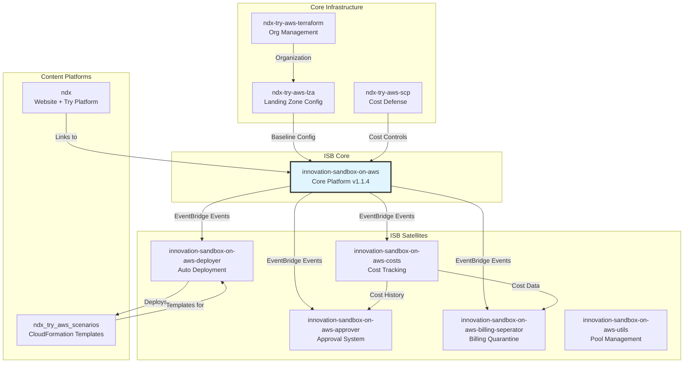

# Repository Dependencies

**Document Version:** 1.0
**Date:** 2026-02-03
**Total Repositories:** 12

---

## Executive Summary

This document maps the dependency relationships between the 12 repositories in the NDX:Try AWS ecosystem. It identifies shared code, deployment order constraints, and integration points based on package.json analysis and architectural understanding.

---

## Dependency Graph



---

## Deployment Order Dependencies

### Phase 1: Foundation (AWS Organization)

**Order:**
1. `ndx-try-aws-terraform` (organization structure)
2. `ndx-try-aws-lza` (Landing Zone Accelerator)
3. `ndx-try-aws-scp` (Service Control Policies)

**Rationale:**
- Organization must exist before LZA can configure it
- LZA establishes account structure and baselines
- SCPs applied after accounts created

---

### Phase 2: ISB Core

**Order:**
4. `innovation-sandbox-on-aws` (all 4 stacks)
   - AccountPool Stack
   - IDC Stack
   - Data Stack
   - Compute Stack

**Prerequisites:**
- LZA has created base OUs
- Identity Center configured
- Parent OU for sandbox accounts exists

---

### Phase 3: ISB Satellites

**Order (parallel after ISB Core):**
5. `innovation-sandbox-on-aws-approver`
6. `innovation-sandbox-on-aws-costs`
7. `innovation-sandbox-on-aws-billing-seperator`
8. `innovation-sandbox-on-aws-deployer`

**Prerequisites:**
- ISB Core EventBridge bus exists
- ISB Core DynamoDB tables created
- Identity Center integration complete

**Cross-Satellite Dependencies:**
- Costs → Billing Separator (cost data check)
- Costs → Approver (historical spending)

---

### Phase 4: Content Platforms

**Order (can deploy in parallel):**
9. `ndx` (website)
10. `ndx_try_aws_scenarios` (templates)

**Prerequisites:**
- None (independent of ISB)
- ISB URL for links from NDX website

---

### Phase 5: Utilities

**Order:**
11. `innovation-sandbox-on-aws-utils` (scripts)

**Prerequisites:**
- ISB Core deployed (for pool account creation)

---

## NPM Package Dependencies

### innovation-sandbox-on-aws (Core)

**Key Dependencies:**
```json
{
  "workspaces": [
    "source/frontend",
    "source/layers/*",
    "source/lambdas/**",
    "source/infrastructure",
    "source/common"
  ],
  "version": "1.1.4"
}
```

**AWS SDK Versions:**
- @aws-sdk/* v3.654.0 - v3.758.0 (mixed)
- aws-cdk v2.170.0 (devDependency)

**Shared Internal Packages:**
- `@amzn/innovation-sandbox-infrastructure` (CDK app)
- `@amzn/innovation-sandbox-frontend` (React UI)
- Common libraries in `source/common/`

---

### innovation-sandbox-on-aws-approver

**Key Dependencies:**
```json
{
  "@aws-lambda-powertools/logger": "^2.12.0",
  "@aws-sdk/client-bedrock-runtime": "^3.700.0",
  "@aws-sdk/client-dynamodb": "^3.700.0",
  "@aws-sdk/client-eventbridge": "^3.700.0",
  "aws-cdk-lib": "^2.170.0",
  "zod": "^3.24.0",
  "engines": {"node": ">=20.0.0"}
}
```

**External API Dependencies:**
- Amazon Bedrock (us-east-1)
- ukps-domains (GitHub, manual sync)

**Shared with ISB Core:**
- EventBridge event schemas
- DynamoDB table structures (read-only)

---

### innovation-sandbox-on-aws-costs

**Key Dependencies:**
```json
{
  "@aws-sdk/client-cost-explorer": "^3.980.0",
  "@aws-sdk/client-scheduler": "^3.980.0",
  "@aws-sdk/s3-request-presigner": "^3.980.0",
  "aws-cdk-lib": "^2.237.1",
  "zod": "^4.3.6"
}
```

**External API Dependencies:**
- AWS Cost Explorer (requires org management account role)

**Consumed by:**
- Billing Separator (reads CostReports table)
- Approver (reads for scoring rules)

---

### innovation-sandbox-on-aws-deployer

**Key Dependencies:**
```json
{
  "@aws-sdk/client-cloudformation": "^3.978.0",
  "@aws-sdk/client-secrets-manager": "^3.978.0",
  "@aws-sdk/client-sts": "^3.978.0",
  "js-yaml": "^4.1.1",
  "engines": {"node": ">=22.0.0"}
}
```

**External API Dependencies:**
- GitHub API (template fetching)

**Consumes Templates From:**
- ndx_try_aws_scenarios repository

---

### ndx (Website)

**Key Dependencies:**
```json
{
  "@11ty/eleventy": "^3.1.2",
  "@x-govuk/govuk-eleventy-plugin": "^8.3.0",
  "@playwright/test": "^1.58.1",
  "packageManager": "yarn@4.5.0"
}
```

**No direct integration with ISB** (links only)

---

### ndx_try_aws_scenarios

**275+ CloudFormation templates**

**Dependencies:**
- None (pure CloudFormation YAML/JSON)
- Consumed by Deployer Lambda

---

## Shared Code & Libraries

### Internal Shared Packages

**ISB Core** (`innovation-sandbox-on-aws`)
```
source/common/
  ├── src/
  │   ├── types.ts              # Shared TypeScript types
  │   ├── constants.ts          # Environment constants
  │   └── utils/
  │       ├── dynamodb.ts       # DynamoDB helpers
  │       ├── eventbridge.ts    # Event publishing
  │       └── validation.ts     # Zod schemas
  └── package.json
```

**Lambda Layers**
```
source/layers/common/
  └── nodejs/
      └── node_modules/         # Shared dependencies
          ├── @aws-sdk/          # AWS SDK v3
          ├── zod/               # Validation
          └── luxon/             # Date handling

source/layers/dependencies/
  └── nodejs/
      └── node_modules/         # Third-party deps
```

---

### External Shared Dependencies

**AWS SDK v3**
- All TypeScript repos use @aws-sdk/* v3.700+
- Potential version conflicts (3.654 vs 3.980)

**CDK Versions**
- ISB Core: v2.170.0
- Approver: v2.170.0
- Costs: v2.237.1 (newer)
- **Issue**: Mixed CDK versions may cause construct incompatibilities

**Validation Library**
- ISB Core: No zod
- Approver: zod v3.24.0
- Costs: zod v4.3.6 (major version difference)
- Deployer: No zod

---

## Event Schema Dependencies

### EventBridge Event Contracts

**Published by ISB Core:**
```typescript
// LeaseApproved event
interface LeaseApprovedEvent {
  source: 'leases-api'
  'detail-type': 'LeaseApproved'
  detail: {
    leaseId: {userEmail: string; uuid: string}
    awsAccountId: string
    approvedBy: string
  }
}

// LeaseTerminated event
interface LeaseTerminatedEvent {
  source: 'leases-api'
  'detail-type': 'LeaseTerminated'
  detail: {
    leaseId: {userEmail: string; uuid: string}
    accountId: string
    terminatedAt: number
  }
}
```

**Consumed by Satellites:**
- Approver listens for: `LeaseRequested`
- Deployer listens for: `LeaseApproved`
- Costs listens for: `LeaseTerminated`
- Billing Separator listens for: `LeaseTerminated`

**Breaking Change Risk:**
- If ISB Core changes event schema, all satellites affected
- No schema versioning currently in place

---

## DynamoDB Table Dependencies

### Read/Write Matrix

| Table | ISB Core | Approver | Costs | Billing Sep | Deployer |
|-------|----------|----------|-------|-------------|----------|
| LeaseTable | R/W | R | R | R | R |
| SandboxAccountTable | R/W | - | - | R/W | - |
| LeaseTemplateTable | R/W | - | - | - | R |
| ApprovalHistory | - | R/W | - | - | - |
| CostReports | - | R | R/W | R | - |
| QuarantineStatus | - | - | - | R/W | - |

**Legend:**
- R/W: Read and Write
- R: Read-only
- -: No access

**Cross-Account Access:**
- All satellites in Hub account (568672915267)
- All tables in same account
- No cross-account DynamoDB access required

---

## Deployment Automation

### GitHub Actions Workflows

**Repositories with CI/CD:**
- innovation-sandbox-on-aws-approver: `deploy.yml`
- innovation-sandbox-on-aws-billing-seperator: `deploy.yml`, `pr-check.yml`
- innovation-sandbox-on-aws-costs: `deploy.yml`, `ci.yml`
- innovation-sandbox-on-aws-deployer: `ci.yml`
- ndx: `infra.yaml`, `ci.yaml`, `test.yml`
- ndx_try_aws_scenarios: `build-deploy.yml`
- ndx-try-aws-scp: `terraform.yaml`

**Repositories without CI/CD:**
- innovation-sandbox-on-aws (manual CDK deployment)
- innovation-sandbox-on-aws-utils (manual scripts)
- ndx-try-aws-lza (manual LZA pipeline)
- ndx-try-aws-terraform (manual terraform apply)
- ndx-try-aws-isb (empty)

---

## Dependency Issues & Risks

### Issue 1: Mixed AWS SDK Versions

**Problem:**
- ISB Core: @aws-sdk v3.654 - v3.758
- Approver: @aws-sdk v3.700
- Costs: @aws-sdk v3.980
- Deployer: @aws-sdk v3.978

**Risk:** API incompatibilities, unexpected behavior

**Mitigation:** Standardize on v3.980+ across all repos

---

### Issue 2: CDK Version Mismatch

**Problem:**
- ISB Core: aws-cdk-lib v2.170.0
- Costs: aws-cdk-lib v2.237.1

**Risk:** Construct compatibility issues

**Mitigation:** Align to v2.237.1 (latest)

---

### Issue 3: No Event Schema Versioning

**Problem:** EventBridge events have no version field

**Example:**
```json
{
  "detail-type": "LeaseApproved",
  // No "version": "1.0" field
}
```

**Risk:** Breaking changes affect all consumers simultaneously

**Mitigation:** Add schema version field, support multiple versions

---

### Issue 4: Uncoordinated Deployments

**Problem:** No enforced deployment order

**Risk:** Satellite deployed before ISB Core creates EventBridge bus

**Mitigation:** Document deployment order (this document), CI/CD orchestration

---

## Recommended Dependency Management

### 1. Monorepo Consideration

**Current:** 12 separate repositories
**Alternative:** Monorepo with workspaces

**Benefits:**
- Shared dependency versions
- Atomic updates across components
- Easier refactoring

**Drawbacks:**
- Larger repo size
- Loss of independent versioning

**Recommendation:** Keep separate repos, use dependency management tools

---

### 2. Dependency Pinning

**Current:** Mix of exact (`3.700.0`) and caret (`^3.700.0`)

**Recommended:**
```json
{
  "@aws-sdk/client-dynamodb": "3.980.0",  // Exact version
  "aws-cdk-lib": "2.237.1"                 // Exact version
}
```

**Benefits:**
- Reproducible builds
- No surprise updates

---

### 3. Shared Type Definitions

**Create:** `@ndx-try/types` NPM package

**Contents:**
```typescript
// Event schemas
export interface LeaseApprovedEvent {...}

// DynamoDB schemas
export interface Lease {...}

// API contracts
export interface CreateLeaseRequest {...}
```

**Publish to:** Private NPM registry or GitHub Packages

---

## References

- [00-repo-inventory.md](./00-repo-inventory.md) - Repository overview
- [70-data-flows.md](./70-data-flows.md) - Data flow diagrams
- [71-external-integrations.md](./71-external-integrations.md) - External APIs

---

**Document Version:** 1.0
**Last Updated:** 2026-02-03
**Status:** Complete - Based on package.json analysis
