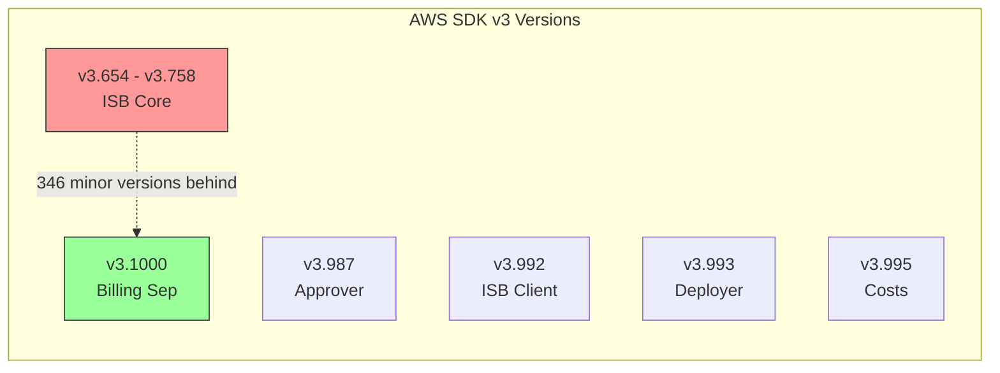
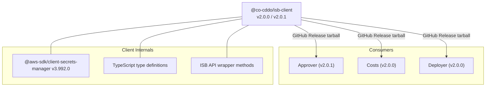

# Repository Dependencies

> **Last Updated**: 2026-03-02
> **Sources**: All 12 repositories (package.json analysis), repos/innovation-sandbox-on-aws-client/package.json

## Executive Summary

The NDX:Try AWS ecosystem comprises 12 repositories with complex inter-dependencies spanning EventBridge event contracts, shared DynamoDB tables, a common API client library (`@co-cddo/isb-client`), and overlapping AWS SDK versions. Dependency analysis reveals version fragmentation across CDK (v2.170.0 to v2.240.0), AWS SDK v3 (v3.654.0 to v3.1000.0), and validation libraries (zod v3.24.0 vs v4.3.6), creating compatibility risks that warrant standardisation.

---

## Dependency Graph

```mermaid
graph TB
    subgraph "Core Infrastructure"
        LZA[ndx-try-aws-lza<br/>Landing Zone Config<br/>YAML]
        TF[ndx-try-aws-terraform<br/>Org Management<br/>Terraform]
        SCP[ndx-try-aws-scp<br/>Cost Defense<br/>Terraform]
    end

    subgraph "ISB Core"
        ISB[innovation-sandbox-on-aws<br/>v1.1.4 - CDK v2.170.0<br/>21 Lambda functions]
    end

    subgraph "Shared Client"
        CLIENT[@co-cddo/isb-client<br/>v2.0.0 / v2.0.1<br/>ISB API wrapper]
    end

    subgraph "ISB Satellites"
        APPROVER[approver<br/>v0.1.0 - CDK v2.170.0]
        BILLING[billing-seperator<br/>v1.0.0 - CDK v2.240.0]
        COSTS[costs<br/>v1.0.0 - CDK v2.240.0]
        DEPLOYER[deployer<br/>v1.0.0 - No CDK infra]
    end

    subgraph "Content Platforms"
        NDX[ndx website<br/>Eleventy v3.1.2<br/>Yarn 4.5.0]
        SCENARIOS[ndx_try_aws_scenarios<br/>Eleventy v3.0.0<br/>275+ templates]
    end

    subgraph "Utilities"
        UTILS[innovation-sandbox-on-aws-utils<br/>Python scripts]
    end

    TF -->|Organization| LZA
    LZA -->|Baseline Config| ISB
    SCP -->|Cost Controls| ISB

    ISB -->|EventBridge Events| APPROVER
    ISB -->|EventBridge Events| BILLING
    ISB -->|EventBridge Events| COSTS
    ISB -->|EventBridge Events| DEPLOYER

    CLIENT -->|API client v2.0.1| APPROVER
    CLIENT -->|API client v2.0.0| COSTS
    CLIENT -->|API client v2.0.0| DEPLOYER

    COSTS -->|Cost Data| BILLING
    COSTS -->|Cost History| APPROVER
    DEPLOYER -->|Deploys templates| SCENARIOS
    NDX -->|Links to ISB| ISB

    style ISB fill:#e1f5ff,stroke:#333,stroke-width:3px
    style CLIENT fill:#ffe1e1,stroke:#333,stroke-width:2px
```

---

## Deployment Order Dependencies

### Phase 1: Foundation (AWS Organization)

| Order | Repository | IaC Tool | Purpose |
|-------|-----------|----------|---------|
| 1 | `ndx-try-aws-terraform` | Terraform | Organization structure, OUs |
| 2 | `ndx-try-aws-lza` | Landing Zone Accelerator | Account baselines, security |
| 3 | `ndx-try-aws-scp` | Terraform | Innovation Sandbox SCPs |

### Phase 2: ISB Core

| Order | Repository | IaC Tool | Stacks |
|-------|-----------|----------|--------|
| 4 | `innovation-sandbox-on-aws` | CDK v2.170.0 | AccountPool, IDC, Data, Compute |

**Prerequisites**: LZA has created OUs, Identity Center configured, parent OU exists.

### Phase 3: ISB Satellites (parallel after Phase 2)

| Order | Repository | IaC Tool | Prerequisites |
|-------|-----------|----------|---------------|
| 5 | `innovation-sandbox-on-aws-approver` | CDK v2.170.0 | ISBEventBus, DynamoDB tables |
| 6 | `innovation-sandbox-on-aws-costs` | CDK v2.240.0 | ISBEventBus, DynamoDB tables |
| 7 | `innovation-sandbox-on-aws-billing-seperator` | CDK v2.240.0 | ISBEventBus, DynamoDB tables |
| 8 | `innovation-sandbox-on-aws-deployer` | CDK (via CI) | ISBEventBus, Secrets Manager |

### Phase 4: Content Platforms (independent)

| Order | Repository | IaC Tool |
|-------|-----------|----------|
| 9 | `ndx` | Eleventy + CDK (infra) |
| 10 | `ndx_try_aws_scenarios` | Eleventy (static site) |

### Phase 5: Utilities (post-ISB)

| Order | Repository | Purpose |
|-------|-----------|---------|
| 11 | `innovation-sandbox-on-aws-utils` | Manual pool account management |

---

## NPM Package Dependencies

### AWS SDK v3 Version Matrix


```mermaid
graph LR
    subgraph "AWS SDK v3 Versions"
        direction TB
        V654["v3.654 - v3.758<br/>ISB Core"]
        V987["v3.987<br/>Approver"]
        V992["v3.992<br/>ISB Client"]
        V993["v3.993<br/>Deployer"]
        V995["v3.995<br/>Costs"]
        V1000["v3.1000<br/>Billing Sep"]
    end

    V654 -.->|"346 minor versions behind"| V1000

    style V654 fill:#f99,stroke:#333
    style V1000 fill:#9f9,stroke:#333
```

| Repository | @aws-sdk/* Range | Notes |
|-----------|-----------------|-------|
| innovation-sandbox-on-aws | v3.654.0 - v3.758.0 | Mixed across 21 workspaces |
| @co-cddo/isb-client | v3.992.0 | Exact pin |
| innovation-sandbox-on-aws-approver | v3.987.0 | Caret ranges (^3.987.0) |
| innovation-sandbox-on-aws-deployer | v3.993.0 | Caret ranges (^3.993.0) |
| innovation-sandbox-on-aws-costs | v3.995.0 | Caret ranges (^3.995.0) |
| innovation-sandbox-on-aws-billing-seperator | v3.1000.0 | Caret ranges (^3.1000.0) |

### CDK Version Matrix

| Repository | aws-cdk-lib | aws-cdk (CLI) | Notes |
|-----------|------------|---------------|-------|
| innovation-sandbox-on-aws | v2.170.0 | (devDep) | Core platform |
| innovation-sandbox-on-aws-approver | v2.170.0 | v2.170.0 | Aligned with core |
| innovation-sandbox-on-aws-costs | v2.240.0 | N/A | 70 minor versions ahead |
| innovation-sandbox-on-aws-billing-seperator | v2.240.0 | N/A | 70 minor versions ahead |

### Validation Library (zod) Versions

| Repository | zod Version | Major Version |
|-----------|------------|---------------|
| innovation-sandbox-on-aws-approver | ^3.24.0 | **v3** |
| innovation-sandbox-on-aws-costs | ^4.3.6 | **v4** |
| innovation-sandbox-on-aws-billing-seperator | ^4.3.6 | **v4** |
| innovation-sandbox-on-aws (core) | N/A | Not used |
| innovation-sandbox-on-aws-deployer | N/A | Not used |

**Note**: zod v3 to v4 is a major version bump with breaking API changes.

### Runtime Versions

| Repository | Node.js | Package Manager | Test Framework |
|-----------|---------|----------------|----------------|
| innovation-sandbox-on-aws | Node 20 | npm (workspaces) | vitest v4.0.10 |
| innovation-sandbox-on-aws-approver | >= 20.0.0 | npm | vitest v4.0.16 |
| innovation-sandbox-on-aws-costs | (not specified) | npm | vitest v4.0.18 |
| innovation-sandbox-on-aws-deployer | >= 22.0.0 | npm | vitest v4.0.17 |
| innovation-sandbox-on-aws-billing-seperator | (not specified) | npm | jest v30.2.0 |
| @co-cddo/isb-client | >= 20 | yarn v4.6.0 | jest v30.2.0 |
| ndx | (not specified) | yarn v4.5.0 | jest (+ Playwright) |
| ndx_try_aws_scenarios | >= 22.0.0 | npm | vitest v4.0.18 |

---

## Shared Code & Libraries

### @co-cddo/isb-client (Central API Client)


```mermaid
graph TB
    CLIENT["@co-cddo/isb-client<br/>v2.0.0 / v2.0.1"]

    subgraph "Consumers"
        APPROVER["Approver (v2.0.1)"]
        COSTS["Costs (v2.0.0)"]
        DEPLOYER["Deployer (v2.0.0)"]
    end

    CLIENT -->|GitHub Release tarball| APPROVER
    CLIENT -->|GitHub Release tarball| COSTS
    CLIENT -->|GitHub Release tarball| DEPLOYER

    subgraph "Client Internals"
        SM["@aws-sdk/client-secrets-manager v3.992.0"]
        TYPES["TypeScript type definitions"]
        API["ISB API wrapper methods"]
    end

    CLIENT --- SM
    CLIENT --- TYPES
    CLIENT --- API
```

**Distribution**: The client is distributed as a `.tgz` tarball via GitHub Releases, not a traditional npm registry. This means consumers pin to specific release URLs rather than semver ranges.

**Version Skew**: The Approver uses v2.0.1 while Costs and Deployer use v2.0.0, creating a minor version discrepancy.

### ISB Core Internal Packages

```
source/common/          # Shared TypeScript types and utilities
source/layers/common/   # Lambda layer with shared dependencies
source/layers/deps/     # Lambda layer with third-party deps
source/frontend/        # React SPA (workspace: @amzn/innovation-sandbox-frontend)
source/infrastructure/  # CDK stacks (workspace: @amzn/innovation-sandbox-infrastructure)
```

### Lambda Powertools Usage

| Repository | Logger | Metrics | Tracer | Idempotency | Parameters |
|-----------|--------|---------|--------|-------------|------------|
| Approver | v2.12.0 | v2.12.0 | - | v2.12.0 | v2.12.0 |
| Billing Sep | v2.31.0 | v2.31.0 | v2.31.0 | - | - |
| Costs | - | - | - | - | - |
| Deployer | - | - | - | - | - |
| ISB Core | - | - | - | - | - |

---

## Event Schema Dependencies

### EventBridge Event Contracts

All satellites depend on the event schema published by ISB Core. There is currently no schema versioning in place.

| Event | Publisher | Consumers | Breaking Change Risk |
|-------|----------|-----------|---------------------|
| LeaseRequested | ISB Core | Approver | High |
| LeaseApproved | ISB Core, Approver | Lifecycle Mgr, Deployer | High |
| LeaseDenied | Approver | Email notification | Low |
| LeaseTerminated | ISB Core, Monitoring | Costs, Billing Sep, Cleanup | High |
| CostDataCollected | Costs | Billing Sep | Medium |
| DeploymentComplete | Deployer | Leases API | Medium |

### DynamoDB Table Access Matrix

| Table | ISB Core | Approver | Costs | Billing Sep | Deployer |
|-------|----------|----------|-------|-------------|----------|
| LeaseTable | R/W | R | R | R | R |
| SandboxAccountTable | R/W | - | - | R/W | - |
| LeaseTemplateTable | R/W | - | - | - | R |
| ApprovalHistory | - | R/W | - | - | - |
| CostReports | - | R | R/W | R | - |
| QuarantineStatus | - | - | - | R/W | - |

---

## GitHub Actions Workflows

### Repositories with CI/CD

| Repository | Workflows | Deploy Method |
|-----------|-----------|---------------|
| innovation-sandbox-on-aws-approver | `deploy.yml` | CDK deploy via OIDC |
| innovation-sandbox-on-aws-billing-seperator | `deploy.yml`, `pr-check.yml` | CDK deploy via OIDC |
| innovation-sandbox-on-aws-costs | `deploy.yml`, `ci.yml` | CDK deploy via OIDC |
| innovation-sandbox-on-aws-deployer | `ci.yml` | CI only (deploy manual) |
| ndx | `infra.yaml`, `ci.yaml`, `test.yml` | CDK + S3 deploy |
| ndx_try_aws_scenarios | `build-deploy.yml` | S3 deploy |
| ndx-try-aws-scp | `terraform.yaml` | Terraform apply |

### Repositories without CI/CD

| Repository | Deploy Method |
|-----------|---------------|
| innovation-sandbox-on-aws | Manual CDK deploy (`npm run deploy:all`) |
| innovation-sandbox-on-aws-utils | Manual Python scripts |
| innovation-sandbox-on-aws-client | Manual GitHub Release |
| ndx-try-aws-lza | Manual LZA pipeline |
| ndx-try-aws-terraform | Manual `terraform apply` |
| ndx-try-aws-isb | Empty (no deployment) |

---

## Dependency Issues & Risks

### Issue 1: AWS SDK v3 Version Fragmentation

**Spread**: v3.654.0 (ISB Core) to v3.1000.0 (Billing Separator) -- a gap of 346 minor versions.

**Risk**: API incompatibilities, missing features in older versions, inconsistent error handling.

**Recommendation**: Standardise on v3.995.0+ across all repos. The ISB Core is most urgently in need of an update.

### Issue 2: CDK Version Mismatch

**Spread**: v2.170.0 (ISB Core, Approver) to v2.240.0 (Costs, Billing Sep) -- 70 minor versions apart.

**Risk**: Construct library incompatibilities, L2 construct API differences.

**Recommendation**: Align all repositories to v2.240.0.

### Issue 3: Zod Major Version Split

**Spread**: v3.24.0 (Approver) vs v4.3.6 (Costs, Billing Sep).

**Risk**: Schema definitions between v3 and v4 are not compatible. Any shared schema validation across these components would fail.

**Recommendation**: Migrate Approver to zod v4 to align with newer satellites.

### Issue 4: No Event Schema Versioning

**Problem**: EventBridge events have no version field. If ISB Core changes an event schema, all consuming satellites break simultaneously.

**Recommendation**: Add a `schemaVersion` field to all events and support backward compatibility during transitions.

### Issue 5: ISB Client Distribution via Tarball

**Problem**: The `@co-cddo/isb-client` is distributed as a GitHub Release tarball URL rather than from a package registry. This makes version resolution opaque and updates difficult to track.

**Recommendation**: Publish to GitHub Packages (npm) or a private registry for proper semver resolution.

### Issue 6: Mixed Test Frameworks

**Problem**: Some repos use vitest, others use jest. The billing separator and ISB client use jest v30, while all other TypeScript repos use vitest v4.

**Recommendation**: Standardise on vitest across all TypeScript repositories for consistency.

---

## Recommended Dependency Management

### 1. Shared Type Definitions

Create and publish `@ndx-try/types` as a shared package:

```typescript
// Event schemas
export interface LeaseApprovedEvent { ... }
export interface LeaseTerminatedEvent { ... }

// DynamoDB schemas
export interface Lease { ... }
export interface SandboxAccount { ... }

// API contracts
export interface CreateLeaseRequest { ... }
```

### 2. Dependency Pinning Strategy

**Current**: Mix of exact (`3.992.0`) and caret (`^3.987.0`) ranges.

**Recommended**: Use exact versions for AWS SDK and CDK to ensure reproducible builds:
```json
{
  "@aws-sdk/client-dynamodb": "3.995.0",
  "aws-cdk-lib": "2.240.0"
}
```

### 3. Renovate/Dependabot Coordination

Configure automated dependency updates across all repositories with grouped PRs for AWS SDK updates to maintain version alignment.

---

## References

- [00-repo-inventory.md](./00-repo-inventory.md) - Repository overview
- [70-data-flows.md](./70-data-flows.md) - Data flow diagrams
- [71-external-integrations.md](./71-external-integrations.md) - External APIs
- [50-github-actions-inventory.md](./50-github-actions-inventory.md) - CI/CD workflows

---
*Generated from source analysis. See [00-repo-inventory.md](./00-repo-inventory.md) for full inventory.*
