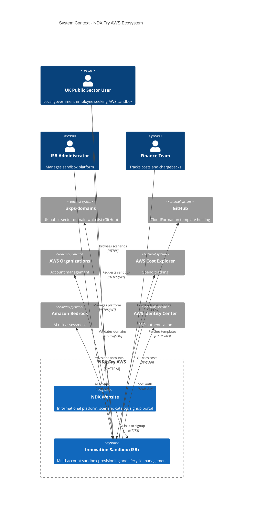
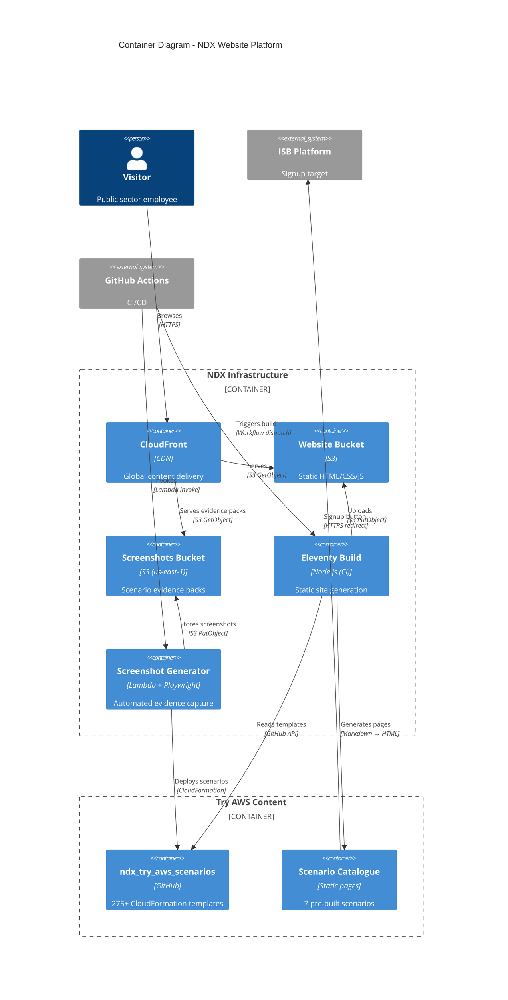
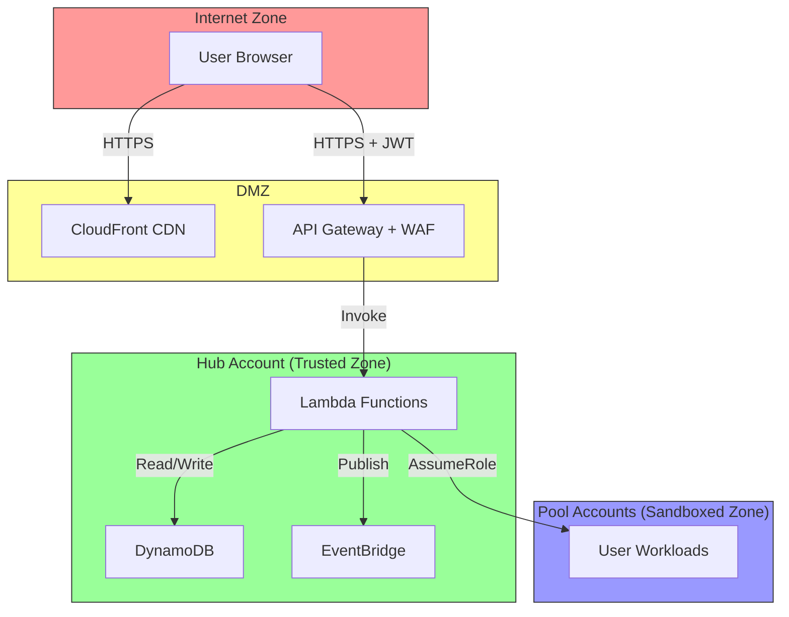

# C4 Architecture Diagrams

**Document Version:** 1.0
**Date:** 2026-02-03
**C4 Model:** System Context, Container, Component views

---

## Executive Summary

This document presents the NDX:Try AWS architecture using the C4 model (Context, Containers, Components, Code). It provides hierarchical views from the system boundary down to key implementation details.

**C4 Model Levels:**
1. **System Context** - External systems and users
2. **Container** - Applications and data stores (ISB and NDX)
3. **Component** - Internal modules (future)

---

## Level 1: System Context Diagram

### NDX + ISB Ecosystem



---

## Level 2: Container Diagram - ISB Platform

### ISB Core + Satellites

```mermaid
C4Container
    title Container Diagram - Innovation Sandbox Platform

    Person(user, "User", "Sandbox requester")
    Person(admin, "Admin", "Platform manager")

    Container_Boundary(hub_account, "Hub Account (568672915267)") {
        Container(frontend, "ISB Frontend", "React SPA", "User interface for lease management")
        Container(api_gateway, "API Gateway", "REST API", "HTTP API with JWT auth")

        ContainerDb(lease_db, "LeaseTable", "DynamoDB", "Active and pending leases")
        ContainerDb(account_db, "SandboxAccountTable", "DynamoDB", "Pool account inventory")
        ContainerDb(template_db, "LeaseTemplateTable", "DynamoDB", "Reusable configurations")

        Container(lease_lambda, "Leases Lambda", "Node.js 20", "CRUD operations on leases")
        Container(account_lambda, "Accounts Lambda", "Node.js 20", "Account management")
        Container(lifecycle_lambda, "Lifecycle Manager", "Node.js 20", "OU management, provisioning")
        Container(monitoring_lambda, "Lease Monitoring", "Python 3.12", "Budget/duration checks")

        Container(cleanup_sfn, "Cleanup State Machine", "Step Functions", "AWS Nuke orchestration")
        Container(cleanup_codebuild, "Account Cleaner", "CodeBuild", "Executes AWS Nuke")

        Container(event_bus, "ISBEventBus", "EventBridge", "Event-driven integration")

        Container(approver, "Approver", "Lambda + SFN", "19-rule scoring engine + AI")
        Container(deployer, "Deployer", "Lambda", "CloudFormation/CDK deployment")
        Container(costs, "Cost Tracker", "Lambda + Scheduler", "Cost Explorer integration")
        Container(billing_sep, "Billing Separator", "Lambda + SQS", "72h quarantine")

        ContainerDb(cost_db, "CostReports", "DynamoDB", "Historical spend")
        ContainerDb(approval_db, "ApprovalHistory", "DynamoDB", "Scoring audit trail")
    }

    Container_Boundary(pool_accounts, "Pool Accounts (x9)") {
        Container(pool_account, "Sandbox Account", "AWS Account", "User workload environment")
    }

    System_Ext(bedrock_ext, "Amazon Bedrock", "AI service")
    System_Ext(ce_ext, "Cost Explorer", "AWS billing API")
    System_Ext(idc_ext, "Identity Center", "SSO provider")

    Rel(user, frontend, "Uses", "HTTPS")
    Rel(frontend, api_gateway, "API calls", "HTTPS/JWT")
    Rel(api_gateway, lease_lambda, "Routes requests", "Invoke")

    Rel(lease_lambda, lease_db, "Read/Write", "AWS SDK")
    Rel(lease_lambda, event_bus, "Publish events", "PutEvents")
    Rel(account_lambda, account_db, "Read/Write", "AWS SDK")
    Rel(lifecycle_lambda, account_db, "Update status", "AWS SDK")

    Rel(event_bus, approver, "LeaseRequested", "Event pattern")
    Rel(event_bus, deployer, "LeaseApproved", "Event pattern")
    Rel(event_bus, costs, "LeaseTerminated", "Event pattern")
    Rel(event_bus, billing_sep, "LeaseTerminated", "Event pattern")

    Rel(approver, bedrock_ext, "AI assessment", "InvokeModel")
    Rel(approver, approval_db, "Write scores", "PutItem")
    Rel(approver, event_bus, "ApprovalComplete", "PutEvents")

    Rel(deployer, pool_account, "Deploy CFN", "AssumeRole")
    Rel(costs, ce_ext, "Query costs", "GetCostAndUsage")
    Rel(costs, cost_db, "Write data", "PutItem")

    Rel(billing_sep, cost_db, "Check availability", "GetItem")
    Rel(billing_sep, account_db, "Release quarantine", "UpdateItem")

    Rel(cleanup_sfn, cleanup_codebuild, "Trigger", "StartBuild")
    Rel(cleanup_codebuild, pool_account, "AWS Nuke", "AssumeRole")

    Rel(admin, frontend, "Manages", "HTTPS")
    Rel(lifecycle_lambda, idc_ext, "Permission sets", "CreateAccountAssignment")

    UpdateLayoutConfig($c4ShapeInRow="4", $c4BoundaryInRow="2")
```



---

## Level 2: Container Diagram - NDX Website

### Content Platform



---

## Key Architectural Patterns

### 1. Event-Driven Satellite Architecture

**Pattern:**
- ISB Core publishes lifecycle events to EventBridge
- Satellites subscribe to relevant event patterns
- Loose coupling enables independent deployment

**Benefits:**
- Satellites can be added/removed without ISB Core changes
- Fault isolation (satellite failure doesn't break core)
- Scalability (EventBridge handles fan-out)

**Drawbacks:**
- Eventual consistency
- Distributed tracing complexity
- Event schema versioning required

---

### 2. Multi-Account Isolation

**Pattern:**
- Hub Account (568672915267): Control plane
- Pool Accounts (x9): Workload isolation
- Management Account (955063685555): Organization root

**Benefits:**
- Security isolation (blast radius limited)
- Billing separation
- Policy enforcement via SCPs

**Drawbacks:**
- Cross-account networking complexity
- IAM role chaining overhead
- Cost Explorer queries span accounts

---

### 3. Serverless-First

**Pattern:**
- Lambda for all compute (except AWS Nuke)
- DynamoDB for data persistence
- S3 for object storage
- No EC2 instances

**Benefits:**
- Auto-scaling
- Pay-per-use cost model
- Zero server management

**Drawbacks:**
- Cold start latency
- 15-minute Lambda timeout (State machines for long tasks)
- Vendor lock-in

---

### 4. API Gateway + Lambda

**Pattern:**
- REST API Gateway fronts all HTTP endpoints
- JWT authorization via Cognito
- Lambda functions per resource type

**Benefits:**
- Standard HTTP interface
- Built-in throttling and caching
- WAF integration

**Drawbacks:**
- API Gateway cost at scale
- 29-second timeout
- Limited WebSocket support

---

## Technology Stack Summary

### ISB Core

| Layer | Technology | Version |
|-------|------------|---------|
| Frontend | React + Vite | React 18 |
| API | API Gateway REST | v1 |
| Compute | Lambda (Node.js) | Node 20.x |
| Orchestration | Step Functions | - |
| Data | DynamoDB | - |
| Events | EventBridge | - |
| Auth | Cognito + Identity Center | - |
| IaC | AWS CDK | v2.170.0 |

### ISB Satellites

| Component | Technology | Runtime |
|-----------|------------|---------|
| Approver | Lambda + Step Functions | Node 20.x |
| Deployer | Lambda | Node 22.x |
| Costs | Lambda + EventBridge Scheduler | TypeScript |
| Billing Separator | Lambda + SQS | Python 3.12 |

### NDX Website

| Component | Technology | Version |
|-----------|------------|---------|
| Static Site Generator | Eleventy | v3.1.2 |
| Design System | GOV.UK Frontend | v8.3.0 |
| Hosting | S3 + CloudFront | - |
| Package Manager | Yarn | v4.5.0 |

---

## Deployment Architecture

### ISB Deployment Model

```
Organization Root (955063685555)
  └── Workloads OU
        └── Prod OU
              └── InnovationSandboxHub (568672915267)
                    ├── AccountPool Stack (DynamoDB, EventBridge)
                    ├── IDC Stack (Identity Center integration)
                    ├── Data Stack (API Gateway, Lambdas)
                    ├── Compute Stack (Step Functions, monitoring)
                    ├── Approver CDK Stack
                    ├── Costs CDK Stack
                    ├── Deployer CDK Stack
                    └── Billing Separator CDK Stack
```

### Pool Account Distribution

```
InnovationSandbox OU
  └── ndx_InnovationSandboxAccountPool OU
        ├── Available OU (pool-003, 004, 005, 006, 009)
        ├── Active OU (none currently)
        ├── CleanUp OU (none currently)
        ├── Frozen OU (none currently)
        └── Quarantine OU (pool-001, 002, 007, 008)
```

---

## Security Boundaries

### Trust Zones



---

## Data Flow Highlights

### Critical Path: Lease Request to Active Sandbox

1. **User** → Frontend (React)
2. **Frontend** → API Gateway (POST /leases)
3. **API Gateway** → Leases Lambda
4. **Leases Lambda** → DynamoDB (create lease)
5. **Leases Lambda** → EventBridge (publish LeaseRequested)
6. **EventBridge** → Approver (trigger scoring)
7. **Approver** → Bedrock (AI assessment)
8. **Approver** → EventBridge (publish LeaseApproved)
9. **EventBridge** → Lifecycle Manager (provision access)
10. **Lifecycle Manager** → Identity Center (grant permissions)
11. **Lifecycle Manager** → Organizations (move OU)
12. **EventBridge** → Deployer (deploy template)
13. **Deployer** → CloudFormation (in pool account)
14. **User** receives access URL

**Total Time:** ~30-90 seconds (auto-approve) or 1-24 hours (manual review)

---

## References

- [70-data-flows.md](./70-data-flows.md) - Detailed data flow diagrams
- [10-isb-core-architecture.md](./10-isb-core-architecture.md) - ISB internals
- [C4 Model](https://c4model.com/) - Architecture visualization framework

---

**Document Version:** 1.0
**Last Updated:** 2026-02-03
**Status:** Complete - C4 Level 1 & 2 diagrams
