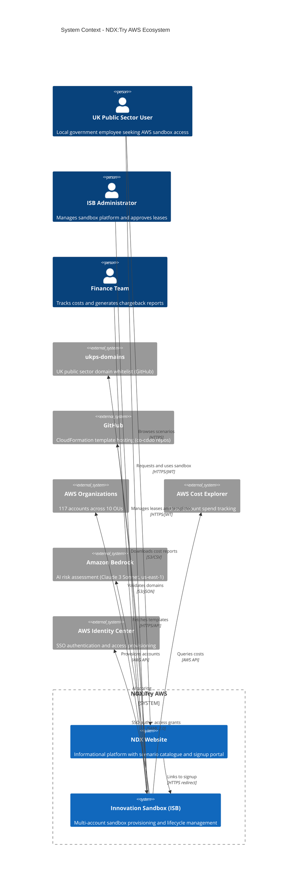
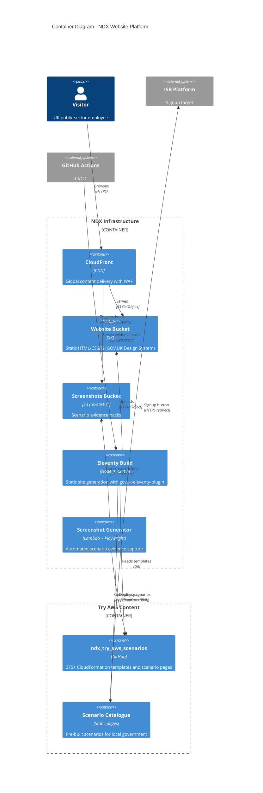
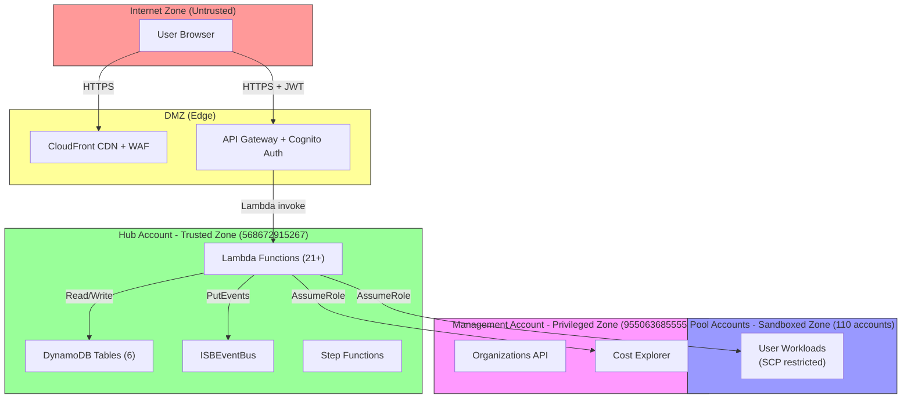

# C4 Architecture

> **Last Updated**: 2026-03-02
> **Sources**: All 12 repositories, .state/discovered-accounts.json, .state/org-ous.json, .state/discovered-scps.json

## Executive Summary

This document presents the NDX:Try AWS architecture using the C4 model (Context, Containers, Components). It provides hierarchical views from the system boundary down to internal component structure, covering both the Innovation Sandbox (ISB) platform and the NDX website ecosystem. The architecture follows an event-driven satellite pattern with a serverless-first approach across 117 AWS accounts.

---

## Level 1: System Context Diagram

### NDX + ISB Ecosystem

```mermaid
C4Context
    title System Context - NDX:Try AWS Ecosystem

    Person(user, "UK Public Sector User", "Local government employee seeking AWS sandbox access")
    Person(admin, "ISB Administrator", "Manages sandbox platform and approves leases")
    Person(finance, "Finance Team", "Tracks costs and generates chargeback reports")

    System_Boundary(ndx_boundary, "NDX:Try AWS") {
        System(ndx, "NDX Website", "Informational platform with scenario catalogue and signup portal")
        System(isb, "Innovation Sandbox (ISB)", "Multi-account sandbox provisioning and lifecycle management")
    }

    System_Ext(ukps, "ukps-domains", "UK public sector domain whitelist (GitHub)")
    System_Ext(github, "GitHub", "CloudFormation template hosting (co-cddo repos)")
    System_Ext(aws_org, "AWS Organizations", "117 accounts across 10 OUs")
    System_Ext(cost_explorer, "AWS Cost Explorer", "Cross-account spend tracking")
    System_Ext(bedrock, "Amazon Bedrock", "AI risk assessment (Claude 3 Sonnet, us-east-1)")
    System_Ext(idc, "AWS Identity Center", "SSO authentication and access provisioning")

    Rel(user, ndx, "Browses scenarios", "HTTPS")
    Rel(user, isb, "Requests and uses sandbox", "HTTPS/JWT")
    Rel(admin, isb, "Manages leases and templates", "HTTPS/JWT")
    Rel(finance, isb, "Downloads cost reports", "S3/CSV")

    Rel(isb, ukps, "Validates domains", "S3/JSON")
    Rel(isb, github, "Fetches templates", "HTTPS/API")
    Rel(isb, aws_org, "Provisions accounts", "AWS API")
    Rel(isb, cost_explorer, "Queries costs", "AWS API")
    Rel(isb, bedrock, "AI scoring", "AWS API")
    Rel(isb, idc, "SSO auth + access grants", "SAML 2.0")

    Rel(ndx, isb, "Links to signup", "HTTPS redirect")

    UpdateLayoutConfig($c4ShapeInRow="3", $c4BoundaryInRow="1")
```

---

## Level 2: Container Diagram - ISB Platform

### ISB Core + Satellites

```mermaid
C4Container
    title Container Diagram - Innovation Sandbox Platform

    Person(user, "User", "Sandbox requester")
    Person(admin, "Admin", "Platform manager")

    Container_Boundary(hub_account, "Hub Account (568672915267)") {
        Container(frontend, "ISB Frontend", "React SPA + Vite", "User interface for lease management")
        Container(api_gateway, "API Gateway", "REST API", "HTTP API with Cognito JWT auth")

        ContainerDb(lease_db, "LeaseTable", "DynamoDB", "Active and pending leases")
        ContainerDb(account_db, "SandboxAccountTable", "DynamoDB", "Pool account inventory (110 accounts)")
        ContainerDb(template_db, "LeaseTemplateTable", "DynamoDB", "Reusable lease configurations")

        Container(lease_lambda, "Leases Lambda", "Node.js 20", "CRUD operations on leases")
        Container(account_lambda, "Accounts Lambda", "Node.js 20", "Account management")
        Container(lifecycle_lambda, "Lifecycle Manager", "Node.js 20", "OU management, IDC provisioning")
        Container(monitoring_lambda, "Lease Monitoring", "Node.js 20", "Budget and duration checks")

        Container(cleanup_sfn, "Cleanup State Machine", "Step Functions", "AWS Nuke orchestration")
        Container(cleanup_codebuild, "Account Cleaner", "CodeBuild", "Executes AWS Nuke")

        Container(event_bus, "ISBEventBus", "EventBridge", "Event-driven integration hub")

        Container(approver, "Approver", "Lambda + SFN", "19-rule scoring engine with Bedrock AI")
        Container(deployer, "Deployer", "Lambda (Node 22)", "CloudFormation/CDK template deployment")
        Container(costs, "Cost Tracker", "Lambda + Scheduler", "Cost Explorer integration and reporting")
        Container(billing_sep, "Billing Separator", "Lambda + SQS", "72h billing quarantine")

        ContainerDb(cost_db, "CostReports", "DynamoDB", "Historical spend data")
        ContainerDb(approval_db, "ApprovalHistory", "DynamoDB", "Scoring audit trail")
    }

    Container_Boundary(pool_accounts, "Pool Accounts (110 in ndx_InnovationSandboxAccountPool OU)") {
        Container(pool_account, "Sandbox Account", "AWS Account", "Isolated user workload environment")
    }

    System_Ext(bedrock_ext, "Amazon Bedrock", "us-east-1")
    System_Ext(ce_ext, "Cost Explorer", "us-east-1")
    System_Ext(idc_ext, "Identity Center", "Global")

    Rel(user, frontend, "Uses", "HTTPS")
    Rel(frontend, api_gateway, "API calls", "HTTPS/JWT")
    Rel(api_gateway, lease_lambda, "Routes requests", "Lambda invoke")

    Rel(lease_lambda, lease_db, "Read/Write", "AWS SDK")
    Rel(lease_lambda, event_bus, "Publish events", "PutEvents")
    Rel(account_lambda, account_db, "Read/Write", "AWS SDK")
    Rel(lifecycle_lambda, account_db, "Update status", "AWS SDK")

    Rel(event_bus, approver, "LeaseRequested", "Event pattern")
    Rel(event_bus, deployer, "LeaseApproved", "Event pattern")
    Rel(event_bus, costs, "LeaseTerminated", "Event pattern")
    Rel(event_bus, billing_sep, "LeaseTerminated", "Event pattern")

    Rel(approver, bedrock_ext, "AI assessment", "InvokeModel")
    Rel(approver, approval_db, "Write scores", "PutItem")
    Rel(approver, event_bus, "ApprovalComplete", "PutEvents")

    Rel(deployer, pool_account, "Deploy CFN", "AssumeRole")
    Rel(costs, ce_ext, "Query costs", "GetCostAndUsage")
    Rel(costs, cost_db, "Write data", "PutItem")

    Rel(billing_sep, cost_db, "Check availability", "GetItem")
    Rel(billing_sep, account_db, "Release quarantine", "UpdateItem")

    Rel(cleanup_sfn, cleanup_codebuild, "Trigger", "StartBuild")
    Rel(cleanup_codebuild, pool_account, "AWS Nuke", "AssumeRole")

    Rel(admin, frontend, "Manages", "HTTPS")
    Rel(lifecycle_lambda, idc_ext, "Permission sets", "CreateAccountAssignment")

    UpdateLayoutConfig($c4ShapeInRow="4", $c4BoundaryInRow="2")
```

---

## Level 2: Container Diagram - NDX Website

### Content Platform

```mermaid
C4Container
    title Container Diagram - NDX Website Platform

    Person(visitor, "Visitor", "UK public sector employee")

    Container_Boundary(ndx_infra, "NDX Infrastructure") {
        Container(cloudfront, "CloudFront", "CDN", "Global content delivery with WAF")
        Container(s3_website, "Website Bucket", "S3", "Static HTML/CSS/JS (GOV.UK Design System)")
        Container(s3_screenshots, "Screenshots Bucket", "S3 (us-east-1)", "Scenario evidence packs")

        Container(eleventy, "Eleventy Build", "Node.js 22 (CI)", "Static site generation with govuk-eleventy-plugin")
        Container(screenshot_lambda, "Screenshot Generator", "Lambda + Playwright", "Automated scenario evidence capture")
    }

    Container_Boundary(try_content, "Try AWS Content") {
        Container(scenarios_repo, "ndx_try_aws_scenarios", "GitHub", "275+ CloudFormation templates and scenario pages")
        Container(catalogue, "Scenario Catalogue", "Static pages", "Pre-built scenarios for local government")
    }

    System_Ext(isb_link, "ISB Platform", "Signup target")
    System_Ext(github_actions, "GitHub Actions", "CI/CD")

    Rel(visitor, cloudfront, "Browses", "HTTPS")
    Rel(cloudfront, s3_website, "Serves", "S3 GetObject")
    Rel(cloudfront, s3_screenshots, "Serves evidence packs", "S3 GetObject")

    Rel(eleventy, scenarios_repo, "Reads templates", "Git")
    Rel(eleventy, catalogue, "Generates pages", "Markdown to HTML")
    Rel(eleventy, s3_website, "Uploads", "S3 PutObject")

    Rel(screenshot_lambda, scenarios_repo, "Deploys scenarios", "CloudFormation")
    Rel(screenshot_lambda, s3_screenshots, "Stores screenshots", "S3 PutObject")

    Rel(catalogue, isb_link, "Signup button", "HTTPS redirect")

    Rel(github_actions, eleventy, "Triggers build", "Workflow dispatch")

    UpdateLayoutConfig($c4ShapeInRow="3", $c4BoundaryInRow="1")
```

---

## Level 3: Component Diagram - ISB Core

### Internal Structure

```mermaid
graph TB
    subgraph "AccountPool Stack"
        AP_LEASE[(LeaseTable<br/>PK: userEmail<br/>SK: uuid)]
        AP_ACCOUNT[(SandboxAccountTable<br/>PK: accountId<br/>GSI: AccountsByStatus)]
        AP_TEMPLATE[(LeaseTemplateTable<br/>PK: uuid)]
        AP_BUS[ISBEventBus]
        AP_POOL_LAMBDA[Pool Management Lambda]
    end

    subgraph "IDC Stack"
        IDC_LAMBDA[Identity Lambdas<br/>- SSO Handler<br/>- IDC Configurer]
        IDC_SECRETS[Secrets Manager<br/>- IDC config<br/>- Permission set ARNs]
    end

    subgraph "Data Stack"
        DATA_API[API Gateway REST]
        DATA_AUTHORIZER[Cognito Authorizer Lambda]
        DATA_LEASES[Leases Lambda]
        DATA_ACCOUNTS[Accounts Lambda]
        DATA_TEMPLATES[Lease Templates Lambda]
        DATA_CONFIG[Configurations Lambda]
    end

    subgraph "Compute Stack"
        COMPUTE_LIFECYCLE[Account Lifecycle Management Lambda]
        COMPUTE_MONITOR[Lease Monitoring Lambda]
        COMPUTE_DRIFT[Account Drift Monitoring Lambda]
        COMPUTE_CLEANUP_SFN[Cleanup Step Functions]
        COMPUTE_CLEANUP_INIT[Initialize Cleanup Lambda]
        COMPUTE_CODEBUILD[CodeBuild - AWS Nuke]
        COMPUTE_EMAIL[Email Notification Lambda]
        COMPUTE_METRICS[Metrics Lambdas<br/>- Cost Reporting<br/>- Group Cost Reporting<br/>- Deployment Summary<br/>- Log Archiving<br/>- Log Subscriber]
        COMPUTE_SECRET_ROT[Secret Rotator Lambda]
    end

    DATA_API --> DATA_AUTHORIZER
    DATA_API --> DATA_LEASES
    DATA_API --> DATA_ACCOUNTS
    DATA_API --> DATA_TEMPLATES
    DATA_API --> DATA_CONFIG

    DATA_LEASES --> AP_LEASE
    DATA_LEASES --> AP_BUS
    DATA_ACCOUNTS --> AP_ACCOUNT
    DATA_TEMPLATES --> AP_TEMPLATE

    COMPUTE_LIFECYCLE --> AP_ACCOUNT
    COMPUTE_LIFECYCLE --> AP_BUS
    COMPUTE_MONITOR --> AP_LEASE
    COMPUTE_MONITOR --> AP_BUS
    COMPUTE_CLEANUP_SFN --> COMPUTE_CLEANUP_INIT
    COMPUTE_CLEANUP_SFN --> COMPUTE_CODEBUILD

    IDC_LAMBDA --> IDC_SECRETS
```

---

## Key Architectural Patterns

### 1. Event-Driven Satellite Architecture

**Pattern**: ISB Core publishes lifecycle events to EventBridge. Satellites subscribe to relevant event patterns and operate independently.

**Benefits**:
- Satellites can be added/removed without ISB Core changes
- Fault isolation (satellite failure does not break core)
- Independent deployment and scaling

**Drawbacks**:
- Eventual consistency between components
- Distributed tracing complexity
- No event schema versioning currently in place

### 2. Multi-Account Isolation (110 Pool + 7 Special)

**Pattern**:
- Hub Account (568672915267): Control plane with all orchestration
- Pool Accounts (110): Isolated workload environments
- Management Account (955063685555): Organization root, billing
- Supporting Accounts: Network, Perimeter, SharedServices, Audit, LogArchive

### 3. Serverless-First

**Pattern**: Lambda for all compute (21+ functions), DynamoDB for persistence, S3 for objects, Step Functions for orchestration, CodeBuild only for AWS Nuke execution.

**No EC2 instances** are used in the ISB platform.

### 4. API Gateway + Lambda + Cognito

**Pattern**: REST API Gateway fronts all HTTP endpoints, Cognito provides JWT authorization, Lambda functions handle per-resource-type logic.

---

## Technology Stack Summary

### ISB Core

| Layer | Technology | Version |
|-------|------------|---------|
| Frontend | React + Vite | React 18 |
| API | API Gateway REST | v1 |
| Compute | Lambda (Node.js) | Node 20.x |
| Orchestration | Step Functions | Standard |
| Data | DynamoDB | On-demand |
| Events | EventBridge | Custom bus |
| Auth | Cognito + Identity Center | SAML 2.0 |
| IaC | AWS CDK | v2.170.0 |

### ISB Satellites

| Component | Runtime | CDK Version | Key Dependencies |
|-----------|---------|-------------|-----------------|
| Approver | Node 20.x | v2.170.0 | Bedrock, Lambda Powertools, zod v3 |
| Deployer | Node 22.x | N/A | Secrets Manager, js-yaml |
| Costs | TypeScript | v2.240.0 | Cost Explorer, EventBridge Scheduler, zod v4 |
| Billing Separator | TypeScript | v2.240.0 | Organizations, SQS, luxon, zod v4 |

### NDX Website

| Component | Technology | Version |
|-----------|------------|---------|
| Static Site Generator | Eleventy | v3.1.2 |
| Design System | GOV.UK Eleventy Plugin | v8.3.1 |
| Hosting | S3 + CloudFront | - |
| Package Manager | Yarn | v4.5.0 |
| E2E Testing | Playwright | v1.58.2 |

---

## Security Boundaries

### Trust Zones

```mermaid
graph TB
    subgraph internet["Internet Zone (Untrusted)"]
        user_browser["User Browser"]
    end

    subgraph dmz["DMZ (Edge)"]
        cloudfront["CloudFront CDN + WAF"]
        api_gateway["API Gateway + Cognito Auth"]
    end

    subgraph hub["Hub Account - Trusted Zone (568672915267)"]
        lambdas["Lambda Functions (21+)"]
        ddb["DynamoDB Tables (6)"]
        eventbridge["ISBEventBus"]
        sfn["Step Functions"]
    end

    subgraph pool["Pool Accounts - Sandboxed Zone (110 accounts)"]
        user_resources["User Workloads<br/>(SCP restricted)"]
    end

    subgraph mgmt["Management Account - Privileged Zone (955063685555)"]
        orgs["Organizations API"]
        ce["Cost Explorer"]
    end

    user_browser -->|HTTPS| cloudfront
    user_browser -->|HTTPS + JWT| api_gateway
    api_gateway -->|Lambda invoke| lambdas
    lambdas -->|Read/Write| ddb
    lambdas -->|PutEvents| eventbridge
    lambdas -->|AssumeRole| user_resources
    lambdas -->|AssumeRole| ce

    style internet fill:#f99,stroke:#333
    style dmz fill:#ff9,stroke:#333
    style hub fill:#9f9,stroke:#333
    style pool fill:#99f,stroke:#333
    style mgmt fill:#f9f,stroke:#333
```

---

## Critical Path: Lease Request to Active Sandbox

1. **User** submits request via Frontend (React)
2. **Frontend** calls API Gateway (POST /leases)
3. **API Gateway** validates JWT, invokes Leases Lambda
4. **Leases Lambda** creates lease in DynamoDB, publishes LeaseRequested
5. **EventBridge** routes to Approver
6. **Approver** executes 19 rules + Bedrock AI, publishes LeaseApproved
7. **EventBridge** routes to Lifecycle Manager and Deployer
8. **Lifecycle Manager** moves account OU (Available to Active), grants IDC permissions
9. **Deployer** fetches template from GitHub, deploys CloudFormation to pool account
10. **User** receives access URL and logs into AWS Console

**Total Time**: ~30-90 seconds (auto-approve) or 1-24 hours (manual review)

---

## References

- [70-data-flows.md](./70-data-flows.md) - Detailed data flow diagrams
- [81-aws-architecture.md](./81-aws-architecture.md) - AWS infrastructure view
- [10-isb-core-architecture.md](./10-isb-core-architecture.md) - ISB internals
- [C4 Model](https://c4model.com/) - Architecture visualization framework

---
*Generated from source analysis. See [00-repo-inventory.md](./00-repo-inventory.md) for full inventory.*
