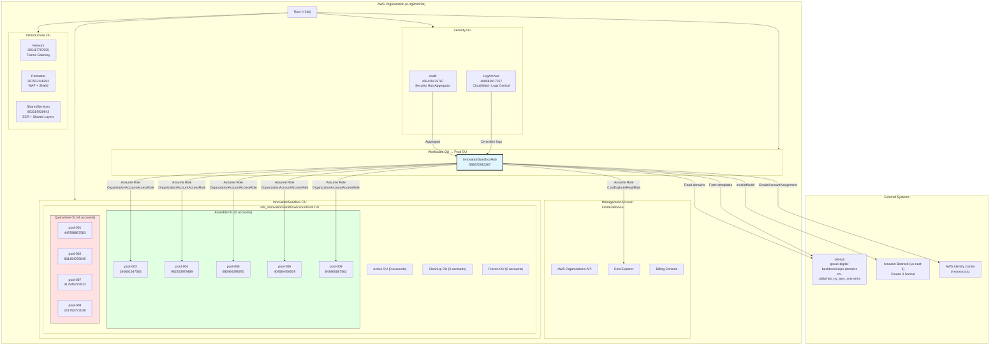
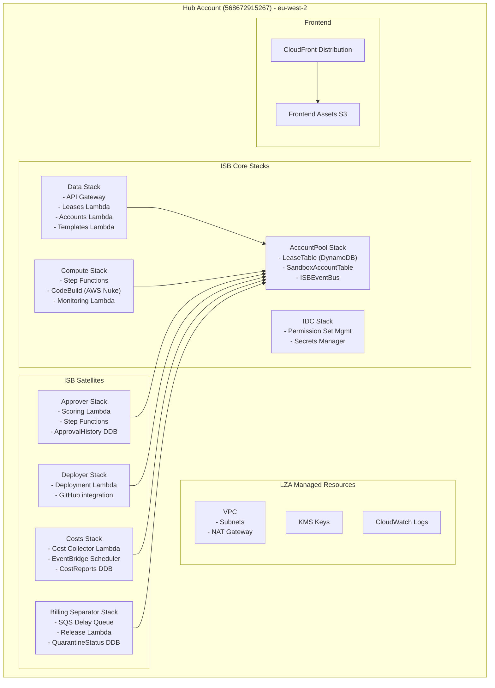
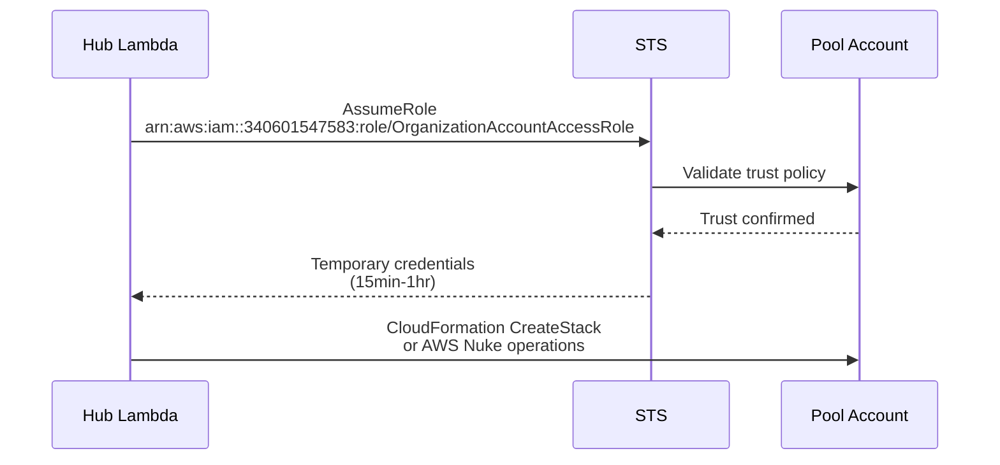
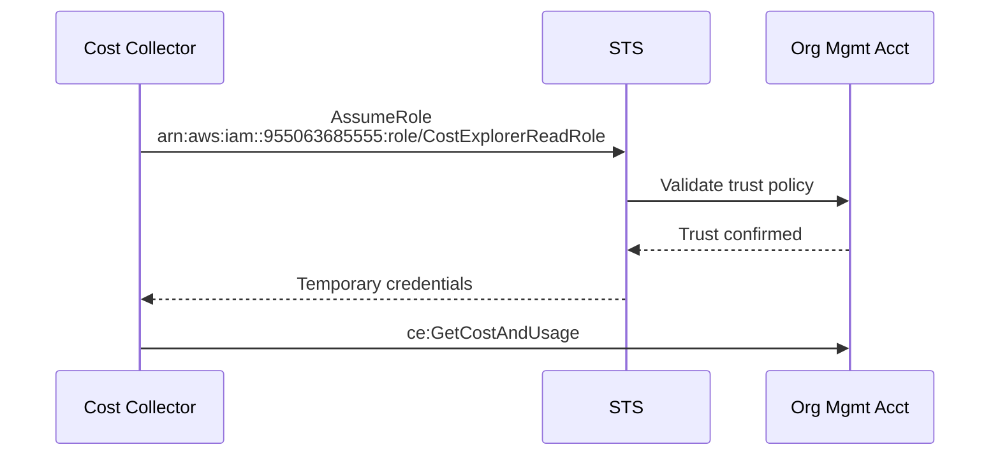

# AWS Architecture Diagram

**Document Version:** 1.0
**Date:** 2026-02-03
**Organization:** o-4g8nrlnr9s

---

## Executive Summary

This document provides a comprehensive view of the AWS infrastructure underlying the NDX:Try platform, showing all accounts, organizational units, cross-account connections, and external integrations.

---

## Complete AWS Architecture



---

## Hub Account (568672915267) Internal Architecture



---

## Cross-Account IAM Trust Relationships

### Hub to Pool Accounts



### Hub to Organization Management



---

## Network Architecture

### VPC Design (Hub Account)

```
VPC: 10.0.0.0/16
├── Public Subnets (eu-west-2a, 2b, 2c)
│   ├── 10.0.0.0/24 (2a) - NAT Gateway
│   ├── 10.0.1.0/24 (2b) - NAT Gateway
│   └── 10.0.2.0/24 (2c) - NAT Gateway
└── Private Subnets (eu-west-2a, 2b, 2c)
    ├── 10.0.10.0/24 (2a) - Lambda ENIs
    ├── 10.0.11.0/24 (2b) - Lambda ENIs
    └── 10.0.12.0/24 (2c) - Lambda ENIs

Internet Gateway → Public Subnets → NAT Gateways → Private Subnets → Lambda Functions
```

**Note:** Lambda functions may or may not be VPC-deployed (not confirmed from docs). Most AWS SDK calls use AWS backbone, not requiring VPC.

---

## Service Control Policies (SCPs) Applied

### OU-Level SCP Attachments

```mermaid
graph TB
    root_ou["Root OU"]
    isb_pool_ou["ndx_InnovationSandboxAccountPool OU"]
    available_ou["Available OU"]
    active_ou["Active OU"]
    quarantine_ou["Quarantine OU"]

    scp_full["FullAWSAccess"]
    scp_restrictions["InnovationSandboxRestrictionsScp<br/>(regions, isolation)"]
    scp_nuke["InnovationSandboxAwsNukeSupportedServicesScp<br/>(whitelist)"]
    scp_protect["InnovationSandboxProtectISBResourcesScp<br/>(control plane)"]
    scp_write_protect["InnovationSandboxWriteProtectionScp<br/>(read-only)"]
    scp_cost_compute["InnovationSandboxCostAvoidanceComputeScp<br/>(instance types)"]
    scp_cost_services["InnovationSandboxCostAvoidanceServicesScp<br/>(block expensive svcs)"]

    root_ou --> scp_full
    isb_pool_ou --> scp_restrictions
    isb_pool_ou --> scp_nuke
    isb_pool_ou --> scp_protect

    available_ou --> scp_write_protect
    active_ou --> scp_cost_compute
    active_ou --> scp_cost_services
    quarantine_ou --> scp_write_protect

    style active_ou fill:#9f9,stroke:#333
    style available_ou fill:#ff9,stroke:#333
    style quarantine_ou fill:#f99,stroke:#333
```



---

## AWS Service Usage Map

| Service | Usage | Account(s) | Purpose |
|---------|-------|------------|---------|
| **Lambda** | 19+ functions | Hub | ISB core, satellites |
| **DynamoDB** | 6 tables | Hub | Data persistence |
| **S3** | 15+ buckets | Hub, Pool | Storage, frontend, templates |
| **API Gateway** | 1 REST API | Hub | ISB API |
| **EventBridge** | 1 custom bus, 10+ rules | Hub | Event-driven architecture |
| **Step Functions** | 2 state machines | Hub | Cleanup, approval workflows |
| **CodeBuild** | 1 project | Hub | AWS Nuke execution |
| **EventBridge Scheduler** | Per-lease schedules | Hub | Cost collection delays |
| **SQS** | 2 queues (+ DLQs) | Hub | Billing separator delay |
| **Secrets Manager** | 3+ secrets | Hub | GitHub token, IDC config |
| **CloudFormation** | 20+ stacks | Hub, Pool | IaC deployments |
| **Organizations** | 1 org | Management | Multi-account management |
| **Identity Center** | 1 instance | Organization | SSO authentication |
| **Cost Explorer** | API access | Management | Billing data |
| **Bedrock** | Model invocations | us-east-1 | AI risk assessment |
| **CloudFront** | 2 distributions | Hub | ISB + NDX frontends |
| **SNS** | 3+ topics | Hub | Alerting |
| **CloudWatch** | Logs, metrics, alarms | All accounts | Observability |
| **KMS** | Multiple CMKs | Hub | Encryption |

---

## Data Residency & Regions

### Primary Region: eu-west-2 (London)

**Services in eu-west-2:**
- All ISB Core Lambda functions
- All DynamoDB tables
- API Gateway
- Step Functions
- CodeBuild
- EventBridge

### Secondary Region: us-east-1

**Services in us-east-1:**
- Amazon Bedrock (Claude 3 Sonnet)
- Some S3 buckets (screenshots)

### Multi-Region Services

**Services that operate globally:**
- CloudFront (edge locations worldwide)
- Identity Center (global service)
- Organizations (global service)

**Cross-Region Access:**
- Hub (eu-west-2) → Bedrock (us-east-1): HTTPS API calls
- Hub (eu-west-2) → S3 (us-east-1): S3 GetObject for screenshots

---

## Disaster Recovery Architecture

### Current State: Single-Region (eu-west-2)

**Recovery Time Objective (RTO):** ~4-8 hours
**Recovery Point Objective (RPO):** ~1 hour (DynamoDB PITR)

**Backup Strategy:**
- DynamoDB Point-in-Time Recovery (35 days)
- DynamoDB automated backups (daily)
- S3 versioning enabled
- CloudFormation templates in Git

**Failover Plan:**
1. Deploy ISB Core to us-west-2 (backup region)
2. Restore DynamoDB tables from PITR
3. Update DNS/CloudFront to point to new region
4. Redeploy satellites

**Limitations:**
- Manual failover process
- No active-active deployment
- Identity Center region dependency

---

## Cost Breakdown by Service

**Monthly Estimate (1000 leases/month):**

| Service | Monthly Cost | % of Total |
|---------|--------------|------------|
| Lambda | £50 | 30% |
| DynamoDB | £40 | 24% |
| NAT Gateway | £30 | 18% |
| Cost Explorer API | £10 | 6% |
| EventBridge | £8 | 5% |
| S3 | £7 | 4% |
| Bedrock | £7 | 4% |
| CloudWatch | £5 | 3% |
| Secrets Manager | £3 | 2% |
| Other | £7 | 4% |
| **Total** | **£167/month** | **100%** |

**Per-Lease Cost:** £0.17

---

## References

- [02-aws-organization.md](./02-aws-organization.md) - Organization structure
- [03-hub-account-resources.md](./03-hub-account-resources.md) - Hub resources
- [05-service-control-policies.md](./05-service-control-policies.md) - SCP details
- [80-c4-architecture.md](./80-c4-architecture.md) - C4 diagrams

---

**Document Version:** 1.0
**Last Updated:** 2026-02-03
**Status:** Complete - Comprehensive AWS infrastructure view
