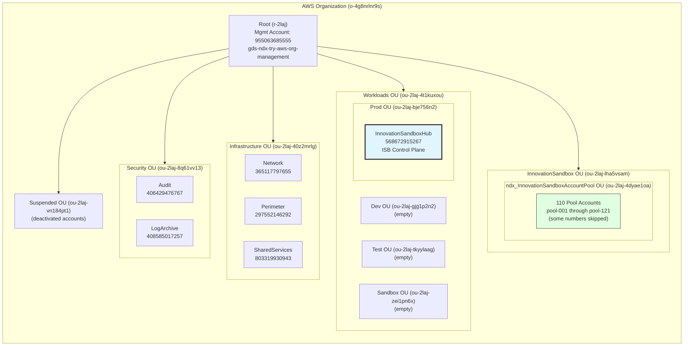
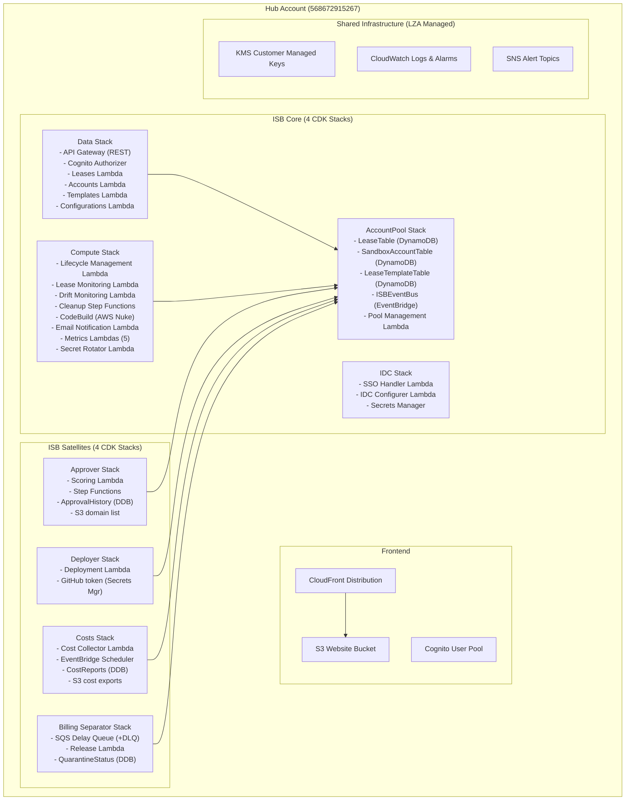
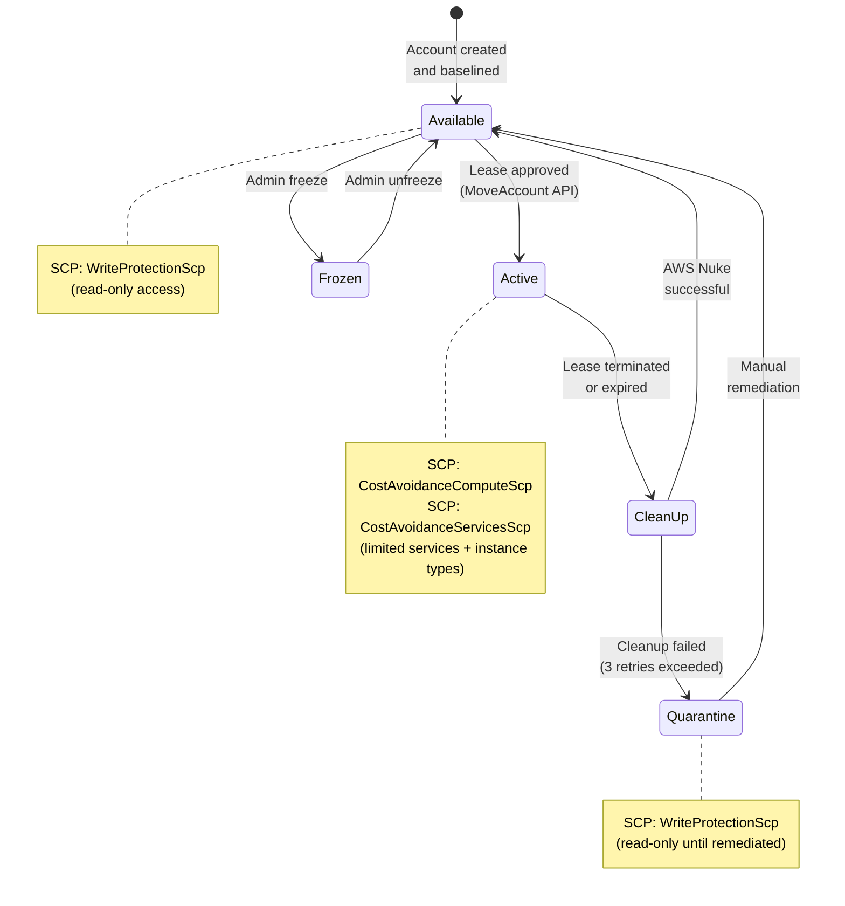
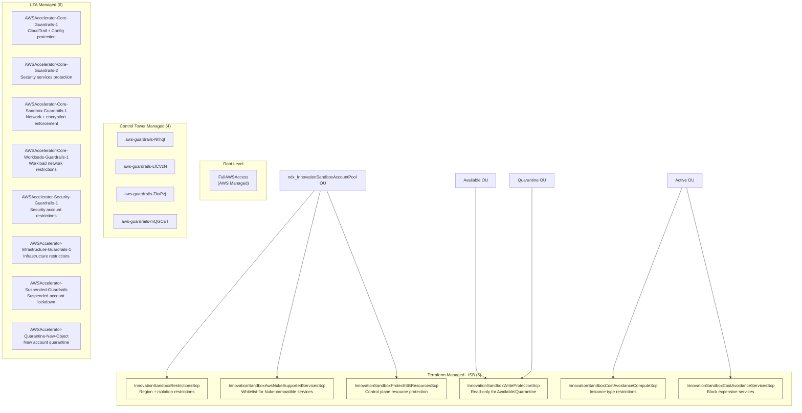
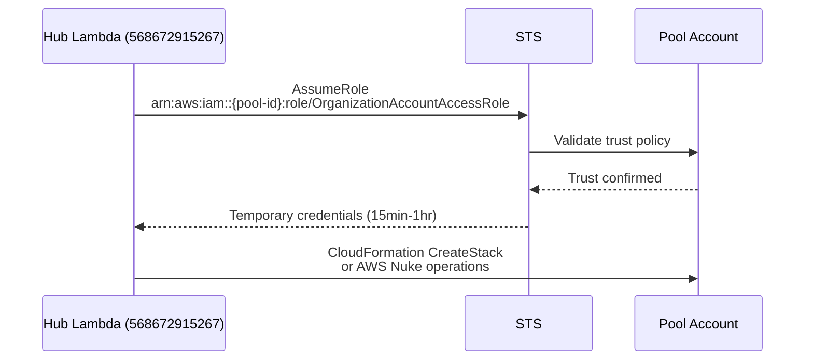
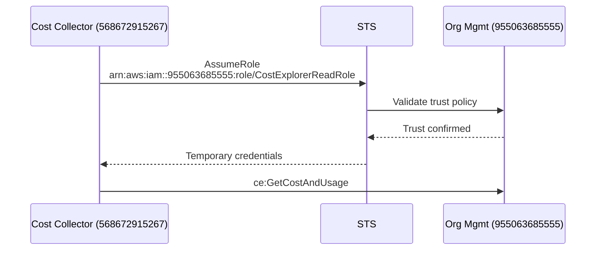

# AWS Architecture

> **Last Updated**: 2026-03-02
> **Sources**: .state/discovered-accounts.json (117 accounts), .state/org-ous.json (10 OUs), .state/discovered-scps.json (19 SCPs), .state/upstream-status.json

## Executive Summary

The NDX:Try AWS platform operates within a single AWS Organization (o-4g8nrlnr9s) managed by account 955063685555. The organization contains 117 accounts: 110 pool accounts for sandbox workloads, 1 hub account (568672915267) running the ISB control plane, and 6 supporting infrastructure accounts (Network, Perimeter, SharedServices, Audit, LogArchive, and the management account itself). All ISB operations are restricted to us-east-1 and us-west-2 regions, with the primary deployment in us-east-1.

---

## Organization Structure (117 Accounts, 10 OUs)


```mermaid
graph TB
    subgraph org["AWS Organization (o-4g8nrlnr9s)"]
        direction TB
        root["Root (r-2laj)<br/>Mgmt Account: 955063685555<br/>gds-ndx-try-aws-org-management"]

        subgraph security_ou["Security OU (ou-2laj-8q61vv13)"]
            audit["Audit<br/>406429476767"]
            log_archive["LogArchive<br/>408585017257"]
        end

        subgraph infra_ou["Infrastructure OU (ou-2laj-40z2mrlg)"]
            network["Network<br/>365117797655"]
            perimeter["Perimeter<br/>297552146292"]
            shared["SharedServices<br/>803319930943"]
        end

        subgraph workloads_ou["Workloads OU (ou-2laj-4t1kuxou)"]
            subgraph prod_ou["Prod OU (ou-2laj-bje756n2)"]
                hub["InnovationSandboxHub<br/>568672915267<br/>ISB Control Plane"]
            end
            dev_ou["Dev OU (ou-2laj-gjg1p2n2)<br/>(empty)"]
            test_ou["Test OU (ou-2laj-tkyylaag)<br/>(empty)"]
            sandbox_ou["Sandbox OU (ou-2laj-zei1pn6x)<br/>(empty)"]
        end

        subgraph isb_ou["InnovationSandbox OU (ou-2laj-lha5vsam)"]
            subgraph pool_parent["ndx_InnovationSandboxAccountPool OU (ou-2laj-4dyae1oa)"]
                pool_accounts["110 Pool Accounts<br/>pool-001 through pool-121<br/>(some numbers skipped)"]
            end
        end

        suspended_ou["Suspended OU (ou-2laj-vn184pt1)<br/>(deactivated accounts)"]

        root --> security_ou
        root --> infra_ou
        root --> workloads_ou
        root --> isb_ou
        root --> suspended_ou
    end

    style hub fill:#e1f5ff,stroke:#333,stroke-width:3px
    style pool_accounts fill:#e1ffe1,stroke:#333
```

### Account Inventory Summary

| Category | Count | Examples |
|----------|-------|---------|
| Management | 1 | gds-ndx-try-aws-org-management (955063685555) |
| ISB Hub | 1 | InnovationSandboxHub (568672915267) |
| Pool Accounts | 110 | pool-001 through pool-121 |
| Security | 2 | Audit (406429476767), LogArchive (408585017257) |
| Infrastructure | 3 | Network, Perimeter, SharedServices |
| **Total** | **117** | |

All pool account emails follow the pattern: `ndx-try-provider+gds-ndx-try-aws-pool-NNN@dsit.gov.uk`

---

## Hub Account (568672915267) Architecture


```mermaid
graph TB
    subgraph hub_account["Hub Account (568672915267)"]
        subgraph isb_core["ISB Core (4 CDK Stacks)"]
            account_pool["AccountPool Stack<br/>- LeaseTable (DynamoDB)<br/>- SandboxAccountTable (DynamoDB)<br/>- LeaseTemplateTable (DynamoDB)<br/>- ISBEventBus (EventBridge)<br/>- Pool Management Lambda"]

            idc_stack["IDC Stack<br/>- SSO Handler Lambda<br/>- IDC Configurer Lambda<br/>- Secrets Manager"]

            data_stack["Data Stack<br/>- API Gateway (REST)<br/>- Cognito Authorizer<br/>- Leases Lambda<br/>- Accounts Lambda<br/>- Templates Lambda<br/>- Configurations Lambda"]

            compute_stack["Compute Stack<br/>- Lifecycle Management Lambda<br/>- Lease Monitoring Lambda<br/>- Drift Monitoring Lambda<br/>- Cleanup Step Functions<br/>- CodeBuild (AWS Nuke)<br/>- Email Notification Lambda<br/>- Metrics Lambdas (5)<br/>- Secret Rotator Lambda"]
        end

        subgraph satellites["ISB Satellites (4 CDK Stacks)"]
            approver_stack["Approver Stack<br/>- Scoring Lambda<br/>- Step Functions<br/>- ApprovalHistory (DDB)<br/>- S3 domain list"]

            deployer_stack["Deployer Stack<br/>- Deployment Lambda<br/>- GitHub token (Secrets Mgr)"]

            costs_stack["Costs Stack<br/>- Cost Collector Lambda<br/>- EventBridge Scheduler<br/>- CostReports (DDB)<br/>- S3 cost exports"]

            billing_stack["Billing Separator Stack<br/>- SQS Delay Queue (+DLQ)<br/>- Release Lambda<br/>- QuarantineStatus (DDB)"]
        end

        subgraph frontend_infra["Frontend"]
            cloudfront["CloudFront Distribution"]
            frontend_s3["S3 Website Bucket"]
            cognito["Cognito User Pool"]
        end

        subgraph shared_infra["Shared Infrastructure (LZA Managed)"]
            kms["KMS Customer Managed Keys"]
            cloudwatch["CloudWatch Logs & Alarms"]
            sns["SNS Alert Topics"]
        end
    end

    data_stack --> account_pool
    compute_stack --> account_pool
    approver_stack --> account_pool
    deployer_stack --> account_pool
    costs_stack --> account_pool
    billing_stack --> account_pool
    cloudfront --> frontend_s3
```

---

## Pool Account Lifecycle

### OU-Based State Management

Pool accounts move between child OUs under `ndx_InnovationSandboxAccountPool` based on their lifecycle state. Different SCPs are attached to each OU to enforce appropriate restrictions.


```mermaid
stateDiagram-v2
    [*] --> Available: Account created<br/>and baselined

    Available --> Active: Lease approved<br/>(MoveAccount API)

    Active --> CleanUp: Lease terminated<br/>or expired

    CleanUp --> Available: AWS Nuke<br/>successful

    CleanUp --> Quarantine: Cleanup failed<br/>(3 retries exceeded)

    Quarantine --> Available: Manual<br/>remediation

    Available --> Frozen: Admin freeze

    Frozen --> Available: Admin unfreeze

    note right of Available
        SCP: WriteProtectionScp
        (read-only access)
    end note

    note right of Active
        SCP: CostAvoidanceComputeScp
        SCP: CostAvoidanceServicesScp
        (limited services + instance types)
    end note

    note right of Quarantine
        SCP: WriteProtectionScp
        (read-only until remediated)
    end note
```

---

## Service Control Policies (19 SCPs)

### SCP Hierarchy


```mermaid
graph TB
    subgraph "Root Level"
        full_access["FullAWSAccess<br/>(AWS Managed)"]
    end

    subgraph "Control Tower Managed (4)"
        ct1["aws-guardrails-NllhqI"]
        ct2["aws-guardrails-LfCVzN"]
        ct3["aws-guardrails-ZkxPzj"]
        ct4["aws-guardrails-mQGCET"]
    end

    subgraph "LZA Managed (6)"
        lza1["AWSAccelerator-Core-Guardrails-1<br/>CloudTrail + Config protection"]
        lza2["AWSAccelerator-Core-Guardrails-2<br/>Security services protection"]
        lza3["AWSAccelerator-Core-Sandbox-Guardrails-1<br/>Network + encryption enforcement"]
        lza4["AWSAccelerator-Core-Workloads-Guardrails-1<br/>Workload network restrictions"]
        lza5["AWSAccelerator-Security-Guardrails-1<br/>Security account restrictions"]
        lza6["AWSAccelerator-Infrastructure-Guardrails-1<br/>Infrastructure restrictions"]
        lza7["AWSAccelerator-Suspended-Guardrails<br/>Suspended account lockdown"]
        lza8["AWSAccelerator-Quarantine-New-Object<br/>New account quarantine"]
    end

    subgraph "Terraform Managed - ISB (5)"
        isb1["InnovationSandboxRestrictionsScp<br/>Region + isolation restrictions"]
        isb2["InnovationSandboxAwsNukeSupportedServicesScp<br/>Whitelist for Nuke-compatible services"]
        isb3["InnovationSandboxProtectISBResourcesScp<br/>Control plane resource protection"]
        isb4["InnovationSandboxWriteProtectionScp<br/>Read-only for Available/Quarantine"]
        isb5["InnovationSandboxCostAvoidanceComputeScp<br/>Instance type restrictions"]
        isb6["InnovationSandboxCostAvoidanceServicesScp<br/>Block expensive services"]
    end

    pool_ou["ndx_InnovationSandboxAccountPool OU"] --> isb1
    pool_ou --> isb2
    pool_ou --> isb3

    available_ou["Available OU"] --> isb4
    active_ou["Active OU"] --> isb5
    active_ou --> isb6
    quarantine_ou["Quarantine OU"] --> isb4

    style isb1 fill:#ffd,stroke:#333
    style isb2 fill:#ffd,stroke:#333
    style isb3 fill:#ffd,stroke:#333
    style isb4 fill:#ffd,stroke:#333
    style isb5 fill:#ffd,stroke:#333
    style isb6 fill:#ffd,stroke:#333
```

### ISB-Specific SCP Summary

| SCP | Applied To | Description |
|-----|-----------|-------------|
| InnovationSandboxRestrictionsScp | Pool OU | Region restrictions (us-east-1, us-west-2), network isolation |
| InnovationSandboxAwsNukeSupportedServicesScp | Pool OU | Only allow services that AWS Nuke can clean |
| InnovationSandboxProtectISBResourcesScp | Pool OU | Prevent modification of ISB control plane resources |
| InnovationSandboxWriteProtectionScp | Available + Quarantine OUs | Read-only access (no create/modify) |
| InnovationSandboxCostAvoidanceComputeScp | Active OU | Restrict EC2, EBS, RDS, EKS instance types |
| InnovationSandboxCostAvoidanceServicesScp | Active OU | Block SageMaker, EMR, Redshift, Neptune |

---

## Cross-Account Trust Relationships

### Hub to Pool Accounts


```mermaid
sequenceDiagram
    participant Hub Lambda (568672915267)
    participant STS
    participant Pool Account

    Hub Lambda (568672915267)->>STS: AssumeRole<br/>arn:aws:iam::{pool-id}:role/OrganizationAccountAccessRole
    STS->>Pool Account: Validate trust policy
    Pool Account-->>STS: Trust confirmed
    STS-->>Hub Lambda (568672915267): Temporary credentials (15min-1hr)
    Hub Lambda (568672915267)->>Pool Account: CloudFormation CreateStack<br/>or AWS Nuke operations
```

### Hub to Organization Management


```mermaid
sequenceDiagram
    participant Cost Collector (568672915267)
    participant STS
    participant Org Mgmt (955063685555)

    Cost Collector (568672915267)->>STS: AssumeRole<br/>arn:aws:iam::955063685555:role/CostExplorerReadRole
    STS->>Org Mgmt (955063685555): Validate trust policy
    Org Mgmt (955063685555)-->>STS: Trust confirmed
    STS-->>Cost Collector (568672915267): Temporary credentials
    Cost Collector (568672915267)->>Org Mgmt (955063685555): ce:GetCostAndUsage
```

---

## Network Architecture

### Hub Account VPC (LZA Managed)

```
VPC: 10.0.0.0/16 (approximate - LZA configured)
+-- Public Subnets (us-east-1a, 1b, 1c)
|   +-- NAT Gateways (for Lambda internet access)
|   +-- Internet Gateway
+-- Private Subnets (us-east-1a, 1b, 1c)
    +-- Lambda ENIs (for VPC-attached functions)
    +-- CodeBuild (for AWS Nuke execution)
```

### Pool Accounts

Pool accounts have **no pre-configured networking**. Users can create their own VPCs subject to SCP restrictions (region-limited to us-east-1 and us-west-2).

---

## Region Usage

### Primary: us-east-1

All ISB Core Lambda functions, DynamoDB tables, API Gateway, Step Functions, CodeBuild, and EventBridge are deployed in us-east-1.

### Secondary: us-west-2

Available as a secondary region for pool account workloads per SCP restrictions. Pool accounts may create resources in both us-east-1 and us-west-2.

### Global Services

| Service | Scope |
|---------|-------|
| CloudFront | Edge locations worldwide |
| Identity Center | Global service |
| Organizations | Global service |
| Route 53 | Global DNS |

### Cross-Region Access

| Source | Target | Purpose |
|--------|--------|---------|
| Hub (us-east-1) | Bedrock (us-east-1) | AI scoring |
| Hub (us-east-1) | Cost Explorer (us-east-1) | Billing data |
| Hub (us-east-1) | S3 (us-east-1) | Screenshots bucket |

---

## AWS Service Usage Map

| Service | Usage | Account(s) | Count |
|---------|-------|------------|-------|
| **Lambda** | Core functions + satellites | Hub | 21+ functions |
| **DynamoDB** | Data persistence | Hub | 6 tables |
| **S3** | Storage, frontend, templates, exports | Hub, Pool | 15+ buckets |
| **API Gateway** | REST API (ISB) | Hub | 1 API |
| **EventBridge** | Event-driven architecture | Hub | 1 custom bus, 10+ rules |
| **Step Functions** | Cleanup + approval workflows | Hub | 2 state machines |
| **CodeBuild** | AWS Nuke execution | Hub | 1 project |
| **EventBridge Scheduler** | Per-lease cost collection delays | Hub | Dynamic schedules |
| **SQS** | Billing separator delay queue | Hub | 2 queues (+DLQs) |
| **Secrets Manager** | GitHub token, IDC config, API keys | Hub | 3+ secrets |
| **CloudFormation** | IaC deployments | Hub, Pool | 20+ stacks |
| **Organizations** | Multi-account management | Management | 1 org, 10 OUs |
| **Identity Center** | SSO authentication | Organization | 1 instance |
| **Cost Explorer** | Billing data API | Management | API access |
| **Bedrock** | AI risk assessment | us-east-1 | Model invocations |
| **CloudFront** | CDN for ISB + NDX frontends | Hub | 2 distributions |
| **Cognito** | JWT authentication | Hub | 1 user pool |
| **SNS** | Alerting | Hub | 3+ topics |
| **CloudWatch** | Logs, metrics, alarms | All accounts | Full stack |
| **KMS** | Encryption | Hub | Multiple CMKs |

---

## Disaster Recovery

### Current State: Single-Region (us-east-1)

| Metric | Value |
|--------|-------|
| Recovery Time Objective (RTO) | ~4-8 hours |
| Recovery Point Objective (RPO) | ~1 hour (DynamoDB PITR) |

### Backup Strategy

- DynamoDB Point-in-Time Recovery (35 days retention)
- DynamoDB automated daily backups
- S3 versioning enabled on critical buckets
- All infrastructure defined as code (CDK + Terraform + LZA)

### Failover Plan

1. Deploy ISB Core to us-west-2 (backup region)
2. Restore DynamoDB tables from PITR
3. Update DNS/CloudFront to point to new region
4. Redeploy satellite stacks
5. Reconfigure Identity Center integration

**Limitation**: Manual failover process with no active-active deployment.

---

## Cost Profile

### Monthly Estimate (Platform Infrastructure Only)

| Service | Monthly Cost (est.) | Notes |
|---------|-------------------|-------|
| Lambda | ~$65 | 21+ functions, on-demand |
| DynamoDB | ~$50 | 6 tables, on-demand mode |
| NAT Gateway | ~$40 | Data transfer charges |
| Cost Explorer API | ~$12 | 100 req/hour limit |
| EventBridge | ~$10 | Custom bus + rules |
| S3 | ~$9 | Multiple buckets |
| Bedrock (Claude 3) | ~$3 | ~$0.0024/approval |
| CloudWatch | ~$6 | Logs, metrics, alarms |
| Secrets Manager | ~$4 | 3+ secrets |
| Other | ~$8 | SNS, SQS, CodeBuild |
| **Total** | **~$207/month** | Platform only (excludes pool usage) |

---

## References

- [02-aws-organization.md](./02-aws-organization.md) - Organization structure details
- [03-hub-account-resources.md](./03-hub-account-resources.md) - Hub account resource inventory
- [04-cross-account-trust.md](./04-cross-account-trust.md) - IAM trust relationships
- [05-service-control-policies.md](./05-service-control-policies.md) - SCP details
- [80-c4-architecture.md](./80-c4-architecture.md) - C4 architecture diagrams

---
*Generated from source analysis. See [00-repo-inventory.md](./00-repo-inventory.md) for full inventory.*
