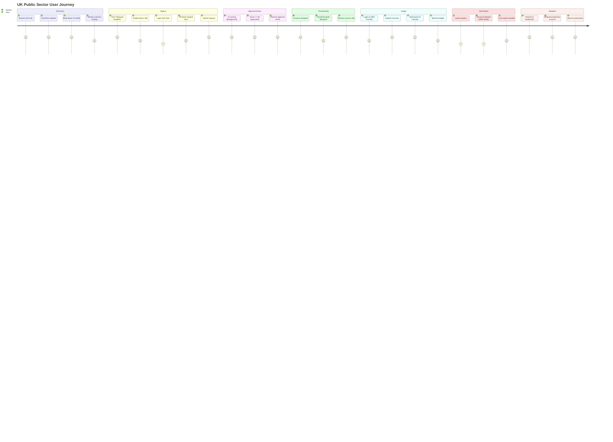
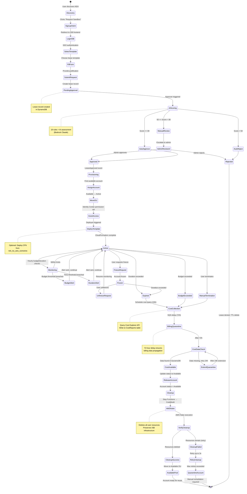
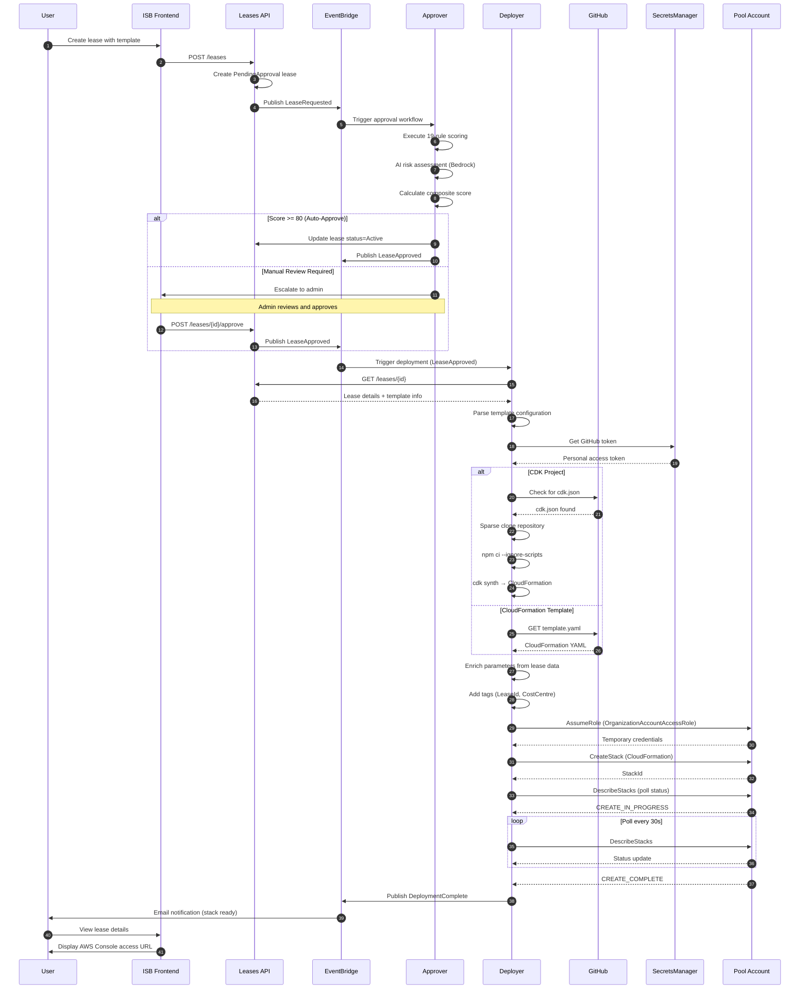
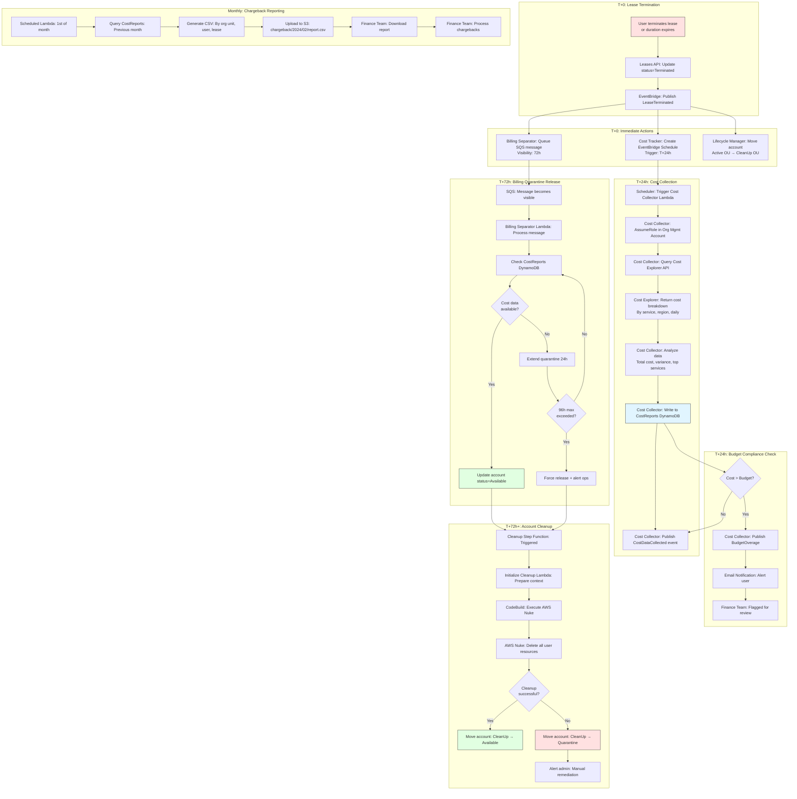
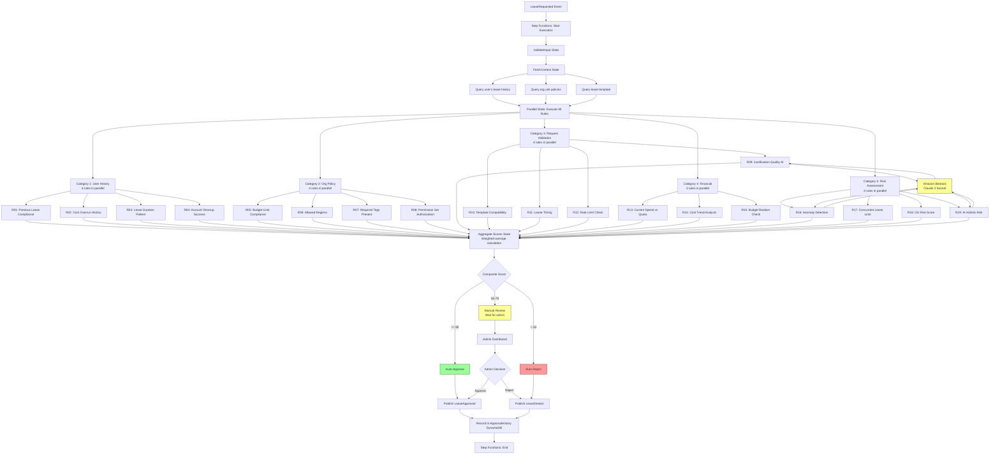
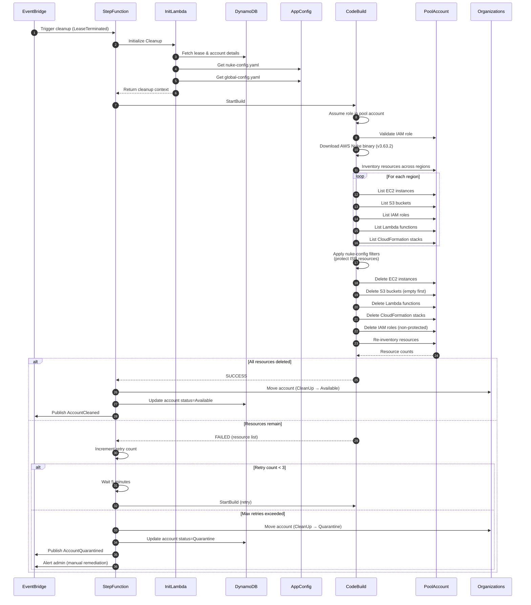

# Process Flows

**Document Version:** 1.0
**Date:** 2026-02-03
**Scope:** End-to-end user journeys and operational processes

---

## Executive Summary

This document presents the complete user and operational journeys through the NDX:Try AWS platform, from initial discovery to production deployment. Each flow is documented with Mermaid diagrams showing the complete path through the system.

---

## Flow 1: Complete User Journey (Discovery → Production)

### End-to-End User Experience



---

## Flow 2: Complete Lease Lifecycle

### From Request to Cleanup



---

## Flow 3: Complete Deployment Pipeline

### CloudFormation Template Deployment



---

## Flow 4: Complete Cost Tracking Cycle

### From Termination to Chargeback



---

## Flow 5: Approver Scoring Process

### 19-Rule Execution Flow



---

## Flow 6: Account Cleanup Process

### AWS Nuke Execution



---

## Operational Processes

### Daily Operations Checklist

```
□ Monitor quarantine queue (should be < 2 accounts)
□ Review cost overages from previous day
□ Check deployer success rate (should be > 95%)
□ Verify approver scoring (80%+ auto-approval target)
□ Review manual approval queue (should be < 10 pending)
□ Check pool capacity (should have >= 5 available accounts)
□ Review CloudWatch alarms (should have 0 active)
□ Scan EventBridge DLQ (should be empty)
□ Verify Cost Explorer quota usage (should be < 80%)
```

### Weekly Operations

```
□ Update ukps-domains whitelist from GitHub
□ Review quarantined accounts (manual cleanup if needed)
□ Generate pool utilization report
□ Review Bedrock AI cost trends
□ Rotate GitHub API token (if expiring)
□ Update Slack channel with metrics summary
```

### Monthly Operations

```
□ Generate chargeback reports (1st of month)
□ Send cost reports to finance team
□ Review capacity planning (add pool accounts if needed)
□ Audit permission sets in Identity Center
□ Review and update lease templates
□ Conduct security audit (access logs, IAM policies)
□ Update documentation with operational learnings
```

---

## References

- [70-data-flows.md](./70-data-flows.md) - Detailed data transformations
- [11-lease-lifecycle.md](./11-lease-lifecycle.md) - Lease state machine
- [20-approver-system.md](./20-approver-system.md) - Scoring rules

---

**Document Version:** 1.0
**Last Updated:** 2026-02-03
**Status:** Complete - End-to-end process documentation
