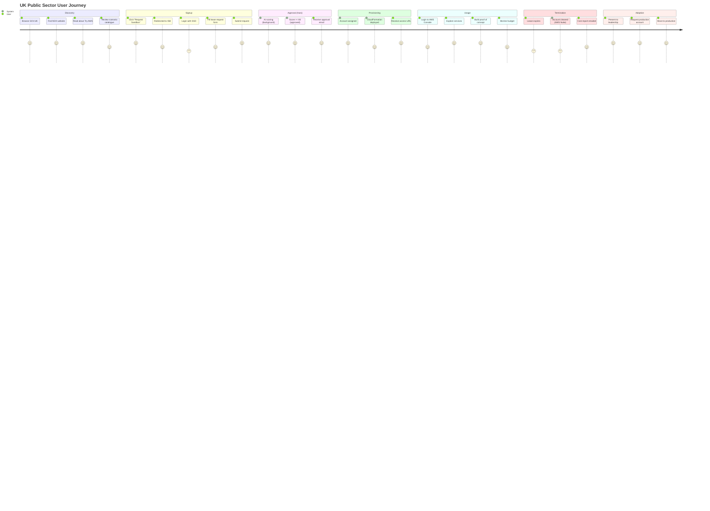
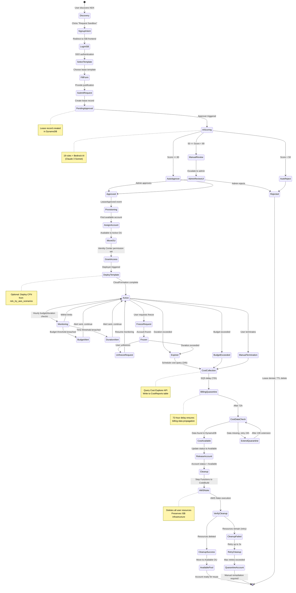
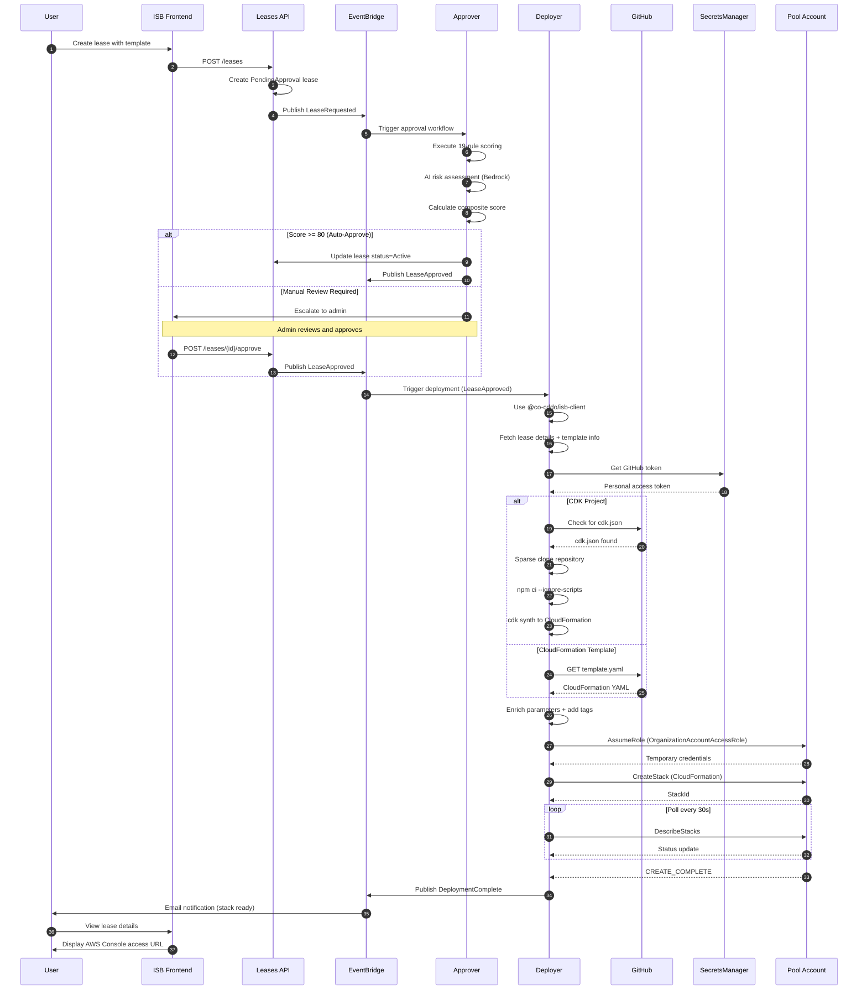
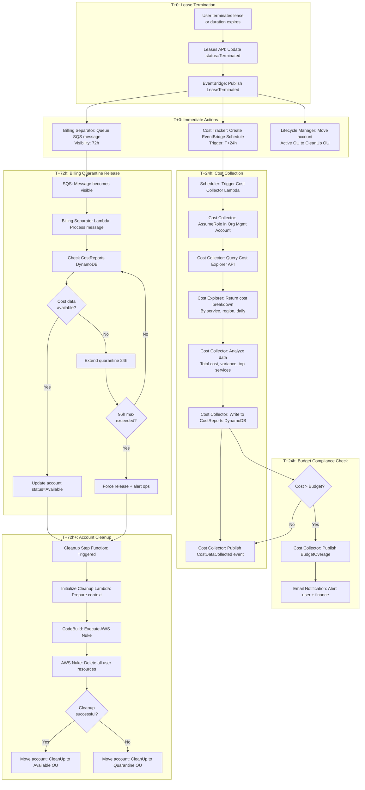
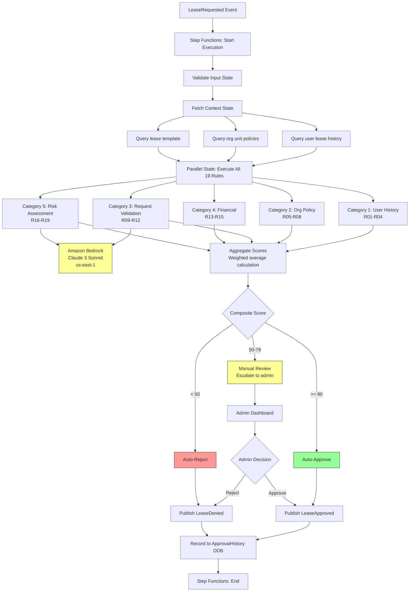
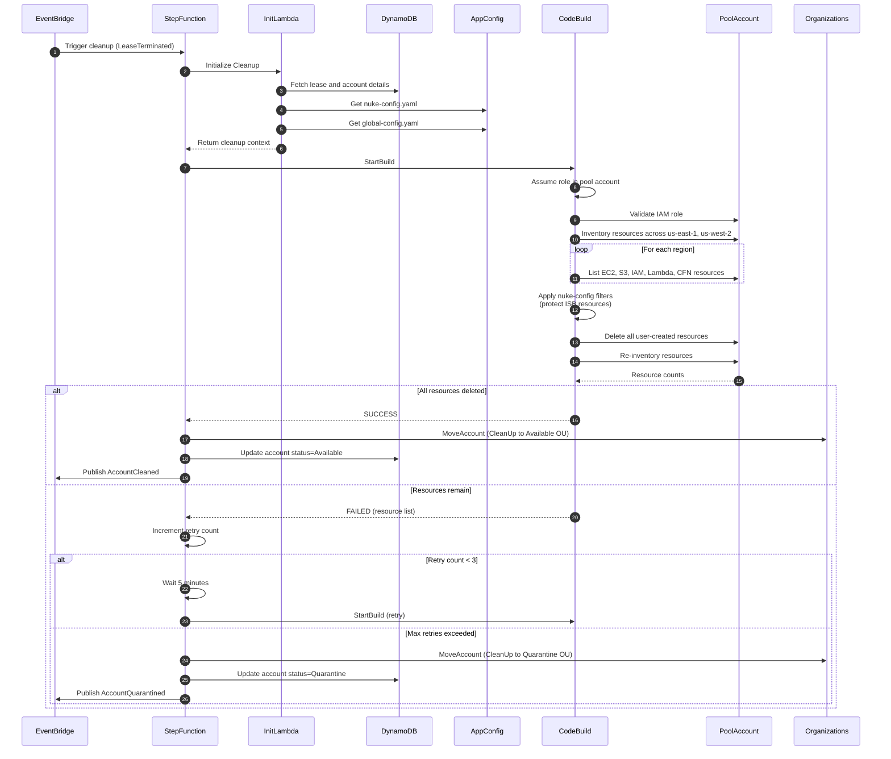
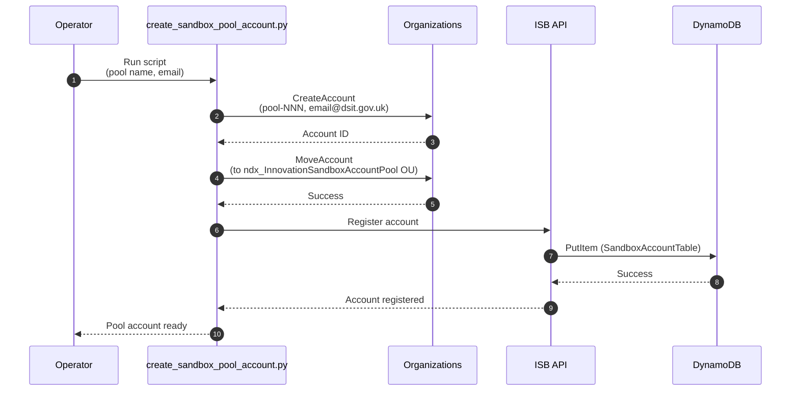

# Process Flows

> **Last Updated**: 2026-03-02
> **Sources**: repos/innovation-sandbox-on-aws, repos/innovation-sandbox-on-aws-approver, repos/innovation-sandbox-on-aws-costs, repos/innovation-sandbox-on-aws-deployer, repos/innovation-sandbox-on-aws-billing-seperator, repos/innovation-sandbox-on-aws-utils

## Executive Summary

This document presents the complete user and operational process flows through the NDX:Try AWS platform. It covers the end-to-end user journey from discovery to production adoption, the full lease lifecycle with all state transitions, the deployment pipeline for CloudFormation templates, the cost tracking cycle from termination to chargeback, and the operational runbooks for daily, weekly, and monthly maintenance activities.

---

## Flow 1: Complete User Journey (Discovery to Production)

### End-to-End User Experience


```mermaid
journey
    title UK Public Sector User Journey
    section Discovery
      Browse GOV.UK: 5: User
      Find NDX website: 5: User
      Read about Try AWS: 5: User
      Review scenario catalogue: 4: User
    section Signup
      Click "Request Sandbox": 5: User
      Redirected to ISB: 4: User
      Login with SSO: 3: User
      Fill lease request form: 4: User
      Submit request: 5: User
    section Approval (Auto)
      AI scoring (background): 5: System
      Score >= 80 (approved): 5: System
      Receive approval email: 5: User
    section Provisioning
      Account assigned: 5: System
      CloudFormation deployed: 4: System
      Receive access URL: 5: User
    section Usage
      Login to AWS Console: 4: User
      Explore services: 5: User
      Build proof of concept: 5: User
      Monitor budget: 4: User
    section Termination
      Lease expires: 3: User
      Account cleaned (AWS Nuke): 3: System
      Cost report emailed: 4: User
    section Adoption
      Present to leadership: 5: User
      Request production account: 5: User
      Move to production: 5: User
```

---

## Flow 2: Complete Lease Lifecycle

### From Request to Cleanup


```mermaid
stateDiagram-v2
    [*] --> Discovery: User discovers NDX
    Discovery --> SignupIntent: Clicks "Request Sandbox"

    SignupIntent --> LoginISB: Redirect to ISB frontend
    LoginISB --> SelectTemplate: SSO authentication

    SelectTemplate --> FillForm: Choose lease template
    FillForm --> SubmitRequest: Provide justification

    SubmitRequest --> PendingApproval: Create lease record

    PendingApproval --> AIScoring: Approver triggered
    AIScoring --> AutoApprove: Score >= 80
    AIScoring --> ManualReview: 50 <= Score < 80
    AIScoring --> AutoReject: Score < 50

    ManualReview --> AdminReviewUI: Escalate to admin
    AdminReviewUI --> Approved: Admin approves
    AdminReviewUI --> Rejected: Admin rejects

    AutoApprove --> Approved
    Approved --> Provisioning: LeaseApproved event

    Provisioning --> AssignAccount: Find available account
    AssignAccount --> MoveOU: Available to Active OU
    MoveOU --> GrantAccess: Identity Center permission set
    GrantAccess --> DeployTemplate: Deployer triggered
    DeployTemplate --> Active: CloudFormation complete

    Active --> Monitoring: Hourly budget/duration checks

    Monitoring --> BudgetAlert: Budget threshold breached
    Monitoring --> DurationAlert: Time threshold breached
    Monitoring --> Active: Within limits

    BudgetAlert --> Active: Alert sent, continue
    DurationAlert --> Active: Alert sent, continue

    Active --> FreezeRequest: User requests freeze
    FreezeRequest --> Frozen: Account frozen
    Frozen --> UnfreezeRequest: User unfreezes
    UnfreezeRequest --> Active: Resume monitoring

    Active --> Expired: Duration exceeded
    Active --> BudgetExceeded: Budget exceeded
    Active --> ManualTermination: User terminates
    Frozen --> Expired: Duration exceeded

    Expired --> CostCollection: Schedule cost query (24h)
    BudgetExceeded --> CostCollection
    ManualTermination --> CostCollection

    CostCollection --> BillingQuarantine: SQS delay (72h)
    BillingQuarantine --> CostDataCheck: After 72h

    CostDataCheck --> CostAvailable: Data found in DynamoDB
    CostDataCheck --> ExtendQuarantine: Data missing, retry 24h

    CostAvailable --> ReleaseAccount: Update status to Available
    ExtendQuarantine --> CostDataCheck: After 24h extension

    ReleaseAccount --> Cleanup: Account status = Available
    Cleanup --> AWSNuke: Step Functions to CodeBuild

    AWSNuke --> VerifyCleanup: AWS Nuke execution
    VerifyCleanup --> CleanupSuccess: Resources deleted
    VerifyCleanup --> CleanupFailed: Resources remain (retry)

    CleanupSuccess --> AvailablePool: Move to Available OU
    CleanupFailed --> RetryCleanup: Retry up to 3x
    RetryCleanup --> QuarantineAccount: Max retries exceeded

    AvailablePool --> [*]: Account ready for reuse
    QuarantineAccount --> [*]: Manual remediation required

    AutoReject --> Rejected
    Rejected --> [*]: Lease denied, TTL delete

    note right of PendingApproval
        Lease record created
        in DynamoDB
    end note

    note right of AIScoring
        19 rules + Bedrock AI
        (Claude 3 Sonnet)
    end note

    note right of DeployTemplate
        Optional: Deploy CFN
        from ndx_try_aws_scenarios
    end note

    note right of CostCollection
        Query Cost Explorer API
        Write to CostReports table
    end note

    note right of BillingQuarantine
        72-hour delay ensures
        billing data propagation
    end note

    note right of AWSNuke
        Deletes all user resources
        Preserves ISB infrastructure
    end note
```

---

## Flow 3: Complete Deployment Pipeline

### CloudFormation Template Deployment


```mermaid
sequenceDiagram
    autonumber
    participant User
    participant ISB Frontend
    participant Leases API
    participant EventBridge
    participant Approver
    participant Deployer
    participant GitHub
    participant SecretsManager
    participant Pool Account

    User->>ISB Frontend: Create lease with template
    ISB Frontend->>Leases API: POST /leases
    Leases API->>Leases API: Create PendingApproval lease
    Leases API->>EventBridge: Publish LeaseRequested

    EventBridge->>Approver: Trigger approval workflow
    Approver->>Approver: Execute 19-rule scoring
    Approver->>Approver: AI risk assessment (Bedrock)
    Approver->>Approver: Calculate composite score

    alt Score >= 80 (Auto-Approve)
        Approver->>Leases API: Update lease status=Active
        Approver->>EventBridge: Publish LeaseApproved
    else Manual Review Required
        Approver->>ISB Frontend: Escalate to admin
        Note over Approver,ISB Frontend: Admin reviews and approves
        ISB Frontend->>Leases API: POST /leases/{id}/approve
        Leases API->>EventBridge: Publish LeaseApproved
    end

    EventBridge->>Deployer: Trigger deployment (LeaseApproved)

    Deployer->>Deployer: Use @co-cddo/isb-client
    Deployer->>Deployer: Fetch lease details + template info

    Deployer->>SecretsManager: Get GitHub token
    SecretsManager-->>Deployer: Personal access token

    alt CDK Project
        Deployer->>GitHub: Check for cdk.json
        GitHub-->>Deployer: cdk.json found
        Deployer->>Deployer: Sparse clone repository
        Deployer->>Deployer: npm ci --ignore-scripts
        Deployer->>Deployer: cdk synth to CloudFormation
    else CloudFormation Template
        Deployer->>GitHub: GET template.yaml
        GitHub-->>Deployer: CloudFormation YAML
    end

    Deployer->>Deployer: Enrich parameters + add tags

    Deployer->>Pool Account: AssumeRole (OrganizationAccountAccessRole)
    Pool Account-->>Deployer: Temporary credentials

    Deployer->>Pool Account: CreateStack (CloudFormation)
    Pool Account-->>Deployer: StackId

    loop Poll every 30s
        Deployer->>Pool Account: DescribeStacks
        Pool Account-->>Deployer: Status update
    end

    Pool Account-->>Deployer: CREATE_COMPLETE

    Deployer->>EventBridge: Publish DeploymentComplete
    EventBridge->>User: Email notification (stack ready)

    User->>ISB Frontend: View lease details
    ISB Frontend->>User: Display AWS Console access URL
```

---

## Flow 4: Complete Cost Tracking Cycle

### From Termination to Chargeback


```mermaid
graph TB
    subgraph "T+0: Lease Termination"
        A1[User terminates lease<br/>or duration expires]
        A2[Leases API: Update status=Terminated]
        A3[EventBridge: Publish LeaseTerminated]
    end

    subgraph "T+0: Immediate Actions"
        B1[Billing Separator: Queue SQS message<br/>Visibility: 72h]
        B2[Cost Tracker: Create EventBridge Schedule<br/>Trigger: T+24h]
        B3[Lifecycle Manager: Move account<br/>Active OU to CleanUp OU]
    end

    subgraph "T+24h: Cost Collection"
        C1[Scheduler: Trigger Cost Collector Lambda]
        C2[Cost Collector: AssumeRole in Org Mgmt Account]
        C3[Cost Collector: Query Cost Explorer API]
        C4[Cost Explorer: Return cost breakdown<br/>By service, region, daily]
        C5[Cost Collector: Analyze data<br/>Total cost, variance, top services]
        C6[Cost Collector: Write to CostReports DynamoDB]
        C7[Cost Collector: Publish CostDataCollected event]
    end

    subgraph "T+24h: Budget Compliance Check"
        D1{Cost > Budget?}
        D2[Cost Collector: Publish BudgetOverage]
        D3[Email Notification: Alert user + finance]
    end

    subgraph "T+72h: Billing Quarantine Release"
        E1[SQS: Message becomes visible]
        E2[Billing Separator Lambda: Process message]
        E3[Check CostReports DynamoDB]
        E4{Cost data<br/>available?}
        E5[Update account status=Available]
        E6[Extend quarantine 24h]
        E7{96h max<br/>exceeded?}
        E8[Force release + alert ops]
    end

    subgraph "T+72h+: Account Cleanup"
        F1[Cleanup Step Function: Triggered]
        F2[Initialize Cleanup Lambda: Prepare context]
        F3[CodeBuild: Execute AWS Nuke]
        F4[AWS Nuke: Delete all user resources]
        F5{Cleanup<br/>successful?}
        F6[Move account: CleanUp to Available OU]
        F7[Move account: CleanUp to Quarantine OU]
    end

    A1 --> A2 --> A3
    A3 --> B1 & B2 & B3

    B2 --> C1 --> C2 --> C3 --> C4 --> C5 --> C6 --> C7

    C6 --> D1
    D1 -->|Yes| D2 --> D3
    D1 -->|No| C7

    B1 --> E1 --> E2 --> E3 --> E4
    E4 -->|Yes| E5 --> F1
    E4 -->|No| E6 --> E7
    E7 -->|No| E3
    E7 -->|Yes| E8 --> F1

    F1 --> F2 --> F3 --> F4 --> F5
    F5 -->|Yes| F6
    F5 -->|No| F7
```

---

## Flow 5: Approver Scoring Process

### 19-Rule Execution Flow


```mermaid
graph TB
    start[LeaseRequested Event] --> sfn_start[Step Functions: Start Execution]

    sfn_start --> validate[Validate Input State]
    validate --> fetch[Fetch Context State]

    fetch --> history[Query user lease history]
    fetch --> org_policy[Query org unit policies]
    fetch --> template[Query lease template]

    history & org_policy & template --> parallel[Parallel State: Execute All 19 Rules]

    parallel --> cat1[Category 1: User History<br/>R01-R04]
    parallel --> cat2[Category 2: Org Policy<br/>R05-R08]
    parallel --> cat3[Category 3: Request Validation<br/>R09-R12]
    parallel --> cat4[Category 4: Financial<br/>R13-R15]
    parallel --> cat5[Category 5: Risk Assessment<br/>R16-R19]

    cat3 --> bedrock[Amazon Bedrock<br/>Claude 3 Sonnet<br/>us-east-1]
    cat5 --> bedrock

    cat1 & cat2 & cat3 & cat4 & cat5 --> aggregate[Aggregate Scores<br/>Weighted average calculation]

    aggregate --> decision{Composite Score}

    decision -->|">= 80"| auto_approve[Auto-Approve]
    decision -->|"50-79"| manual_review[Manual Review<br/>Escalate to admin]
    decision -->|"< 50"| auto_reject[Auto-Reject]

    auto_approve --> publish_approved[Publish LeaseApproved]
    manual_review --> admin_ui[Admin Dashboard]
    admin_ui --> admin_decision{Admin Decision}
    admin_decision -->|Approve| publish_approved
    admin_decision -->|Reject| publish_rejected[Publish LeaseDenied]
    auto_reject --> publish_rejected

    publish_approved & publish_rejected --> record[Record to ApprovalHistory DDB]
    record --> sfn_end[Step Functions: End]

    style bedrock fill:#ff9,stroke:#333
    style auto_approve fill:#9f9,stroke:#333
    style auto_reject fill:#f99,stroke:#333
    style manual_review fill:#ff9,stroke:#333
```

---

## Flow 6: Account Cleanup Process (AWS Nuke)

### Step Functions + CodeBuild Orchestration


```mermaid
sequenceDiagram
    autonumber
    participant EventBridge
    participant StepFunction
    participant InitLambda
    participant DynamoDB
    participant AppConfig
    participant CodeBuild
    participant PoolAccount
    participant Organizations

    EventBridge->>StepFunction: Trigger cleanup (LeaseTerminated)

    StepFunction->>InitLambda: Initialize Cleanup
    InitLambda->>DynamoDB: Fetch lease and account details
    InitLambda->>AppConfig: Get nuke-config.yaml
    InitLambda->>AppConfig: Get global-config.yaml
    InitLambda-->>StepFunction: Return cleanup context

    StepFunction->>CodeBuild: StartBuild

    CodeBuild->>CodeBuild: Assume role in pool account
    CodeBuild->>PoolAccount: Validate IAM role

    CodeBuild->>PoolAccount: Inventory resources across us-east-1, us-west-2

    loop For each region
        CodeBuild->>PoolAccount: List EC2, S3, IAM, Lambda, CFN resources
    end

    CodeBuild->>CodeBuild: Apply nuke-config filters<br/>(protect ISB resources)

    CodeBuild->>PoolAccount: Delete all user-created resources
    CodeBuild->>PoolAccount: Re-inventory resources
    PoolAccount-->>CodeBuild: Resource counts

    alt All resources deleted
        CodeBuild-->>StepFunction: SUCCESS
        StepFunction->>Organizations: MoveAccount (CleanUp to Available OU)
        StepFunction->>DynamoDB: Update account status=Available
        StepFunction->>EventBridge: Publish AccountCleaned
    else Resources remain
        CodeBuild-->>StepFunction: FAILED (resource list)
        StepFunction->>StepFunction: Increment retry count

        alt Retry count < 3
            StepFunction->>StepFunction: Wait 5 minutes
            StepFunction->>CodeBuild: StartBuild (retry)
        else Max retries exceeded
            StepFunction->>Organizations: MoveAccount (CleanUp to Quarantine OU)
            StepFunction->>DynamoDB: Update account status=Quarantine
            StepFunction->>EventBridge: Publish AccountQuarantined
        end
    end
```

---

## Flow 7: Pool Account Provisioning (Manual)

### Using innovation-sandbox-on-aws-utils

The `innovation-sandbox-on-aws-utils` repository contains Python scripts for manual pool account operations:


```mermaid
sequenceDiagram
    autonumber
    participant Operator
    participant create_sandbox_pool_account.py
    participant Organizations
    participant ISB API
    participant DynamoDB

    Operator->>create_sandbox_pool_account.py: Run script<br/>(pool name, email)
    create_sandbox_pool_account.py->>Organizations: CreateAccount<br/>(pool-NNN, email@dsit.gov.uk)
    Organizations-->>create_sandbox_pool_account.py: Account ID

    create_sandbox_pool_account.py->>Organizations: MoveAccount<br/>(to ndx_InnovationSandboxAccountPool OU)
    Organizations-->>create_sandbox_pool_account.py: Success

    create_sandbox_pool_account.py->>ISB API: Register account
    ISB API->>DynamoDB: PutItem (SandboxAccountTable)
    DynamoDB-->>ISB API: Success
    ISB API-->>create_sandbox_pool_account.py: Account registered

    create_sandbox_pool_account.py-->>Operator: Pool account ready
```

### Available Utility Scripts

| Script | Purpose |
|--------|---------|
| `create_sandbox_pool_account.py` | Create and register new pool account |
| `assign_lease.py` | Manually assign a lease to a user |
| `terminate_lease.py` | Force-terminate an active lease |
| `force_release_account.py` | Release a quarantined account |
| `create_user.py` | Create user in Identity Center |
| `clean_console_state.py` | Reset console preferences |

---

## Operational Processes

### Daily Operations Checklist

```
[ ] Monitor quarantine queue (target: < 2 accounts)
[ ] Review cost overages from previous day
[ ] Check deployer success rate (target: > 95%)
[ ] Verify approver scoring (target: 80%+ auto-approval)
[ ] Review manual approval queue (target: < 10 pending)
[ ] Check pool capacity (target: >= 5 available accounts)
[ ] Review CloudWatch alarms (target: 0 active)
[ ] Scan EventBridge DLQ (target: empty)
[ ] Verify Cost Explorer quota usage (target: < 80%)
```

### Weekly Operations

```
[ ] Update ukps-domains whitelist from govuk-digital-backbone
[ ] Review quarantined accounts (manual cleanup if needed)
[ ] Generate pool utilisation report
[ ] Review Bedrock AI cost trends
[ ] Rotate GitHub API token (if approaching expiry)
[ ] Update team channel with metrics summary
```

### Monthly Operations

```
[ ] Generate chargeback reports (1st of month)
[ ] Send cost reports to finance team
[ ] Review capacity planning (add pool accounts if needed)
[ ] Audit permission sets in Identity Center
[ ] Review and update lease templates
[ ] Conduct security audit (access logs, IAM policies)
[ ] Check upstream ISB fork status (currently 10 commits behind)
[ ] Update documentation with operational learnings
```

---

## Emergency Procedures

### Pool Exhaustion (< 2 Available Accounts)

1. Check quarantine queue for accounts ready to release
2. Run `force_release_account.py` on oldest quarantined accounts
3. If insufficient, create new pool accounts with `create_sandbox_pool_account.py`
4. Escalate if capacity planning indicates sustained demand increase

### Cleanup Failure (Account Stuck in Quarantine)

1. Review CodeBuild logs for the failed Nuke execution
2. Identify resources that could not be deleted
3. Manually delete residual resources via AWS Console
4. Run `force_release_account.py` to move account back to Available OU
5. Document failure pattern for future nuke-config updates

### Cost Explorer Outage

1. Cost collection Lambda will retry via DLQ
2. Billing separator extends quarantine automatically (up to 96h)
3. At 96h, force-release with alert to ops team
4. Estimate costs manually from CloudWatch metrics if needed

---

## References

- [70-data-flows.md](./70-data-flows.md) - Detailed data transformations
- [11-lease-lifecycle.md](./11-lease-lifecycle.md) - Lease state machine
- [20-approver-system.md](./20-approver-system.md) - Scoring rules detail
- [23-deployer.md](./23-deployer.md) - Deployer architecture
- [21-billing-separator.md](./21-billing-separator.md) - Billing separator
- [24-utils.md](./24-utils.md) - Utility scripts

---
*Generated from source analysis. See [00-repo-inventory.md](./00-repo-inventory.md) for full inventory.*
