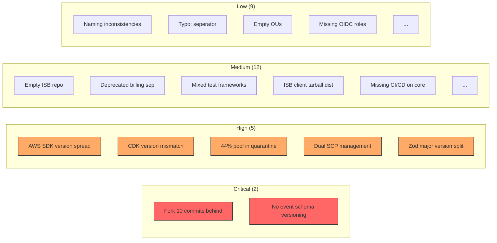
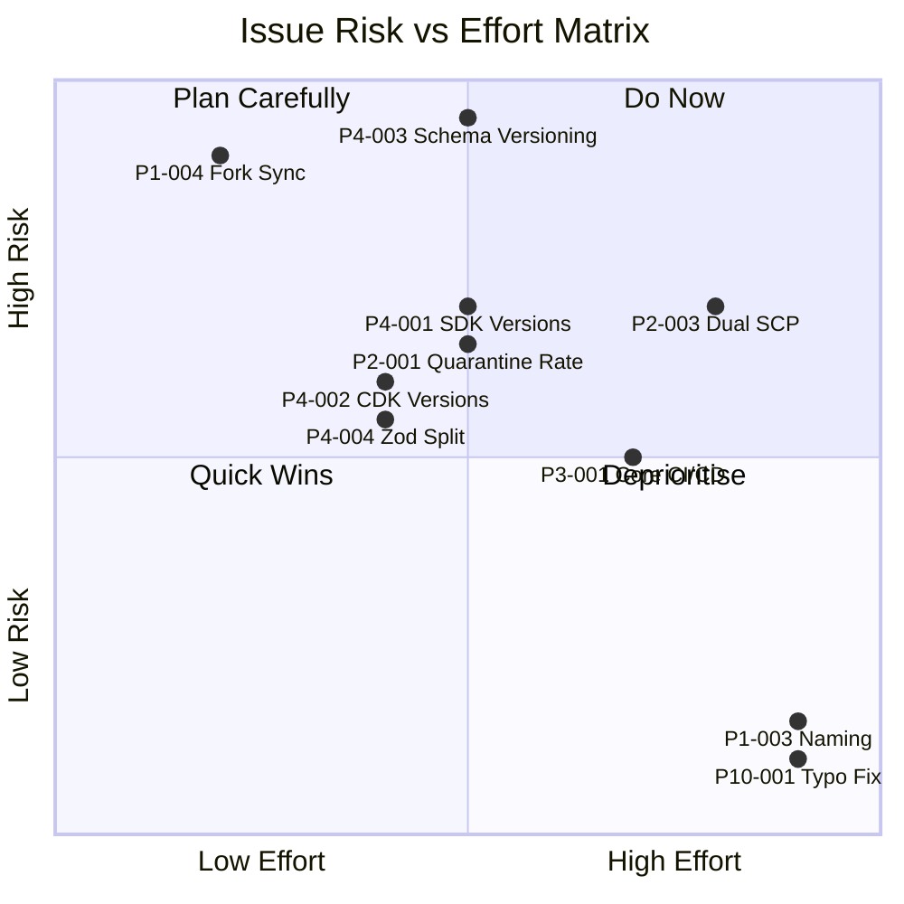

# Issues Discovered

> **Last Updated**: 2026-03-02
> **Sources**: All 12 repositories, .state/upstream-status.json, .state/discovered-accounts.json, .state/org-ous.json, .state/discovered-scps.json

## Executive Summary

This document catalogs all issues, inconsistencies, security concerns, and improvement recommendations discovered during the comprehensive NDX:Try AWS architecture analysis. A total of 28 issues have been identified across 10 analysis phases, with 2 rated critical, 5 high, 12 medium, and 9 low severity. The most significant findings relate to the ISB fork being 10 commits behind upstream, mixed dependency versions creating compatibility risks, and the high quarantine rate for pool accounts.

---

## Issue Severity Ratings

| Severity | Description | Count |
|----------|-------------|-------|
| CRITICAL | Security vulnerability, data loss risk, or system outage potential | 2 |
| HIGH | Significant operational impact or compliance concern | 5 |
| MEDIUM | Technical debt, inconsistency, or moderate risk | 12 |
| LOW | Documentation gap, naming inconsistency, or minor improvement | 9 |
| **Total** | | **28** |

---

## Summary by Category



---

## All Issues

### Phase 1: Repository Discovery

| ID | Severity | Issue | Affected | Details |
|----|----------|-------|----------|---------|
| P1-001 | MEDIUM | Empty placeholder repository | ndx-try-aws-isb | Contains only .gitignore and LICENSE. No source code or documentation. Should be archived. |
| P1-002 | MEDIUM | Deprecated component still deployed | innovation-sandbox-on-aws-billing-seperator | README states: "This is a temporary workaround." Tracking ISB issue #70. |
| P1-003 | LOW | Inconsistent repository naming | All repos | Mix of hyphens and underscores: `ndx-try-aws-*` vs `ndx_try_aws_scenarios`. |
| P1-004 | CRITICAL | Fork 10 commits behind upstream | innovation-sandbox-on-aws | Fork at commit cf75b87, upstream at 90488e0. 10 commits behind, potentially missing security patches and features. See `.state/upstream-status.json`. |

### Phase 2: AWS Organization Structure

| ID | Severity | Issue | Affected | Details |
|----|----------|-------|----------|---------|
| P2-001 | HIGH | High quarantine rate | Pool accounts | 4 of 9 initial pool accounts (44%) were in Quarantine OU. Indicates cleanup failures or extended cooldown issues. |
| P2-002 | LOW | Empty environment OUs | Workloads OU | Dev, Test, and Sandbox OUs exist under Workloads but are unused. All workloads are in Prod. |
| P2-003 | HIGH | Dual SCP management | Organization SCPs | SCPs are managed by both LZA (`ndx-try-aws-lza`) and Terraform (`ndx-try-aws-scp`). Creates risk of conflicting policies and configuration drift. |
| P2-004 | LOW | Role naming inconsistency | IAM Roles | Mix of `github-actions-*` and `GitHubActions-*` naming patterns across repos. |
| P2-005 | LOW | Missing GitHub OIDC roles | Multiple repos | billing-seperator, costs, utils, scenarios, lza, scp, terraform repos do not have visible OIDC roles in Hub account. |

### Phase 3: ISB Core Architecture

| ID | Severity | Issue | Affected | Details |
|----|----------|-------|----------|---------|
| P3-001 | HIGH | ISB Core has no CI/CD pipeline | innovation-sandbox-on-aws | Deployment is manual (`npm run deploy:all` with .env file). All satellite repos have GitHub Actions workflows but core does not. |
| P3-002 | MEDIUM | Outdated AWS SDK in ISB Core | innovation-sandbox-on-aws | AWS SDK ranges from v3.654.0 to v3.758.0, while satellites use v3.987.0 to v3.1000.0. A gap of 242+ minor versions. |
| P3-003 | MEDIUM | 21 Lambda functions without centralised monitoring | innovation-sandbox-on-aws | No evidence of unified observability dashboard. Individual CloudWatch logs but no centralised metrics aggregation. |

### Phase 4: ISB Satellite Components

| ID | Severity | Issue | Affected | Details |
|----|----------|-------|----------|---------|
| P4-001 | HIGH | AWS SDK v3 version spread (346 minor versions) | All satellites | Ranges from v3.654.0 (ISB Core) to v3.1000.0 (Billing Separator). Creates risk of API incompatibilities. |
| P4-002 | HIGH | CDK version mismatch | Costs, Billing Sep vs Core | CDK v2.240.0 in Costs and Billing Sep vs v2.170.0 in Core and Approver (70 minor versions apart). |
| P4-003 | CRITICAL | No EventBridge event schema versioning | All satellites | Events lack a `schemaVersion` field. If ISB Core changes event schema, all consuming satellites break simultaneously with no backward compatibility. |
| P4-004 | HIGH | Zod major version split (v3 vs v4) | Approver vs Costs/Billing Sep | Approver uses zod v3.24.0. Costs and Billing Sep use zod v4.3.6. These are incompatible major versions with breaking API changes. |
| P4-005 | MEDIUM | ISB Client version skew | Approver vs Costs/Deployer | Approver uses `@co-cddo/isb-client` v2.0.1 while Costs and Deployer use v2.0.0. |
| P4-006 | MEDIUM | ISB Client distributed as GitHub tarball | @co-cddo/isb-client | Not published to npm or GitHub Packages. Dependencies reference tarball URLs, making version resolution opaque. |

### Phase 5: NDX Websites

| ID | Severity | Issue | Affected | Details |
|----|----------|-------|----------|---------|
| P5-001 | LOW | ndx package.json description is "TODO:" | ndx | The `description` field in package.json still says "TODO:" -- never completed. |
| P5-002 | MEDIUM | Scenarios repo has heavy devDependencies | ndx_try_aws_scenarios | AWS SDK clients (CloudFormation, CloudWatch, DynamoDB, Lambda, S3, SNS, STS) are all in devDependencies. Suggests tooling/testing uses that may bloat CI. |

### Phase 6: Infrastructure (LZA & Terraform)

| ID | Severity | Issue | Affected | Details |
|----|----------|-------|----------|---------|
| P6-001 | MEDIUM | Two IaC tools manage overlapping concerns | LZA + Terraform | LZA manages core guardrails and security baselines. Terraform manages ISB-specific SCPs. Ownership boundary is unclear. |
| P6-002 | LOW | Terraform repos lack CI/CD | ndx-try-aws-terraform | Only ndx-try-aws-scp has a `terraform.yaml` workflow. ndx-try-aws-terraform is deployed manually. |

### Phase 7: CI/CD Pipelines

| ID | Severity | Issue | Affected | Details |
|----|----------|-------|----------|---------|
| P7-001 | MEDIUM | Mixed test frameworks | All TypeScript repos | Some repos use vitest (v4.0.10-v4.0.18), others use jest (v30.2.0). Billing separator and ISB client use jest; all others use vitest. |
| P7-002 | MEDIUM | No automated dependency updates | All repos | No evidence of Renovate or Dependabot configured across repositories. Manual dependency management leads to version drift. |

### Phase 8: Security & Compliance

| ID | Severity | Issue | Affected | Details |
|----|----------|-------|----------|---------|
| P8-001 | MEDIUM | GitHub PAT for deployer | innovation-sandbox-on-aws-deployer | Uses a Personal Access Token stored in Secrets Manager. PATs have broad permissions and require manual rotation. Consider GitHub App tokens instead. |
| P8-002 | LOW | No VPC endpoints for AWS services | Hub account | Lambda functions access Bedrock, Cost Explorer, and other AWS APIs via NAT Gateway rather than VPC endpoints. Traffic traverses the public internet path. |

### Phase 9: Data Flows

| ID | Severity | Issue | Affected | Details |
|----|----------|-------|----------|---------|
| P9-001 | MEDIUM | Cost Explorer 100 req/hour limit | Costs satellite | With 110 pool accounts, batch querying is essential. A scaling event could hit the rate limit. |
| P9-002 | LOW | No data retention policy documentation | DynamoDB tables | TTL values are set (30 days for LeaseTable, 90 days for QuarantineStatus) but there is no formal data retention policy document. |

### Phase 10: Naming & Documentation

| ID | Severity | Issue | Affected | Details |
|----|----------|-------|----------|---------|
| P10-001 | LOW | Typo in repository name: "seperator" | innovation-sandbox-on-aws-billing-**seperator** | Should be "separator". This typo is baked into GitHub repo name, CI/CD pipelines, and documentation references. |
| P10-002 | LOW | Inconsistent license types | All repos | ISB Core uses Apache-2.0, Approver and Deployer use MIT, Costs uses ISC, NDX uses MIT. No unified licensing policy. |

---

## Detailed Issue Analysis

### P1-004: Fork 10 Commits Behind Upstream (CRITICAL)

**Repository**: `innovation-sandbox-on-aws`
**Upstream**: `aws-solutions/innovation-sandbox-on-aws`
**Current State** (from `.state/upstream-status.json`):

```json
{
  "upstreamUrl": "https://github.com/aws-solutions/innovation-sandbox-on-aws",
  "upstreamSha": "90488e0a554a3a76f41ceaf39a0d4127b4e47c28",
  "localSha": "cf75b87e1764611d794343640136cf3fb047a801",
  "divergence": {
    "ahead": 0,
    "behind": 10
  }
}
```

**Risk**: Missing 10 upstream commits that may include security patches, bug fixes, or feature improvements. The fork has zero local commits ahead, meaning no customisations have been applied -- this should be a straightforward merge.

**Recommendation**: Immediately merge upstream changes. Establish a regular (monthly) upstream sync process.

---

### P4-003: No Event Schema Versioning (CRITICAL)

**Problem**: All EventBridge events exchanged between ISB Core and satellites lack a version identifier:

```json
{
  "source": "leases-api",
  "detail-type": "LeaseApproved",
  "detail": {
    "leaseId": { "userEmail": "...", "uuid": "..." },
    "awsAccountId": "...",
    "approvedBy": "..."
  }
}
```

There is no `schemaVersion`, `eventVersion`, or equivalent field. If the ISB Core team modifies the event payload structure (adds fields, renames fields, changes types), all four satellite consumers (Approver, Deployer, Costs, Billing Separator) will fail simultaneously.

**Recommendation**: Add a `schemaVersion: "1.0"` field to all events. Implement consumer-side schema validation (already partially done with zod). Document event schemas in a shared repository or as EventBridge Schema Registry entries.

---

### P2-001: High Quarantine Rate (HIGH)

**Current State** (at time of initial analysis):
- Available: 5 accounts (pool-003, 004, 005, 006, 009)
- Quarantine: 4 accounts (pool-001, 002, 007, 008)
- Active: 0 accounts

44% of the initial 9 pool accounts were in quarantine. With the full pool of 110 accounts now provisioned, this ratio may have improved, but the underlying cleanup reliability concern remains.

**Possible Causes**:
1. AWS Nuke failing to delete certain resource types
2. Protected resources not properly configured in nuke-config.yaml
3. SCP restrictions preventing Nuke from deleting resources
4. CodeBuild timeout before Nuke completes

**Recommendation**: Review CodeBuild logs for failed cleanup jobs. Update nuke-config.yaml to handle edge cases. Consider increasing max retries from 3.

---

### P4-001: AWS SDK Version Spread (HIGH)

```
ISB Core:          v3.654.0 - v3.758.0  (oldest)
ISB Client:        v3.992.0             (exact pin)
Approver:          v3.987.0             (caret)
Deployer:          v3.993.0             (caret)
Costs:             v3.995.0             (caret)
Billing Separator: v3.1000.0            (caret)
```

The spread of 346 minor versions across the ecosystem means API changes, bug fixes, and security patches in the SDK are inconsistently applied. The ISB Core is the most significantly outdated.

---

## Recommendations Summary

### Immediate Actions (Critical)

| ID | Action | Effort |
|----|--------|--------|
| P1-004 | Merge 10 upstream commits into ISB Core fork | Low (straightforward merge, 0 ahead) |
| P4-003 | Add `schemaVersion` field to all EventBridge events | Medium (cross-repo change) |

### Short-Term Actions (High)

| ID | Action | Effort |
|----|--------|--------|
| P4-001 | Standardise AWS SDK to v3.995.0+ across all repos | Medium |
| P4-002 | Align CDK version to v2.240.0 across all repos | Medium |
| P4-004 | Migrate Approver from zod v3 to zod v4 | Medium |
| P2-003 | Consolidate SCP management to single IaC source | High |
| P2-001 | Investigate and remediate quarantine backlog | Medium |

### Medium-Term Actions (Medium)

| ID | Action | Effort |
|----|--------|--------|
| P3-001 | Add CI/CD pipeline for ISB Core | High |
| P4-006 | Publish ISB Client to GitHub Packages (npm) | Low |
| P7-001 | Standardise on vitest across all TypeScript repos | Medium |
| P7-002 | Configure Renovate/Dependabot across all repos | Low |
| P8-001 | Replace GitHub PAT with GitHub App token | Medium |
| P1-001 | Archive ndx-try-aws-isb (empty repo) | Low |
| P1-002 | Track ISB issue #70 for billing separator replacement | Low |
| P6-001 | Document IaC ownership boundaries (LZA vs Terraform) | Low |
| P9-001 | Implement batch cost collection strategy | Medium |
| P3-002 | Update AWS SDK in ISB Core workspaces | Medium |
| P3-003 | Create unified CloudWatch dashboard | Medium |
| P5-002 | Move AWS SDK clients from devDeps if not needed | Low |

### Long-Term Actions (Low)

| ID | Action | Effort |
|----|--------|--------|
| P1-003 | Standardise repository naming conventions | High (rename = breaking) |
| P10-001 | Fix "seperator" typo (requires repo rename) | High (GitHub URL changes) |
| P10-002 | Adopt unified license policy (recommend MIT or Apache-2.0) | Low |
| P2-002 | Document or remove empty environment OUs | Low |
| P2-004 | Standardise IAM role naming conventions | Medium |
| P2-005 | Create OIDC roles for all repos that need them | Medium |
| P5-001 | Fix "TODO:" in ndx package.json description | Low |
| P8-002 | Deploy VPC endpoints for AWS services | Medium |
| P9-002 | Create formal data retention policy document | Low |

---

## Risk Matrix



---

## References

- [01-upstream-analysis.md](./01-upstream-analysis.md) - Upstream fork analysis
- [02-aws-organization.md](./02-aws-organization.md) - Organization structure
- [05-service-control-policies.md](./05-service-control-policies.md) - SCP details
- [72-repo-dependencies.md](./72-repo-dependencies.md) - Dependency analysis
- [50-github-actions-inventory.md](./50-github-actions-inventory.md) - CI/CD inventory

---
*Generated from source analysis. See [00-repo-inventory.md](./00-repo-inventory.md) for full inventory.*
